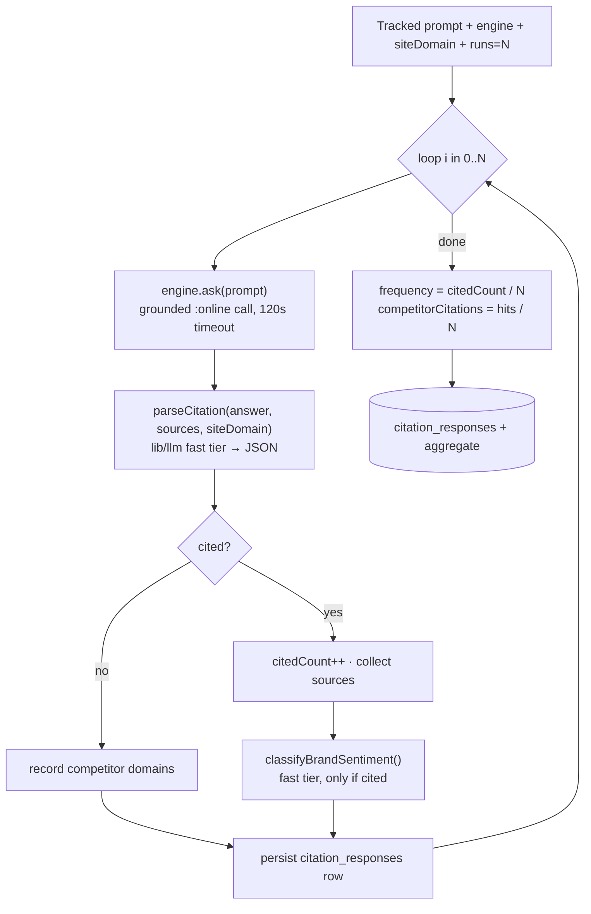
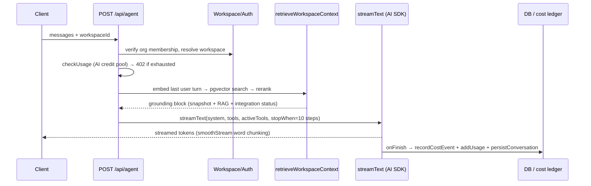

Spyro has **two completely different relationships with AI models**, and keeping them straight is the single most important thing to understand on this page.

<CardGroup cols={2}>
  <Card title="lib/llm — the AIs we USE" icon="pen-nib">
    The internal LLM Spyro calls to **do work**: parse a citation, classify
    intent, draft a section, generate seed prompts. One vendor-agnostic
    interface, OpenRouter-first.
  </Card>
  <Card title="lib/engines — the AIs we QUERY" icon="magnifying-glass-chart">
    The external "citation-target" engines Spyro **interrogates** (ChatGPT,
    Claude, Gemini, Perplexity, Google AI Overviews) to measure whether a user's
    site is recommended. These are the *subject* of measurement, not a tool.
  </Card>
</CardGroup>

<Warning>
  `lib/llm` and `lib/engines` are not the same system. `lib/llm` is *our* brain.
  `lib/engines` is *the thing we test*. A few stale source comments still say
  "our internal LLM, always Gemini" (`lib/engines/index.ts:11`) — that is wrong:
  the real internal provider order is **OpenRouter → OpenAI → Gemini** (see below).
</Warning>

## lib/llm — the internal LLM abstraction

Every place in the codebase that needs an LLM to *do something* goes through one
entry point, `getLLM()`. It returns a vendor-agnostic `LLMProvider` so feature
code never imports an SDK directly.

### The interface

The contract lives in `lib/llm/types.ts`. There are three model **tiers** so each
caller picks a cost/quality point, plus a `generateJson` convenience that parses
and falls back instead of throwing.

```ts
// lib/llm/types.ts:5-40
export type LLMTier = "fast" | "capable" | "premium";

export interface LLMProvider {
  readonly name: string;
  generate(prompt: string, opts?: GenerateOptions): Promise<GenerateResult>;
  /** convenience: generate + JSON.parse, with a fallback value on failure */
  generateJson<T>(prompt: string, fallback: T, opts?: GenerateOptions): Promise<{ value: T; mocked: boolean }>;
}
```

- **`fast`** — cheap model for high-volume, low-stakes work (citation parsing,
  sentiment, intent routing).
- **`capable`** — quality writing (bulk section drafting).
- **`premium`** — the top model for the high-impact, low-token work users judge as
  "ChatGPT/Claude-quality": topic ideas, titles, outline + meta.

### Provider selection (the real order)

`getLLM()` picks a provider by **key presence**, best-first, and caches it. There
is **no mock fallback** — if nothing is configured it throws, so real errors
surface instead of silently returning fake data.

```ts
// lib/llm/index.ts:19-35
export function getLLM(): LLMProvider {
  if (_provider) return _provider;
  if (env.OPENROUTER_API_KEY) {
    _provider = createOpenRouterProvider(env.OPENROUTER_API_KEY);
  } else if (env.OPENAI_API_KEY) {
    _provider = createOpenAIProvider(env.OPENAI_API_KEY);
    console.warn("[llm] Using OpenAI directly (no OPENROUTER_API_KEY set).");
  } else if (env.GOOGLE_GENAI_API_KEY) {
    _provider = createGeminiProvider(env.GOOGLE_GENAI_API_KEY);
    console.warn("[llm] Using Gemini directly (no OPENROUTER_API_KEY / OPENAI_API_KEY).");
  } else {
    throw new Error("[llm] No LLM provider configured. ...");
  }
  return _provider;
}
```

| Priority | Provider | Key | Default models (fast / capable / premium) |
|---|---|---|---|
| 1 (primary) | **OpenRouter** | `OPENROUTER_API_KEY` | `openai/gpt-4.1-mini` / `moonshotai/kimi-k2.6` / `anthropic/claude-sonnet-4.6` |
| 2 (fallback) | OpenAI | `OPENAI_API_KEY` | `gpt-4.1-mini` / `gpt-4.1-mini` / `gpt-4.1` |
| 3 (fallback) | Gemini | `GOOGLE_GENAI_API_KEY` | `gemini-2.5-flash` / `gemini-2.5-flash` / `gemini-2.5-pro` |

OpenRouter is the default because **one key routes every chat model**, and it is
OpenAI-compatible — so the provider drives it with the OpenAI SDK pointed at
`https://openrouter.ai/api/v1` (`lib/llm/openrouter.ts:15`). Override any tier's
model per env (`OPENROUTER_FAST_MODEL`, `OPENROUTER_CAPABLE_MODEL`,
`OPENROUTER_PREMIUM_MODEL`).

<Note>
  The `fast` tier **must** stay a genuinely cheap model — it handles the highest
  volume (citation parse, sentiment, intent). A source comment records that once
  defaulting it to Kimi "silently ~10x'd citation-parse cost"
  (`lib/llm/openrouter.ts:8-13`). `gpt-4.1-mini` is the intended cheap path.
</Note>

### How a generation actually runs

The OpenRouter provider sets temperature by tier (`0.2` for `fast`, `0.7`
otherwise), requests JSON mode when asked, and passes two OpenRouter-specific
flags: `usage.include` (return real `$` cost for the ledger) and
`reasoning.enabled=false` (never let a model burn "thinking" tokens on parsing).

```ts
// lib/llm/openrouter.ts:44-56
const res = await client.chat.completions.create({
  model,
  messages,
  temperature: opts.temperature ?? (opts.tier === "fast" ? 0.2 : 0.7),
  max_tokens: opts.maxOutputTokens,
  response_format: opts.json ? { type: "json_object" } : undefined,
  ...({ usage: { include: true }, reasoning: { enabled: false } } as object),
});
```

### Retries and the JSON contract

`generateJson` is the workhorse for structured extraction. Reasoning models
(Kimi) spend their output budget "thinking" first, so a small `max_tokens` cap can
leave the visible content **empty** — and `JSON.parse("")` throws. The provider
strips code fences, **retries** against non-deterministic empties, and honours the
documented fallback-on-failure contract by returning `mocked: true` instead of
throwing (`lib/llm/openrouter.ts:90-108`):

```ts
// lib/llm/openrouter.ts:97-108
const jsonOpts: GenerateOptions = { ...opts, json: true };
for (let attempt = 0; attempt < 2; attempt++) {
  try {
    const { text } = await generate(prompt, jsonOpts);
    const trimmed = stripCodeFence(text);
    if (trimmed) return { value: JSON.parse(trimmed) as T, mocked: false };
  } catch (err) { /* logged */ }
}
return { value: fallback, mocked: true };
```

The Gemini provider adds its own quota fallback: a `429`/`RESOURCE_EXHAUSTED` on a
`pro` model (common on the free tier) retries once on `gemini-2.5-flash`
(`lib/llm/gemini.ts:51-73`).

<Tip>
  Callers that need reliable JSON pass **no** `maxOutputTokens` cap (so output is
  uncapped and can't be truncated to empty), and always handle the returned
  `mocked` flag. When `mocked` is `true`, the UI surfaces "estimated / unavailable"
  honestly rather than presenting a fallback as real data.
</Tip>

## lib/engines — citation-target engines

This is the **opposite direction**. `lib/engines` defines the external AIs whose
answers Spyro samples to measure a site's *AI visibility*. Adding an engine is
config here, not a rewrite (`lib/engines/index.ts:7-13`).

Four of the five engines route through **a single OpenRouter key** (OpenRouter is
OpenAI-compatible), deliberately pointed at the **flagship consumer models** —
because the whole point is to measure what real users see in ChatGPT/Claude/etc:

```ts
// lib/engines/openrouter.ts:15-20
export const OPENROUTER_MODELS: Partial<Record<CitationEngineId, string>> = {
  chatgpt: "openai/gpt-5.3-chat",              // only GPT-5 *-chat variant on OpenRouter
  claude: "anthropic/claude-haiku-4.5",        // cost-optimized; not the Claude.ai flagship
  gemini: "google/gemini-3.5-flash",           // Gemini consumer Flash — representative + cheap
  perplexity: "perplexity/sonar",              // Perplexity consumer default
};
```

The fifth engine, **`ai_overview`**, does not call a chat model at all — it rides
the [SERP layer](/backend/seo-engine) and reads Google's AI Overview block
(`lib/engines/index.ts:153-172`).

| Engine id | How it's answered |
|---|---|
| `ai_overview` | Google SERP via `getSerpProvider().search()`, reads the AI Overview prose + sources |
| `chatgpt` | OpenRouter → `openai/gpt-5.3-chat` |
| `claude` | OpenRouter → `anthropic/claude-haiku-4.5` |
| `gemini` | OpenRouter → `google/gemini-3.5-flash` |
| `perplexity` | OpenRouter → `perplexity/sonar` |

### Grounded (web-connected) mode

Citation checks run **grounded** so answers mirror the real chat interfaces, which
all browse the web. Grounding switches to OpenRouter's `:online` model variant,
which attaches the web-search plugin (`lib/engines/openrouter.ts:32-35`). Because a
grounded call browses *and* reasons, a single ask routinely exceeds 30s — so the
per-request timeout is **120s** (`lib/engines/index.ts:47`).

### Retries built for "don't re-bill"

`openRouterChat` retries only transient failures — `429` and `5xx`, plus
network/timeout errors — up to `MAX_ATTEMPTS = 10`, with `Retry-After`-aware
exponential backoff + jitter. Other `4xx` (bad key, bad model) fail fast. The
design goal is explicit: `429`s aren't billed, so absorbing rate limits **inside**
one Inngest step means a successful ask memoizes and is never re-billed by a
function retry (`lib/engines/index.ts:37-150`).

## Anatomy of a citation check

A citation check runs one prompt against one engine **N times** (non-determinism
is the point — that's why we sample), parses each answer for whether the user's
domain is cited and which competitors are, then aggregates into a **frequency**.



The orchestration is `runCitationCheck` (`lib/citations/run.ts:38-115`):

```ts
// lib/citations/run.ts:54-64
for (let i = 0; i < n; i++) {
  const answer = await engine.ask(prompt);
  if (answer.mocked) mocked = true;
  if (!firstExcerpt) firstExcerpt = answer.text.slice(0, 800);
  const parsed = await parseCitation(answer.text, answer.sources, siteDomain);
  if (parsed.cited) {
    citedCount++;
    answer.sources.forEach((s) => citedUrls.add(s));
  }
  for (const c of parsed.competitors) competitorHits.set(c, (competitorHits.get(c) ?? 0) + 1);
  // ... persist full response + sentiment (best-effort) ...
}
// frequency: Math.round((citedCount / n) * 1000) / 1000
```

**Parsing** uses the cheap `fast` tier with a deterministic string-match fallback.
`parseCitation` asks the internal LLM whether `siteDomain` is cited and which
competitor domains appear, returning strict JSON; if the LLM is unavailable it
falls back to `naiveParse` (substring + domain regex) and flags `mocked`
(`lib/citations/parse.ts:32-48`). This is the cleanest example of `lib/engines`
(the AI being measured) and `lib/llm` (the AI doing the measuring) working
together in one loop.

Persistence is **best-effort and never throws** — a failed sentiment classify or
row insert must not break a paid run (which would make an Inngest retry re-bill
every engine). See [Background jobs](/backend/background-jobs) for the scheduled
citation cron that drives this, and [Database](/backend/database) for the
`citation_responses` table.

### Seed prompts

The starter set of tracked prompts is generated at onboarding by
`generateSeedPrompts` (`lib/citations/seed-prompts.ts`). These are deliberately
**buyer questions** ("best X for Y", "where can I find…") — natural queries that
*should* surface the site — never SEO keyword strings and never the user's own
brand (we measure unprompted recommendation). It uses the `fast` tier grounded in
the site's real ranking keywords, with a deterministic template fallback so
onboarding is never blocked.

## The Spyro agent

The chat agent (`app/api/agent/route.ts`) is the conversational surface — an
SEO + GEO assistant that calls tools, grounds answers in the user's own site, and
hands work to the writer. It is built on the **Vercel AI SDK** (`streamText`),
which is a different provider path from `lib/llm`.

### Agent provider selection

`getAgentModel()` (`lib/agent/model.ts`) picks the streaming model by key
presence, with its own order and its own default:

```ts
// lib/agent/model.ts:39-40, 57-99 (condensed)
const OPENROUTER_AGENT_MODEL = process.env.OPENROUTER_AGENT_MODEL ?? "minimax/minimax-m2.7";

export function getAgentModel(): AgentModelChoice {
  if (env.OPENROUTER_API_KEY) { /* OpenRouter via @ai-sdk/openai-compatible */ }
  else if (env.MOONSHOT_API_KEY) { /* Moonshot Kimi K2 */ }
  else if (env.OPENAI_API_KEY) { /* direct OpenAI gpt-4.1-mini */ }
  else throw new Error("[agent] No agent model configured. ...");
}
```

| Priority | Provider | Key | Default agent model |
|---|---|---|---|
| 1 | **OpenRouter** | `OPENROUTER_API_KEY` | `minimax/minimax-m2.7` (`OPENROUTER_AGENT_MODEL` to override) |
| 2 | Moonshot | `MOONSHOT_API_KEY` | Kimi K2 (`MOONSHOT_MODEL`) |
| 3 | OpenAI | `OPENAI_API_KEY` | `gpt-4.1-mini` |

The same module also exposes `getRouterModel()` (a cheap classifier for intent
routing) and `getAuditAssistantModel()` (the Ask-Spyro audit sidebar uses MiniMax
2.7, with a `gpt-4.1-mini` fallback).

### Request lifecycle



Key behaviors in `app/api/agent/route.ts`:

- **Scope is server-bound.** The workspace is resolved from the session and an
  explicit `workspaceId`, verified via org membership — a client-supplied id is
  never trusted (`route.ts:106-149`).
- **Credit gating.** A shared per-workspace AI credit pool (chat + keyword search)
  is checked before opening the stream; over-limit returns `402` (`route.ts:151-165`).
- **Grounding up-front.** The system prompt is augmented with the workspace
  snapshot, RAG context for the latest turn, and integration status (GSC/GA4
  connected?) — each best-effort (`route.ts:191-223`).
- **Turn routing.** `routeTurn()` selects the **tool subset** the model may use
  this turn (`activeTools`), so a simple question can't trigger unwanted paid API
  calls (`route.ts:256`).
- **Bounded tool loop.** `stopWhen: stepCountIs(10)` caps chained tool calls so a
  confused model can't loop forever; `maxRetries: 2` retries transient provider
  failures (`route.ts:300-308`).
- **`maxDuration = 300`** — tool chains (sitemap crawls, audits, embeddings) need
  headroom so `onFinish` billing + persistence still run.

### Tools and the RAG-first rule

Tools are bound per-request through a factory (`buildSpyroTools`) so the
authenticated `userId`/`workspaceId` scope every query — never trusted from the
model (`lib/agent/spyro-tools.ts:1-8`). Every tool is wrapped by
`withToolErrorHandling` so a thrown error (DataForSEO down, sitemap fail) becomes a
structured `{ error }` result instead of aborting the stream.

The system prompt (`lib/agent/system-prompt.ts`) locks a **RAG-first rule**: for
*any* site-specific question the first tool call must be `searchMySite`, grounding
the answer in the user's actual indexed pages. That is the product's stated
differentiator.

## RAG and embeddings

Spyro grounds the agent (and citation chunks, audits, keyword research) in the
user's own content via a per-workspace vector index.

### Embeddings — OpenAI

Embeddings are the one place Spyro always uses **OpenAI directly**
(`text-embedding-3-small`, 1536 dims, locked single-model). Texts are embedded in
batches of 96 with one retry, empty strings coerced to a space so a batch never
gets rejected, and spend recorded best-effort (`lib/embed/openai.ts:18-82`):

```ts
// lib/embed/openai.ts:18-19
const MODEL = "text-embedding-3-small";
const DIMS = 1536; // pgvector column dim — unchanged across the 3-large→3-small switch
```

<Note>
  `.env.local.example` documents the embedding model as `text-embedding-3-large`,
  but the code is **locked to `text-embedding-3-small`** (`lib/embed/openai.ts:18`).
  The index must be single-model — if this constant changes, every existing vector
  must be rebuilt. Trust the code.
</Note>

### Storage and retrieval — pgvector

Vectors live in the `site_chunks` table, namespaced by workspace and (for
knowledge sources) by `metadata.sourceType`. The store uses pgvector's cosine
distance operator `<=>`, converting distance to a similarity score
(`lib/vector/pgvector.ts:123-161`):

```ts
// lib/vector/pgvector.ts:135-141, 158
select id, url, title, heading, chunk_text, metadata,
       embedding <=> ${vec}::vector as distance
from site_chunks
where workspace_id = ${siteId}
order by embedding <=> ${vec}::vector
limit ${k}
// ...
score: 1 - Number(r.distance), // cosine similarity, higher = closer
```

The agent path retrieves candidates by vector search, then **reranks** them.
`rerankOrFallback` (`lib/rerank/index.ts:82-160`) calls an OpenRouter-hosted Cohere
reranker (`cohere/rerank-4-fast` by default) and **falls back to vector order on
any recoverable failure** — it never throws to the caller and always logs exactly
one structured line. Disable with `RERANK_ENABLED=false`.

### Knowledge documents

Beyond crawled pages, Spyro embeds the workspace's own structured data into RAG via
pure builders in `lib/embed/knowledge.ts` — keyword research, off-domain intel,
audit findings, citation checks, and published blog posts — each tagged with a
`sourceType` so an incremental re-embed of one source replaces only that source's
vectors:

```ts
// lib/embed/knowledge.ts:13
export type KnowledgeSourceType = "keywords" | "intel" | "audit" | "citations" | "blog";
```

## Token & cost tracking

Every billable external call is recorded into the `api_cost_events` table by
`recordCostEvent` (`lib/admin/cost.ts`). It is **best-effort and never throws** — a
ledger write failing must not break a call that already cost money — and skips
no-signal writes (no cost AND no tokens).

```ts
// lib/admin/cost.ts:7-13
export type CostProvider =
  | "openrouter" | "dataforseo" | "openai"
  | "moonshot" | "screenshotone" | "flux";
```

- **Real `$` when the provider reports it.** OpenRouter returns `usage.cost`
  (because we pass `usage.include`); that value is recorded verbatim.
- **Estimated when only tokens are known.** The AI-SDK chat path reports tokens but
  no `$`, so cost is estimated from a price table and stamped `estimated: true`
  in `meta` (`lib/admin/cost.ts:48-56`).
- **Ambient attribution.** Operation, `userId`, `orgId`, and `workspaceId` fall
  back to the ambient `withCostContext` scope, so spend ties to the right
  workspace even deep inside a citation loop.

Crucially, cost recording lives **inside** each provider's `generate`
(`lib/llm/openrouter.ts:70-79`) rather than in `index.ts`, so `generateJson`
(citation parsing) is covered too. Citation-engine spend is recorded with
`operation: "citation"` and `meta.engine`, embeddings with `operation: "embed"`,
and the agent chat with `operation: "chat"` in `onFinish`. See
[Logging & monitoring](/backend/logging) for how the admin cost dashboard reads
this ledger.

## Related

- [SEO Engine](/backend/seo-engine) — keyword/SERP data that grounds the agent's tools
- [GEO Engine](/backend/geo-engine) — the AI-visibility scoring measured against citation engines
- [Crawler](/backend/crawler) — produces the page chunks that feed RAG
- [Audit](/backend/audit) — uses `lib/llm` for AI fix suggestions
- [Content Engine](/backend/content-engine) — the writer the agent hands articles to
- [Background Jobs](/backend/background-jobs) — the citation + indexing crons
- [Database](/backend/database) — `citation_responses`, `site_chunks`, `api_cost_events`
- [Free Tools](/backend/free-tools) — public AI-visibility checker built on these engines
