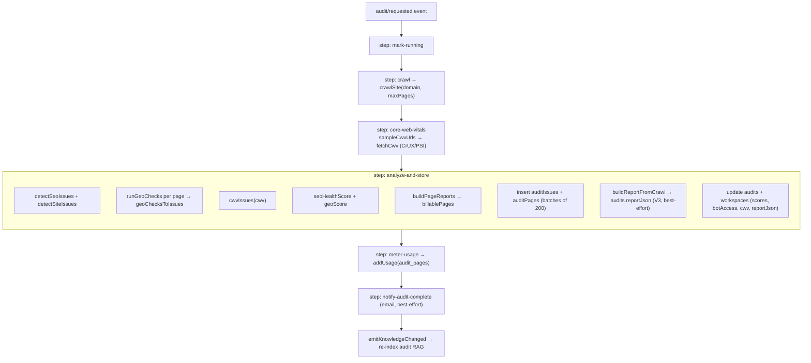
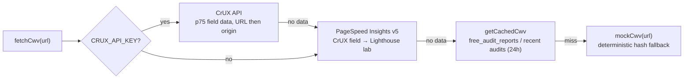

An audit is the full-site health check that ties the other engines together. It
crawls a site, runs every detector ([SEO](/backend/seo-engine),
[GEO](/backend/geo-engine), Core Web Vitals, bot access), scores the results, and
stores per-issue and per-page rows for the dashboard and PDF report. The heavy run
is **Inngest-driven** so it survives serverless time limits and retries cleanly.

## Two scopes

| Scope | Entry point | Pages | Where |
|---|---|---|---|
| Single page | `checkUrl(url)` | 1 | `lib/audit/url-check.ts` - synchronous, used by the agent's `auditPage` tool |
| Full site | `audit/requested` event | up to `maxPages` (weekly = 50) | `lib/inngest/fns/audit.ts` - background job |

### Single-page audit

`checkUrl` reuses `crawlSite(url, 1)` so robots.txt and llms.txt context is
available to the GEO checks, then runs both detector families and scores the lone
page. Site-wide checks that need many pages (internal clustering) read as "fail" for
a single page - that is expected.

```ts
// lib/audit/url-check.ts:61-89 (condensed)
export async function checkUrl(rawUrl: string): Promise<UrlCheckResult> {
  const result = await crawlSite(rawUrl, 1);
  const page = result.pages[0];
  if (!page || page.error) return { /* ...seoScore: null, geoScore: null, error... */ };

  const seoIssues = detectSeoIssues(result);
  const geoChecks = runGeoChecks(page, result);
  const geoIssues = geoChecksToIssues(page.url, geoChecks);
  return {
    url: page.url, status: page.status, wordCount: page.wordCount,
    seoScore: seoHealthScoreForPage(seoIssues),
    geoScore: geoScoreForPage(geoChecks),
    issues: [...seoIssues, ...geoIssues],
  };
}
```

`urlMatchesWorkspaceDomain` guards the input: the URL must be on the workspace's own
apex or a sub-domain, or the request is rejected.

## The full-site audit flow

The site audit is the Inngest function `auditCrawlFn` (`id: audit-crawl-site`,
retries 2, concurrency limit 3), triggered by the `audit/requested` event. Each
phase is a discrete `step.run` so Inngest can memoize it and never re-crawl on a
downstream retry.



The orchestration, verbatim at the heart of `analyze-and-store`:

```ts
// lib/inngest/fns/audit.ts:36-48
const seoIssues = detectSeoIssues(result);
const siteIssues = detectSiteIssues(result);
const okPages = result.pages.filter((p) => !p.error && p.status < 400);
const geoPerPage = okPages.map((p) => runGeoChecks(p, result));
const geoIssues = okPages.flatMap((p, i) => geoChecksToIssues(p.url, geoPerPage[i]));
const cwvIssueList = cwvIssues(cwv);
const allIssues = [...seoIssues, ...geoIssues, ...siteIssues, ...cwvIssueList];

const seoScoreVal = seoHealthScore(allIssues, result.pages.length);
const geoScoreVal = geoScore(geoPerPage);

const { rows, billablePages } = buildPageReports(okPages, [...seoIssues, ...siteIssues, ...cwvIssueList], geoPerPage);
```

`analyze-and-store` then also builds a full **V3 SEO+GEO report** - the same
category-scored report the free SEO/GEO tool produces - and stores it on
`audits.reportJson`. It is **best-effort**: a build failure is logged but never
fails the audit, and it does **not** change the on-screen scores (those still come
from `seoHealthScore`/`geoScore`):

```ts
// lib/inngest/fns/audit.ts:56-61, 84
let reportJson = null;
try {
  reportJson = buildReportFromCrawl(domain, "site", result, cwv);
} catch (e) {
  console.warn("[audit] V3 report build failed:", (e as Error).message);
}
// …then persisted in the same audits update:
await db.update(audits).set({ /* status, scores, cwv, botAccess, */ reportJson })
  .where(eq(audits.id, auditId));
```

This stored report is what the **PDF export** renders via Gotenberg for modern
audits; pre-migration-`0063` audits (`reportJson = null`) fall back to the legacy
react-pdf document. See [PDF engine](/backend/pdf-engine).

An audit is triggered two ways:

- **Manually** - the `startAudit()` server action (`lib/actions/audit.ts:72`)
  inserts a `queued` `audits` row and sends `audit/requested`. If Inngest is
  unreachable (local dev) it falls back to `runInline()`, capped at 20 pages - the
  same detectors and scorers run, just synchronously.
- **Weekly** - `auditScheduledFn` (`id: audit-weekly`) is fired per-workspace by the
  hourly fan-out dispatcher when the workspace's local clock matches its schedule.
  It respects the workspace's `weeklyAudit` opt-out and enqueues an `audit/requested`
  with `maxPages: 50`.

See [Background jobs](/backend/background-jobs) for the dispatcher and cron model.

## What gets checked

An audit combines four issue sources, all normalised to the same `DetectedIssue`
shape (`category: "seo" | "geo"`, `severity: critical | warning | info`):

1. **Per-page technical SEO** - `detectPerPageSeoIssues` (titles, meta, H1, thin
   content, slow pages, schema, https, noindex, viewport, alt text...).
2. **Cross-page + site SEO** - `detectCrossPageSeoIssues` (duplicate titles, orphan
   pages, broken links, hreflang) and `detectSiteIssues` (AI crawler access,
   sitemap, robots). See the [SEO engine](/backend/seo-engine) for the full list.
3. **GEO readiness** - `runGeoChecks` per page → `geoChecksToIssues`. See the
   [GEO engine](/backend/geo-engine).
4. **Core Web Vitals** - `cwvIssues(cwv)`.

### Core Web Vitals

CWV is sourced from **field data**, not an in-process Lighthouse run.

<Warning>
  The bundled puppeteer/Lighthouse lab runner was **removed** - it never worked on
  Vercel (serverless can't launch Chrome). The source note is explicit
  (`lib/seo/cwv.ts:415-417`). CWV now comes from Google's CrUX API and PageSpeed
  Insights (which runs Lighthouse server-side). If you saw `scripts/test-cwv-runner.ts`
  or migration `0032_audit_cwv` and assumed a local Lighthouse dependency, trust the
  code: the data path is field-first.
</Warning>

`fetchCwv` (`lib/seo/cwv.ts:507`) is a layered, never-throwing lookup:



The metrics captured are LCP, INP, CLS, plus FCP/TTFB and (from Lighthouse)
performance/accessibility/best-practices/SEO category scores and opportunities. The
sampler `sampleCwvUrls` picks one representative URL per template (plus standalone
pages), capped at 10, so a 50-page audit doesn't run 50 PageSpeed calls. CWV issues
are graded against the standard thresholds:

```ts
// lib/seo/cwv.ts:565-581 (condensed)
// LCP > 2.5s warn / > 4s critical; INP > 200ms warn; CLS > 0.1 warn
if (m.lcp != null && m.lcp > 2500) issues.push({ type: "poor_lcp", severity: m.lcp > 4000 ? "critical" : "warning", /* ... */ });
if (m.inp != null && m.inp > 200) issues.push({ type: "poor_inp", severity: "warning", /* ... */ });
if (m.cls != null && m.cls > 0.1) issues.push({ type: "poor_cls", severity: "warning", /* ... */ });
```

<Tip>
  There is a sanctioned cross-boundary CWV cache: a paid audit will reuse a
  `free_audit_reports` row written by the public audit tool within 24h to save CrUX
  quota (`lib/seo/cwv.ts:303-343`). Treat `free_audit_reports.reportJson.cwv[]` as
  shared, not a private free-tool table.
</Tip>

### Bot access

The audit records which AI crawlers a site allows. `botAccessFromRobots` reads the
parsed robots groups and reports whether the seven `BOT_ACCESS_TARGETS` -
`GPTBot`, `ChatGPT-User`, `OAI-SearchBot`, `ClaudeBot`, `Googlebot`, `Google-Extended`,
and `PerplexityBot` - are disallowed (`lib/crawler/robots.ts:83-91`). The result is
stored on `audits.botAccess`. Separately, a blocked crawler from the broader `AI_BOTS`
list (`robots.ts:12-21`) surfaces as the critical `ai_crawler_access` issue from
`detectSiteIssues`.

## Scoring and billing

- **SEO score** - `seoHealthScore(allIssues, pagesCrawled)`: the average of the
  per-page SEO scores (clean pages count as 100), minus a small capped penalty for
  site-global issues - only `category: "seo"` issues count, so CWV and cross-page
  SEO contribute here too. See [SEO engine](/backend/seo-engine#health-scoring).
- **GEO score** - `geoScore(geoPerPage)`: the average of per-page weighted GEO
  pass-rates.

Both land on the `audits` row **and** are mirrored onto the `workspaces` row
(`seoScore`, `geoScore`, `lastCrawledAt`) so the dashboard reads them without
joining the latest audit.

Per-page rows are built by `buildPageReports`. Pages are grouped into **templates**
(`/blog/:slug`), and only **one representative per template** - the worst combined
SEO+GEO page - plus every standalone page is marked **billable**. That billable
count is what's metered:

```ts
// lib/audit/pages.ts:58-66 (condensed)
for (const list of byTemplate.values()) {
  let worst = list[0];
  for (const r of list) if (r.seoScore + r.geoScore < worst.seoScore + worst.geoScore) worst = r;
  worst.isBillable = true;
}
const billablePages = rows.filter((r) => r.isBillable).length;
```

The job meters this via `addUsage(userId, "audit_pages", billablePages)`. See
[Billing](/backend/billing) for plan limits.

## AI fix suggestions

Each issue in the audit UI can request a tailored fix. `POST
/api/audit/[auditId]/suggest-fix` (`app/api/audit/[auditId]/suggest-fix/route.ts`)
verifies the user owns the audit, then **streams** a short, action-first suggestion
using the audit-assistant model (`minimax/minimax-m2.7` via OpenRouter, with a
`gpt-4.1-mini` fallback - see [AI engine](/backend/ai)):

```ts
// app/api/audit/[auditId]/suggest-fix/route.ts:28-35 (system prompt)
const SYSTEM = `You are Spyro - a technical SEO and AI-visibility expert.
Your job: give a precise, actionable fix for a specific website issue.
Rules:
- 2–4 sentences max. No fluff.
- Start with the action ("Add…", "Set…", "Update…", "Remove…").
- Don't repeat the issue back - jump straight to the fix.
- Include a short HTML/code snippet when it helps (use backticks for inline code).
- Tailor the advice to the domain and affected pages provided.`;
```

The prompt is built from the issue type, standard guidance (`fixText`), and the
affected URLs (capped at 6), at `temperature: 0.35` with a 600-token cap (250 was too
tight - MiniMax spends some budget on internal reasoning before emitting text). The
generated text is persisted by the `saveAiSuggestion` server action into the
`audits.aiSuggestions` jsonb column (a `{ issueType: suggestion }` map, added by
migration `0037_audit_ai_suggestions`). The related `POST /api/audit/ask` route powers
the conversational "Ask Spyro about this audit" sidebar.

## Storage

| Table | Holds |
|---|---|
| `audits` | one row per run - status, scores, `pagesCrawled`, `billablePages`, `cwv`, `botAccess`, `reportJson` (V3 report, added `0063`) |
| `audit_issues` | every `DetectedIssue` (batched inserts of 200) |
| `audit_pages` | per-page rows with template label, SEO/GEO score, `isBillable` |

After storing, the job calls `emitKnowledgeChanged(workspaceId, userId, ["audit"])`
so the audit findings are re-embedded into RAG and the agent can reference them. See
[Database](/backend/database) for the full schema.

## Related

- [Crawler](/backend/crawler) - the `crawlSite` that feeds every audit
- [SEO Engine](/backend/seo-engine) - technical SEO detectors + health scoring
- [GEO Engine](/backend/geo-engine) - the GEO readiness checks + score
- [Background Jobs](/backend/background-jobs) - Inngest steps, retries, the weekly cron
- [AI Engine](/backend/ai) - the model behind suggest-fix and Ask-Spyro
- [Free Tools](/backend/free-tools) - the public audit tool that shares the CWV cache
- [Billing](/backend/billing) - `audit_pages` metering and plan limits
- [Database](/backend/database) - `audits`, `audit_issues`, `audit_pages`
