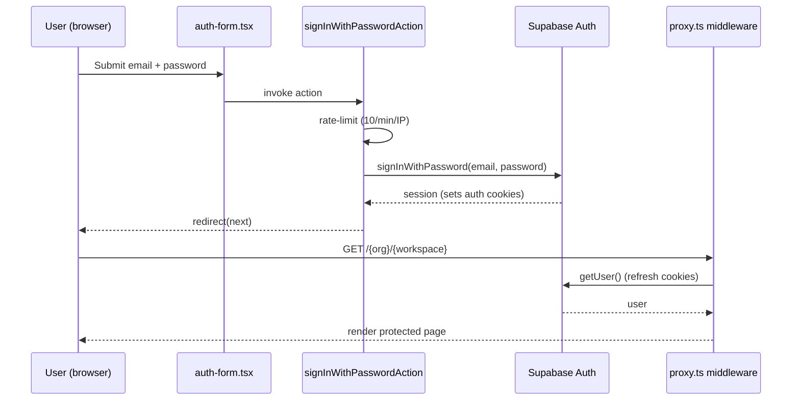

Spyro authenticates **users** with [Supabase Auth](https://supabase.com/auth).
Sessions are cookie-based and shared between the browser and the server via the
`@supabase/ssr` package, so Server Components, Route Handlers, and Server Actions
all see the same session.

This page covers the *user* identity layer. For API-key auth on the external
surface, see [Public API](/backend/public-api). For roles and permissions once a
user is signed in, see [Authorization](/backend/authorization).

## The three Supabase clients

Spyro uses three flavors of Supabase client, each for a different execution
context:

| Client | File | Key | Used in |
| --- | --- | --- | --- |
| **Browser** | `lib/supabase/client.ts` | publishable → anon | Client Components |
| **Server** | `lib/supabase/server.ts` | anon | Server Components, Route Handlers, Server Actions |
| **Admin** | `lib/supabase/admin.ts` | service role | Privileged ops (create user, mint magic links) |

The browser client accepts the new publishable key, falling back to the legacy
anon key (`lib/supabase/client.ts:9-12`):

```ts
const SUPABASE_KEY =
  process.env.NEXT_PUBLIC_SUPABASE_PUBLISHABLE_KEY ??
  process.env.NEXT_PUBLIC_SUPABASE_ANON_KEY ??
  "";
```

The server client binds Supabase to the request cookies through the
`@supabase/ssr` cookie adapter, and tolerates being called from a Server
Component (where setting cookies throws) by swallowing the error — the
[middleware](/backend/middleware) refreshes the session instead
(`lib/supabase/server.ts:11-29`):

```ts
// lib/supabase/server.ts:13-28
return createServerClient(env.SUPABASE_URL ?? "", env.SUPABASE_ANON_KEY ?? "", {
  cookies: {
    getAll() {
      return cookieStore.getAll();
    },
    setAll(cookiesToSet) {
      try {
        cookiesToSet.forEach(({ name, value, options }) =>
          cookieStore.set(name, value, options),
        );
      } catch {
        // Called from a Server Component — safe to ignore; middleware refreshes the session.
      }
    },
  },
});
```

The canonical "who is signed in?" helper is `getCurrentUser()`
(`lib/supabase/server.ts:32-39`), which returns `null` when Supabase is
unconfigured or no user is present. Route handlers call this directly; pages go
through the [auth guards](/backend/authorization).

## Where auth runs

Almost all auth logic lives in **Server Actions** in `lib/actions/auth.ts`
(`"use server"`). The auth *pages* under `app/(auth)/*` render client form
components (`components/app/auth-form.tsx`, `verify-form.tsx`, `reset-form.tsx`)
that invoke those actions. Two thin **Route Handlers** under `app/auth/*` handle
OAuth/recovery callbacks and sign-out.

Every action is rate-limited to **10 attempts/minute/IP** across all auth actions
combined (`lib/actions/auth.ts:32-42`), using the in-memory limiter
(`lib/rate-limit.ts`), and supports an optional Cloudflare Turnstile captcha
token.

## Signup — a custom OTP flow

Spyro deliberately **never calls `supabase.auth.signUp()`**. A naive signup would
insert an *unconfirmed* `auth.users` row before the user verifies their email,
which (via the DB trigger below) would materialize an orphaned profile and org
for every abandoned signup. Instead, Spyro keeps the pending signup entirely in
an **encrypted, HttpOnly cookie** and emails its own one-time code:

<Steps>
<Step title="Submit signup form">
`signUpWithPasswordAction` validates the input. If a `profiles` row already
exists for the email, it returns `existingAccount` (a verified account exists),
because unverified signups create no rows (`lib/actions/auth.ts:96-103`).
</Step>
<Step title="Stash pending signup + email an OTP">
It generates an 8-digit OTP and stores the email, name, password, code, and
expiry in an encrypted cookie — **no Supabase user is created yet**
(`lib/actions/auth.ts:109-131`):

```ts
const code = generateOtp();
const pending: PendingSignup = { email, fullName, password, code, /* … */ };
await setPendingSignup(pending);
const res = await sendOtpEmail(email, code);
// …
redirect(`/verify?next=${encodeURIComponent(next)}`);
```
</Step>
<Step title="Verify the code">
On `/verify`, `verifyOtpAction` compares the entered code with the cookie. Wrong
codes decrement an attempt counter (`MAX_OTP_ATTEMPTS`); too many wipes the
pending session (`lib/actions/auth.ts:176-185`).
</Step>
<Step title="Create the confirmed user">
Only after the code matches does Spyro create the user — **already confirmed** —
via the service-role admin client. This is the first and only write to Supabase
in the whole flow (`lib/actions/auth.ts:189-195`):

```ts
const admin = createAdminClient();
const { data: created, error: createErr } = await admin.auth.admin.createUser({
  email: pending.email,
  password: pending.password,
  email_confirm: true,
  user_metadata: { full_name: pending.fullName, display_name: pending.fullName },
});
```
</Step>
<Step title="Establish a session">
It calls `ensureProfile()` as an idempotent backstop to the DB trigger, then
signs the user in with their password and clears the pending cookie
(`lib/actions/auth.ts:206-215`).
</Step>
</Steps>

<Note>
`resendOtpAction` issues a fresh code, resets the attempt counter, and extends
the window, keeping the same pending details (`lib/actions/auth.ts:218-241`).
</Note>

## Login — password and Google OAuth

**Password login** (`signInWithPasswordAction`, `lib/actions/auth.ts:146-150`):

```ts
const { error } = await supabase.auth.signInWithPassword({
  email,
  password,
  options: { captchaToken: captchaToken(formData) },
});
```

Because real accounts are always created confirmed, an "email not confirmed"
error here means an anomalous/legacy row, and the action steers the user to sign
up again (`lib/actions/auth.ts:155-157`).

**Google OAuth** (`signInWithGoogleAction`, `lib/actions/auth.ts:67-72`) starts
the provider redirect, pointing the callback at `/auth/callback`:

```ts
const { data, error } = await supabase.auth.signInWithOAuth({
  provider: "google",
  options: { redirectTo: `${origin}/auth/callback?next=${encodeURIComponent(next)}` },
});
if (error) return { error: error.message };
if (data.url) redirect(data.url);
```

The callback Route Handler exchanges the OAuth `code` for a session via PKCE
(`app/auth/callback/route.ts:12-15`):

```ts
if (code) {
  const supabase = await createClient();
  const { error } = await supabase.auth.exchangeCodeForSession(code);
  if (!error) return NextResponse.redirect(`${origin}${next.startsWith("/") ? next : "/"}`);
  // …
}
```

<Tip>
The callback rebuilds the origin from forwarded headers (`originFromHeaders`) so
recovery/OAuth redirects land on the host the user is actually on (ngrok, Vercel
preview, or prod) — not the internal localhost origin Next sees behind a tunnel.
</Tip>

## Password reset — two steps

1. **Request** (`requestPasswordResetAction`, `lib/actions/auth.ts:254-257`)
   calls `resetPasswordForEmail`, routing the recovery link through
   `/auth/callback` (PKCE) to `/reset/update`. It always returns a neutral
   message to avoid email enumeration:

   ```ts
   const { error } = await supabase.auth.resetPasswordForEmail(email, {
     redirectTo: `${origin}/auth/callback?next=/reset/update`,
     captchaToken: captchaToken(formData),
   });
   ```

2. **Update** (`updatePasswordAction`, `lib/actions/auth.ts:276-281`): the
   recovery link already exchanged the code for a session, so the user is
   authenticated on `/reset/update`. The action confirms a session exists, then
   sets the new password:

   ```ts
   const { data: { user } } = await supabase.auth.getUser();
   if (!user) return { error: "Your reset link has expired. Request a new one." };
   const { error } = await supabase.auth.updateUser({ password });
   ```

## Sign out

`signOutAction` (`lib/actions/auth.ts:284-290`) calls `supabase.auth.signOut()`
and redirects to `/`. A Route Handler at `app/auth/signout/route.ts` does the
same for non-action callers.

## The auth.users → profiles trigger

When a user's email becomes confirmed, a Postgres trigger materializes the
app-level rows: a `profiles` row, a **personal organization**, and an `owner`
membership. The function `handle_new_user()` is defined canonically in
`drizzle/rls.sql` §9, with `drizzle/0047_gate_handle_new_user.sql` carrying the
same definition as a standalone migration (re-running `rls.sql` is equivalent).

The critical detail is the **email-confirmation gate** — it fires on
`INSERT OR UPDATE` of `auth.users` but only acts on the `NULL → confirmed`
transition:

```sql
-- drizzle/0047_gate_handle_new_user.sql:27-35
-- Only materialize app rows once the email is actually confirmed.
if new.email_confirmed_at is null then
  return new;
end if;
-- On UPDATE, act only on the NULL→confirmed transition, not every later auth.users
-- write (last_sign_in_at, token refresh, etc. all UPDATE this table).
if tg_op = 'UPDATE' and old.email_confirmed_at is not null then
  return new;
end if;
```

This handles every entry path:

- **Email/password** signup inserts an unconfirmed row → no app rows (and in
  Spyro's flow, `admin.createUser({ email_confirm: true })` inserts already
  confirmed).
- **OTP verification** flips `email_confirmed_at` `NULL → now()` → app rows
  created on the UPDATE.
- **OAuth** users are inserted already-confirmed → app rows on the INSERT.

```sql
-- drizzle/0047_gate_handle_new_user.sql:78-80
drop trigger if exists on_auth_user_created on auth.users;
create trigger on_auth_user_created after insert or update on auth.users
  for each row execute function public.handle_new_user();
```

The application-side `ensureProfile()` (`lib/profile.ts:25-37`) is an idempotent
backstop that does the same work if the trigger hasn't run, and `createPersonalOrg()`
(`lib/org.ts:38-71`) is the org-creation half. New orgs start **inactive**
(`subscription_active = false`) with no local trial — the billing gate lives on
the org, set by the Dodo webhook. See [Authorization](/backend/authorization#plan--usage-gating).

## Login sequence



## Common mistakes

<AccordionGroup>
<Accordion title="Calling supabase.auth.signUp() to add a user">
Don't. Spyro's signup is OTP-gated and creates the user via the admin API only
after verification. A direct `signUp()` would create an unconfirmed row and
desync from the `profiles`/org model.
</Accordion>
<Accordion title="Reading the session in a Server Component and expecting cookie writes">
`setAll` is a no-op from a Server Component (it throws and is swallowed). Cookie
refresh happens in the middleware. Use `getCurrentUser()` to read, and let
`proxy.ts` keep the session fresh.
</Accordion>
<Accordion title="Forgetting to allowlist redirect URLs in Supabase">
`signInWithOAuth` and `resetPasswordForEmail` both redirect through
`/auth/callback`. That URL must be allowlisted in the Supabase Auth settings or
`exchangeCodeForSession` fails with "redirect-url not allowlisted".
</Accordion>
</AccordionGroup>

## Related

- [Authorization](/backend/authorization) — roles, guards, and plan gating after sign-in.
- [Middleware](/backend/middleware) — the edge gate that protects pages and refreshes sessions.
- [Public API](/backend/public-api) — API-key auth for external callers.
- [Database](/backend/database) — the `profiles`, `organizations`, and membership tables.
- [Architecture](/getting-started/architecture) — the overall request lifecycle.
