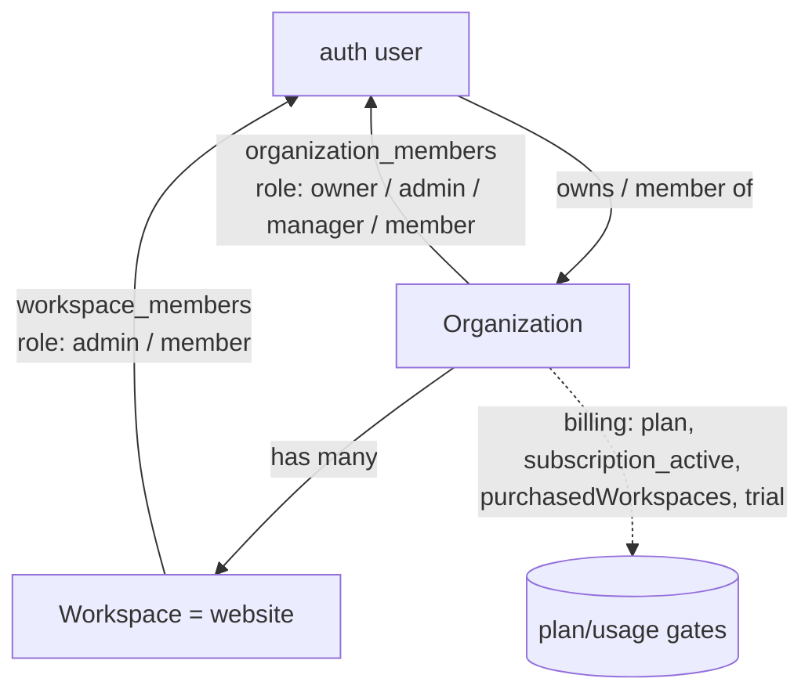

Once a user is [authenticated](/backend/authentication), authorization decides
**what they can see and do**. Spyro layers four mechanisms:

1. A three-level **org → workspace → user** tenancy model with roles.
2. **Auth guards** (`lib/auth-guard.ts`) that resolve and enforce access in the app.
3. **Row-Level Security** (RLS) as membership-driven defense in depth.
4. **Plan and usage gating** that caps what each organization can consume.

Plus a separate, fully-isolated **superadmin** layer with impersonation.

## The tenancy model



- An **organization** is the billing and ownership boundary. Every user gets a
  **personal org** on signup (`lib/org.ts:38-71`).
- A **workspace** is a single website (1:1 with a site). Workspaces belong to an
  org.
- **Membership** is explicit: `organization_members` and `workspace_members` rows
  carry roles.

### Roles

Roles are Postgres enums (`lib/db/schema.ts:56-57`):

```ts
export const orgRoleEnum = pgEnum("org_role", ["owner", "admin", "manager", "member"]);
export const workspaceRoleEnum = pgEnum("workspace_role", ["admin", "member"]);
```

| Org role | Powers |
| --- | --- |
| `owner` | Everything, including billing and deleting the org |
| `admin` | Manage members, workspaces, settings (not delete org) |
| `manager` | Workspaces-only authority - create/manage workspaces and assign people; **cannot** touch billing or org membership |
| `member` | Only the workspaces they're explicitly assigned to |

| Workspace role | Powers |
| --- | --- |
| `admin` | Full control of the workspace (e.g. create/reveal/delete API keys) |
| `member` | Use the workspace |

The `manager` org role and the rename of the workspace role `manager → admin`
were introduced in `drizzle/0029_org_manager_workspace_admin_roles.sql`.

**Role inheritance** is the key rule: an org `owner`, `admin`, or `manager` is
treated as `admin` on **every** workspace in the org; only a `member` is
restricted to their assigned workspaces (`lib/org.ts:86-98`):

```ts
export async function workspaceAccess(
  userId: string, orgRole: OrgRole, workspace: Workspace,
): Promise<WorkspaceRole | null> {
  if (orgRole !== "member") return "admin";
  const [m] = await db
    .select({ role: workspaceMembers.role })
    .from(workspaceMembers)
    .where(and(eq(workspaceMembers.workspaceId, workspace.id), eq(workspaceMembers.userId, userId)))
    .limit(1);
  return m?.role ?? null;
}
```

## Auth guards

`lib/auth-guard.ts` is the app's gatekeeper. URLs are shaped `/{org}/{workspace}/…`,
and the guards resolve those slugs to access objects, **404-ing** anyone who
isn't a member (404, not 403, so the existence of a tenant isn't leaked).

| Guard | What it does |
| --- | --- |
| `requireUser()` | Env + auth gate; returns the user or `redirect("/login")`. Also runs `ensureProfile()`. Cached per request. |
| `requireAccess(orgSlug)` | Resolves the org from the slug; `notFound()` if not a member. Returns role + effective plan/trial. |
| `requireWorkspace(access, slug)` | Resolves a workspace within a resolved org; `notFound()` if no access. Returns the effective workspace role. |
| `defaultLanding(userId)` | Role-aware "where should `/` send this user?" |

```ts
// lib/auth-guard.ts:39-55
export const requireAccess = cache(async (orgSlug: string): Promise<OrgAccess> => {
  const { userId, email, avatarUrl } = await requireUser();
  const found = await getUserOrgBySlug(userId, orgSlug);
  if (!found) notFound();
  return { ...effectiveAccess(found.org), orgRole: found.role, userId, email, avatarUrl };
});

export async function requireWorkspace(
  access: OrgAccess, workspaceSlug: string,
): Promise<{ workspace: Workspace; workspaceRole: WorkspaceRole }> {
  const w = await getWorkspaceBySlug(access.userId, access.org.id, access.orgRole, workspaceSlug);
  if (!w) notFound();
  const role = await workspaceAccess(access.userId, access.orgRole, w);
  if (!role) notFound();
  return { workspace: w, workspaceRole: role };
}
```

Server Actions and Route Handlers reuse these guards. For example, creating an
API key requires the **workspace admin** role (`lib/actions/api-keys.ts:58-62`):

```ts
const access = await requireAccess(orgSlug);
const { workspace, workspaceRole } = await requireWorkspace(access, workspaceSlug);
if (workspaceRole !== "admin") {
  return { ok: false, message: "Only workspace admins can create keys" };
}
```

<Tip>
`requireUser`, `requireAccess` are wrapped in React `cache()`, so resolving the
same org twice in one request hits the DB once.
</Tip>

## Row-Level Security (defense in depth)

Spyro's own server queries run through the Drizzle/Postgres role, which
**bypasses RLS**. RLS exists as a second wall for anything that touches the
tables with the anon/auth key (e.g. a leaked client query). It is
**membership-driven**, not simple `user_id = auth.uid()` ownership. There are two
policy files: `drizzle/rls.sql` and `drizzle/rls_site_chunks.sql`.

```sql
-- drizzle/rls.sql:5-7
-- Access model: MEMBERSHIP-DRIVEN (org/workspace membership), not user_id ownership.
-- The app's own queries run through the Drizzle/Postgres role which BYPASSES RLS -
-- RLS here is defence-in-depth for anything that touches tables with the anon/auth key.
```

Two `security definer` helpers drive every policy (`drizzle/rls.sql:48-66`):

```sql
create or replace function public.org_role(org uuid)
returns text language sql stable security definer set search_path = public as $$
  select role::text from public.organization_members
  where org_id = org and user_id = auth.uid()
$$;

create or replace function public.has_workspace_access(ws uuid)
returns boolean language sql stable security definer set search_path = public as $$
  select exists (
    select 1 from public.workspaces w
    where w.id = ws and (
      public.org_role(w.org_id) in ('owner', 'admin', 'manager')
      or exists (
        select 1 from public.workspace_members m
        where m.workspace_id = w.id and m.user_id = auth.uid()
      )
    )
  )
$$;
```

Tables are bucketed by how they relate to a tenant (`drizzle/rls.sql:14-31`):

| Bucket | Policy | Example tables |
| --- | --- | --- |
| Workspace-scoped | `has_workspace_access(workspace_id)` | `audits`, `tracked_prompts`, `integrations`, `ranks`, `agent_conversations` |
| Workspace-scoped, nullable | null-and-own **or** `has_workspace_access` | `keywords`, `blog_ideas`, `blog_posts` |
| User-only | `user_id = auth.uid()` | `usage_counters`, `serp_snapshots`, `citation_checks`, `audit_issues` |
| Org tables | `org_role(...)`-based | `organizations`, `organization_members`, `workspace_members`, `organization_invites` |
| Self-only | `id = auth.uid()` | `profiles` |
| Server-only | RLS on, **zero** policies | `waitlist`, `processed_events` |

The org-table policies encode the role hierarchy directly - e.g. only `owner` may
delete an org, `owner`/`admin` may update it, and any member may read it
(`drizzle/rls.sql:169-174`).

<Note>
`site_indexes` and `site_chunks` are governed **exclusively** by
`drizzle/rls_site_chunks.sql` - `rls.sql` deliberately excludes them to avoid
conflicting policies.
</Note>

## Plan & usage gating

Beyond *who* can act, Spyro gates *how much* an org can do. The single source of
truth is `lib/plans.ts`.

### Plans

There are two self-serve plans plus a contact-sales tier (`lib/plans.ts:150-220`):

| Plan | Price | Workspaces | White-label |
| --- | --- | --- | --- |
| **Pro** | $99/mo | up to 2 sites | no |
| **Agency** | $99/site/mo with volume discounts (10/15/20%) | 3–20 sites | yes |
| **Custom** | contact sales | 21+ sites | - |

<Warning>
Plan pricing in the code (`lib/plans.ts:88-130`) is the **source of truth** -
Pro $99 + Agency per-site. The README's older $14/$39/$69 tiers are stale.
Per-site capabilities are identical between Pro and Agency; they differ only on
workspace count and white-label.
</Warning>

`PlanLimits` (`lib/plans.ts:33-73`) holds every quota - `blogsPerMonth`,
`integrationsMax`, `aiCreditsPerMonth`, `trackedKeywordsMax`, allowed citation
`engines`, etc. Helpers like `planLimits()`, `withinLimit()`, `blogQuota()`, and
`workspaceLimit()` derive effective caps. Legacy plan values are coerced with
`normalizePlan()` (`growth → pro`).

### Trial & billing state

An org's *effective* access is computed by `effectiveAccess()`
(`lib/profile.ts:39-49`). Orgs start **inactive** and must check out; the
Dodo-managed trial and the only billing gate live on `subscription_active`:

```ts
const inTrial = !org.subscriptionActive && !!trialEnds && trialEnds > now;
const expired = !org.subscriptionActive && (!trialEnds || trialEnds <= now);
const effectivePlan: PlanId = normalizePlan(org.subscriptionActive ? org.plan : "pro");
```

`defaultLanding()` uses this to route owners with an unpaid org to `/checkout`
(`lib/auth-guard.ts:65-88`).

### Usage counters

`lib/usage.ts` tracks consumption in `usage_counters`, keyed per **acting user**
per **calendar month** (UTC). An org's total for a metric is the sum across all
its members (`lib/usage.ts:49-63`). Metrics include `blogs`, `keywords`,
`serp`, plus per-workspace counters like `ai_credits:<wsId>`,
`tracked_keywords:<wsId>`, and `citation_calls:<wsId>`.

```ts
// lib/usage.ts:92-96
export async function checkUsage(userId: string, metric: Metric, limit: number): Promise<UsageCheck> {
  const used = await getUsage(userId, metric);
  const allowed = withinLimit(used, limit);
  return { used, limit, allowed, remaining: limit < 0 ? -1 : Math.max(0, limit - used) };
}
```

This combination - `planLimits()` for the cap, `getUsage()`/`addUsage()` for the
count, `withinLimit()` for the verdict - is how endpoints return things like the
`402 plan_limit` on [integration register](/backend/public-api#post-api-v1-integrations-register)
or the `402`/`429` AI-credit errors in the agent and audit routes.

## Superadmin & impersonation

Spyro has a separate operator panel with **its own auth**, fully independent of
Supabase user login.

### Admin sessions

`requireAdmin()` (`lib/admin/auth.ts:20-27`) gates the panel in three steps,
each failure 404-ing (never revealing the panel):

```ts
export const requireAdmin = cache(async (): Promise<{ username: string }> => {
  if (!featureFlags.adminConfigured) notFound();
  await assertIpAllowed();
  const token = (await cookies()).get(ADMIN_SESSION_COOKIE)?.value;
  const username = verifySessionToken(token);
  if (!username) redirect("/superadmin/login");
  return { username };
});
```

The admin session is a **stateless, HMAC-signed token** in an HttpOnly cookie
(`spyro_admin`), with a **1-hour TTL** and no DB session table - the signature
(keyed by `ADMIN_SESSION_SECRET`) plus an embedded expiry *is* the session
(`lib/admin/session.ts:8-15, 34-43`). Login requires username + scrypt password +
TOTP, behind the IP allowlist and a per-IP brute-force lockout (see
[`/api/admin/login`](/backend/apis#admin)).

### Admin impersonation

An admin can impersonate a user to debug their account. `startImpersonation()`
(`lib/admin/impersonate.ts:30-70`) mints a one-time magic-link token for the
target via the **service-role** admin API (the supported way to obtain a session
for an arbitrary user), and writes an audit row:

```ts
const admin = createAdminClient();
const { data, error } = await admin.auth.admin.generateLink({
  type: "magiclink",
  email: target.email,
});
// …writes adminImpersonationSessions row, returns { tokenHash, marker }
```

The [`/api/admin/impersonate`](/backend/apis#admin) route exchanges that
`tokenHash` with `verifyOtp` on the admin's browser to set the impersonated
session, and writes a marker cookie `spyro_impersonation` (HttpOnly, 30-minute
cap) that the main app reads to show an "impersonating" banner. Ending the
session signs out and marks the audit row ended.

<Info>
Impersonation is bounded: `IMPERSONATION_MINUTES = 30` (`lib/admin/impersonate.ts:12`),
every session is audit-logged in `admin_impersonation_sessions`, and the marker
cookie is the only thing the user-facing app reads - it does **not** flow through
the [middleware](/backend/middleware).
</Info>

## Related

- [Authentication](/backend/authentication) - how users sign in before any of this applies.
- [Middleware](/backend/middleware) - the edge gate and the admin IP allowlist.
- [Public API](/backend/public-api) - API-key auth and the `402 plan_limit` gate.
- [Billing](/backend/billing) - plans, Dodo checkout, and how `subscription_active` flips.
- [Database](/backend/database) - the membership tables and `usage_counters`.
- [Security](/backend/security) - RLS, IP allowlist, and secret handling.
