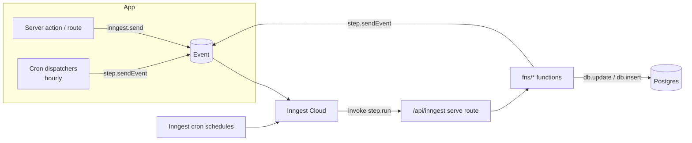

Anything slow, retryable, or scheduled runs as an **[Inngest](https://www.inngest.com)
function**, never inside a request handler. Crawls, citation checks, rank checks, blog
generation, GA4/GSC imports, digests, and webhook delivery all live in `lib/inngest/fns/*`.
A Next.js API route exposes them to Inngest Cloud, which drives both their event triggers and
their cron schedules.



## The client

The Inngest client carries **no secrets in code** - only an app id. Event keys, signing keys,
and the base URL come from Inngest's own env vars (or dev mode):

```ts
// lib/inngest/client.ts:1-9
import { Inngest } from "inngest";

/**
 * Inngest client. Events are loosely typed here; each function casts
 * `event.data` to the shape it expects. Long-running work (crawls, citation
 * checks, rank checks, blog generation, digests) runs as Inngest functions -
 * never inside request handlers.
 */
export const inngest = new Inngest({ id: "spyro" });
```

The rest of `client.ts` (lines 11-158) is just TypeScript payload interfaces
(`AuditRequestedData`, `WriterGenerateRequestedData`, `BlogPlanRequestedData`, …) used by
callers and handler casts - events are intentionally loosely typed.

## The serve route

`lib/inngest/functions.ts` collects every function into one flat `functions` array (41 in
total), and the API route serves them via Inngest's Next adapter:

```ts
// app/api/inngest/route.ts:1-16 (abridged)
import { serve } from "inngest/next";
import { inngest } from "@/lib/inngest/client";
import { functions } from "@/lib/inngest/functions";

export const maxDuration = 300; // Vercel Hobby max; each step is its own <300s invocation
export const { GET, POST, PUT } = serve({ client: inngest, functions });
```

`maxDuration = 300` caps each served step at 300s, so long jobs are split one `step.run` per
phase, and each phase becomes its own sub-300s invocation. "Registering crons" simply means
syncing this `/api/inngest` endpoint with Inngest Cloud - there is **no Vercel cron array**;
all schedules are Inngest `cron:` triggers on the functions below.

## Emitting events

Events are emitted two ways:

- **Directly** with `inngest.send({ name, data })` from server actions and inside handlers.
- **Durably** with `step.sendEvent(...)` for fan-out inside a handler (dispatchers, plan
  refill, URL checks).

`lib/inngest/emit.ts` holds two fire-and-forget helpers - `emitKnowledgeChanged()` and
`emitInitialInsightsRequested()` - that wrap the send in try/catch and **swallow failures**.
A dropped emit is acceptable here because the daily `knowledge-sweep` cron re-indexes any
delta the emit missed:

```ts
// lib/inngest/emit.ts:16-24
if (!workspaceId) return;
try {
  await inngest.send({
    name: "workspace/knowledge.changed",
    data: { workspaceId, userId, sourceTypes },
  });
} catch (e) {
  console.warn("[knowledge.changed] emit failed:", (e as Error).message);
}
```

## All registered functions

There are **41** functions across `lib/inngest/fns/*` (several files export more than one).
**15 are cron-triggered**, **25 are event-triggered**, and **1
(`competitor-gap-analysis`) is dual**. Cron strings below are verbatim and in UTC.

| Function id | Trigger | Schedule / event | What it does | Writes to |
| --- | --- | --- | --- | --- |
| `free-audit-cleanup` | cron | `0 3 * * *` | Purge expired free-audit reports | `free_audit_reports` |
| `audit-crawl-site` | event | `audit/requested` | Crawl + SEO/GEO/CWV checks + score + email | `audits`, `audit_issues`, `audit_pages` |
| `audit-weekly` | event | `audit/run.requested` | Per-workspace weekly audit (respects opt-out) | `audits` → emits `audit/requested` |
| `tracked-url-check` | event | `url-check/requested` | Re-check one watched URL | `tracked_urls` |
| `tracked-urls-weekly` | event | `audit/run.requested` | Fan out a check per tracked URL | `tracked_urls` → emits `url-check/requested` |
| `citations-check-one` | event | `citations/check-requested` | Run one tracked-prompt citation check | `citation_checks` |
| `citations-scheduled` | event | `citations/run.requested` | Weekly citation run over a workspace's prompts | `citation_checks` |
| `tracking-scheduled` | event | `tracking/run.requested` | Weekly Google rank check | `ranks` |
| `tracking-instant` | event | `tracking/instant.requested` | On-demand rank check | `ranks` |
| `weekly-digest` | event | `digest/run.requested` | Build + email per-workspace weekly digest | _(email only)_ |
| `site-index-build` | event | `site/index.requested` | RAG indexer: crawl → chunk → embed → replace | `site_indexes`, vector store |
| `workspace-knowledge-index` | event | `workspace/knowledge.changed` | Debounced (45s) re-embed of changed sources | vector store |
| `knowledge-sweep-daily` | cron | `0 4 * * *` | Daily safety sweep: rebuild stale namespaces | vector store |
| `workspace-onboarding` | event | `workspace/onboarding.requested` | Orchestrator: one crawl → 4 tracks | `site_indexes`, `audits` → fan-out |
| `site-intel-weekly` | event | `site-intel/run.requested` | Weekly off-domain intel snapshot | `workspace_intel_snapshots` |
| `article-write` | event | `article/write.requested` | Advanced writer pipeline + auto-publish | `blog_posts`, `article_research` → emits `image/pipeline.requested` |
| `blog-plan` | event | `ideas/plan.requested` | Generate 30-day idea plan (step per phase) | `blog_plans`, `blog_ideas` |
| `image-pipeline` | event | `image/pipeline.requested` | Director → featured → in-content images | `blog_posts` (imageStatus), image storage |
| `gsc-import-on-connect` | event | `workspace/gsc.connected` | Import 28d+90d GSC data on property pick | GSC perf tables → emits insights |
| `gsc-import-requested` | event | `workspace/gsc.import-requested` | Consumer of GSC dispatcher / manual re-sync | GSC perf tables |
| `ga4-import-on-connect` | event | `workspace/ga4.connected` | Import GA4 AI-referral data on property pick | GA4 referral tables, `integrations` |
| `ga4-import-requested` | event | `workspace/ga4.import-requested` | Consumer of GA4 dispatcher / manual re-sync | GA4 referral tables, `integrations` |
| `site-intel-weekly-dispatch` | cron | `0 * * * *` | Hourly local-time fan-out → site-intel | _(emits events)_ |
| `citations-scheduled-dispatch` | cron | `0 * * * *` | Hourly local-time fan-out → citations | _(emits events)_ |
| `tracking-scheduled-dispatch` | cron | `0 * * * *` | Hourly local-time fan-out → tracking | _(emits events)_ |
| `audit-weekly-dispatch` | cron | `0 * * * *` | Hourly local-time fan-out → audit | _(emits events)_ |
| `weekly-digest-dispatch` | cron | `0 * * * *` | Hourly local-time fan-out → digest | _(emits events)_ |
| `gsc-import-daily-dispatch` | cron | `0 * * * *` | Hourly; fire GSC import per connection ≥~23h old | emits `workspace/gsc.import-requested` |
| `ga4-import-daily-dispatch` | cron | `0 * * * *` | Hourly; same due-gate for GA4 | emits `workspace/ga4.import-requested` |
| `workspace-initial-insights` | event | `workspace/initial-insights.requested` | Recompute + cache dashboard insights | `workspaces.onboarding_state` |
| `scheduled-publish` | cron | `*/30 * * * *` | Publish posts whose `scheduled_at` arrived | `blog_posts` |
| `auto-generate-scheduled` | cron | `0 * * * *` | Hourly; at local hour 6, enqueue today's approved ideas | `blog_ideas`, `blog_posts` |
| `topic-discovery` | event | `ideas/discover.requested` | Planner-grade topic discovery (cap 50/ws) | `blog_ideas`, `topic_discovery_runs` |
| `plan-refill` | cron | `0 7 * * 1` | Mon 07:00; refill low idea runway | `blog_plans` → emits `ideas/plan.requested` |
| `integration-deliver` | event | `integration/deliver` | Sign + POST a webhook payload (4 retries) | `integration_deliveries`, `integrations` |
| `integration-deliver-failed` | event | `inngest/function.failed` | Flip integration to `failing` after 3 fails | `integrations` |
| `integration-deliveries-prune` | cron | `0 3 * * *` | Prune to last 200 deliveries per integration | `integration_deliveries` |
| `competitor-signals` | cron | `0 */6 * * *` | Every 6h; upsert ranking competitor domains | `workspace_competitors` |
| `competitor-gap-analysis` | event + cron | `competitors/gap.requested` and `0 3 * * 1` | Per-workspace (event) or all (Mon 03:00) gap analysis | gap-analysis tables |
| `post-fanout` | event | `post/fanout.requested` | Durable fan-out after a manual publish | via `fanoutPublishedPost` |
| `trial-ending-reminder` | cron | `0 9 * * *` | Daily; email orgs whose trial ends in 24-48h | _(email only)_ |

<Note>
  Apart from `plan-refill` (`0 7 * * 1`) and `competitor-gap-analysis` (`0 3 * * 1`), there
  are **no fixed weekly UTC crons left**. Every "weekly" job is actually an hourly cron
  *dispatcher* that fans out to per-workspace event consumers, gated on each workspace's local
  timezone - see below.
</Note>

## Per-workspace dispatchers

`lib/inngest/fns/dispatcher.ts` replaced the old global weekly UTC crons with **per-workspace
local-time fan-out**, so each workspace runs its weekly jobs on its own Monday. A factory
builds each dispatcher with id `${jobKey}-dispatch` and a `{ cron: "0 * * * *" }` trigger
(every UTC hour). On each tick it:

1. Lists every workspace's `id` + `timezone` (`dispatcher.ts:29-31`).
2. Filters to those whose **local clock** matches the job's configured fire time:
   `isLocalFireHour(w.timezone, JOB_SCHEDULE[jobKey], now)` (`dispatcher.ts:32`).
3. Emits one per-workspace event with an **idempotency event id**
   `${jobKey}:${w.id}:${week}`, so an at-least-once cron fire collapses to a single consumer
   run per workspace per ISO week (`dispatcher.ts:35-44`).

Five weekly dispatchers are instantiated from the factory (`dispatcher.ts:56-60`): site-intel,
citations, tracking, audit, and digest. Two more - `gscImportDispatcher` and
`ga4ImportDispatcher` - are hand-written (also `0 * * * *`) but use a **due-based gate**
instead of a fixed clock time: for each connected integration they check
`isDueForRefresh(meta.lastImportedAt, now)` (≥~23h old) with an hourly idempotency bucket, so
each connection self-paces to roughly once a day with a drifting fire time
(`dispatcher.ts:62-135`).

## Scheduling helpers - `lib/scheduling`

The dispatchers' timezone math is a dependency-free module (`Intl` only):

- **`JOB_SCHEDULE`** (`job-schedule.ts:21-27`) maps each weekly job key to a `{ dayOfWeek,
  hour }` **local** fire time - all on Monday: citations 0:00, site-intel 1:00, tracking 2:00,
  audit 4:00, digest 13:00.
- **`isLocalFireHour(tz, fire, now)`** (`:84-87`) projects `now` into the workspace tz and
  returns whether it matches the job's day+hour - the dispatcher's due-gate.
- **`nextLocalFire(tz, fire, now)`** (`:94-107`) computes the next matching UTC instant
  (iterating hour-by-hour, ≤192 iterations) - used to render "Next run: …" labels.
- **`isDueForRefresh(lastImportedAt, now, minHours = 23)`** (`:39-48`) gates the GA4/GSC daily
  dispatchers; `REFRESH_MIN_HOURS = 23` (`:35`).

`lib/scheduling/auto-generate.ts` exports a single pure gate
`shouldAutoGenerate({ expired, blogsUsed, blogLimit })` (`:5-12`): false if `expired`, else
`blogsUsed < blogLimit`. The actual hourly selection logic (local hour 6, 2-day grace window,
idempotency) lives in the `auto-generate-scheduled` function (`fns/auto-generate-scheduled.ts`),
which calls this gate per idea.

## Enqueue-and-poll and the inline fallback

User-facing long jobs use an **enqueue-and-poll** pattern so the request returns instantly.
`enqueueArticleWrite()` (`lib/writer/enqueue.ts:42-152`) is the canonical example - the Ideas
page, the writer form, and the chat agent all funnel through it:

1. Insert a `blog_posts` row with `status: "queued"` and return its id **immediately**
   (`enqueue.ts:44-58`).
2. Try to hand off durably via `inngest.send({ name: "article/write.requested", … })`
   (`:61-76`).
3. The writer UI then **polls** `blog_posts.status` / `step_status` until the function
   transitions it to `done` or `error`.

If `inngest.send` throws - typically local dev or a demo with no Inngest reachable - the
`catch` runs the entire writer **synchronously, in-process**, so the feature still works
without a job runner:

```ts
// lib/writer/enqueue.ts:77-80
} catch {
  // Inline fallback (dev/demo without Inngest).
  await db.update(blogPosts).set({ status: "running" }).where(eq(blogPosts.id, post.id));
  await initPipelineStatus(post.id);
  // ...classifyArticle → startResearchVersion → writeArticleAdvanced → persist + addUsage
```

The inline branch (`:81-149`) classifies, researches, writes, persists the finished
`blog_posts` row (`status: "done"`, markdown, meta, SEO score), and meters usage with
`addUsage(args.userId, "blogs", 1)` - exactly what the Inngest function would have done. On
error it sets `status: "error"` with the message (`:144-149`). Either way it returns
`post.id` (`:151`).

The same fallback shape exists for **URL checks**: `performUrlCheck` is shared by the
`tracked-url-check` Inngest function and an inline path used when Inngest isn't reachable
(`lib/audit/url-check-run.ts`). The softer variant - swallowing a failed emit and relying on
the daily `knowledge-sweep` cron - is used by the `emit.ts` helpers above.

## Related

- [Content Engine](/backend/content-engine) - the `article-write`, `blog-plan`, `image-pipeline`, and `topic-discovery` functions in their pipeline context
- [SEO Engine](/backend/seo-engine) - the `audit`, `tracking`, and `competitor-signals` jobs
- [GEO Engine](/backend/geo-engine) - the `citations` jobs
- [Integrations](/backend/integrations) - `ga4-import`, `gsc-import`, and `integration-deliver`
- [Billing](/backend/billing) - `trial-reminders` and `plan-refill`, and `addUsage` metering
- [Database](/backend/database) - the tables these jobs write
