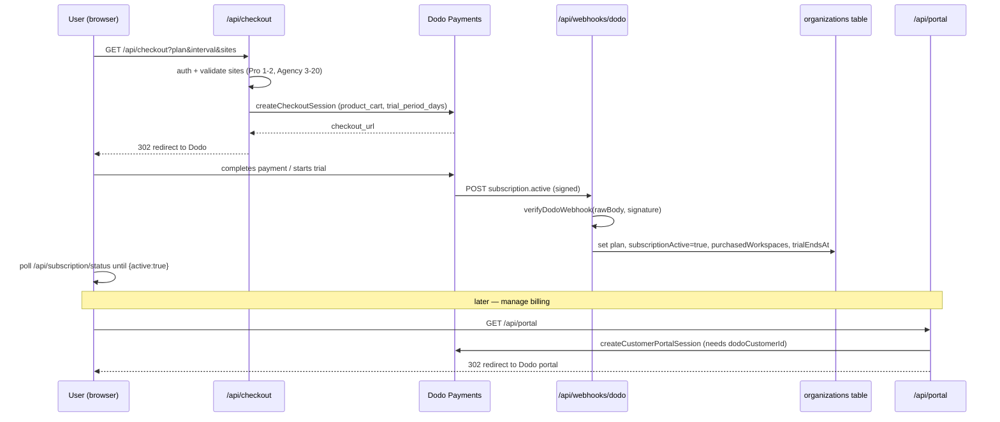

Spyro's billing runs entirely on **[Dodo Payments](https://dodopayments.com)** as the
merchant of record. Checkout, the customer portal, and subscription state are all driven
through Dodo, and the source of truth for what each plan can do lives in one file:
`lib/plans.ts`.

<Warning>
  **The README and `.env.local.example` still mention "Polar" — that is stale.** The live
  provider is Dodo: env vars are `DODO_*` (`lib/env.ts:93-107`), the webhook route is
  `app/api/webhooks/dodo/route.ts`, and migration `drizzle/0022_dodo_payments.sql` added the
  Dodo columns. There are **no `POLAR_*` env vars anywhere**. Two legacy `polar_*` columns
  survive in the schema for old data only — see [Legacy Polar remnants](#legacy-polar-remnants).
</Warning>

## Plans, prices and limits

There are exactly two self-serve plans — **Pro** and **Agency** — plus a marketing-only
**Custom** tier (21+ sites, contact sales). The `PlanId` type encodes this
(`lib/plans.ts:20`):

```ts
// lib/plans.ts:20
export type PlanId = "pro" | "agency";
```

<Note>
  **There is no "growth" plan you can buy.** `growth` is a *legacy database enum value* only.
  `normalizePlan()` maps any stored `"growth"` (or `null`) to `"pro"` at read time
  (`lib/plans.ts:227-230`), and `drizzle/0022_dodo_payments.sql:11`
  (`UPDATE "organizations" SET "plan" = 'pro' WHERE "plan" = 'growth'`) migrated the old rows.
  The DB enum is `["growth", "pro", "agency"]` (`lib/db/schema.ts:35`)
  because Postgres cannot `DROP VALUE` from an enum — see [Legacy remnants](#legacy-polar-remnants).
</Note>

### Pricing

Both plans are priced **per site** at a `$99/mo` base. Pro covers 1–2 sites; Agency covers
3–20 sites with a volume discount. Annual = pay for 10 months ("2 months free").

| | **Pro** | **Agency** |
| --- | --- | --- |
| Base price | `$99/mo` per site (`lib/plans.ts:154`) | `$99/mo` per site (`AGENCY_BASE_PER_SITE`, `lib/plans.ts:90`) |
| Sites | 1–2 (`PRO_MAX_SITES = 2`) | 3–20 (`AGENCY_MIN_SITES = 3`, `AGENCY_MAX_SITES = 20`) |
| 2-site total | `$198/mo` (no 2nd-site discount, `lib/plans.ts:127-130`) | — |
| Volume discount | none | 3–5 sites: 10% · 6–10: 15% · 11–20: 20% (`lib/plans.ts:101-106`) |
| White-label | `false` (`lib/plans.ts:174`) | `true` (`lib/plans.ts:206`) |
| 21+ sites | — | "Contact us" Custom tier, no self-serve checkout |

Agency pricing is computed, not stored — `agencyPrice(sites)` rounds `sites × $99 × (1 −
discount)` (`lib/plans.ts:109-113`). Adding a 3rd site auto-converts a Pro org to Agency.

<Warning>
  `.env.local.example:88-89` describes the 2-site Pro product as `$178/mo ($89×2)`. The code
  is authoritative and uses **`$198/mo ($99×2)`** (`lib/plans.ts:123`, `lib/env.ts:99-100`).
  The example file's numbers are out of date — quote `lib/plans.ts`, never the example.
</Warning>

### Per-plan limits

Agency is deliberately "Pro × N sites" — every per-site capability is identical; Agency only
differs on **workspace count** and **white-label** (`lib/plans.ts:188-190`). The shared
limits (`lib/plans.ts:158-209`):

| Limit | Pro | Agency |
| --- | --- | --- |
| `blogsPerMonth` (the core metered unit) | `30` | `30` per site |
| `workspaces` | `2` | `purchasedWorkspaces` (default 3) |
| `keywordsPerMonth` | `1000` | `1000` |
| `serpLookupsPerMonth` | `500` | `500` |
| `auditPages` | `500` | `500` |
| `blogIdeasPerMonth` | `30` | `30` |
| `inContentImagesPerPost` | `3` | `3` |
| `trackedPrompts` | `10` | `10` |
| `citationCallsPerMonth` | `600` | `600` |
| `aiCreditsPerMonth` | `200` | `200` |
| `trackedKeywordsMax` | `50` | `50` |
| `integrationsMax` | `5` | `5` |
| `engines` | AI Overview, Gemini, ChatGPT, Claude, Perplexity | same |

<Info>
  **There are no credit packs.** Despite older planning docs, `lib/plans.ts:11` states the
  quota model is "**blogs per month** (no word credits, no credit packs)," and no
  `CREDIT_PACKS` const or one-time-purchase flow exists anywhere in the code. The two metered
  pools are `blogsPerMonth` (AI Writer allowance) and `aiCreditsPerMonth` (a shared
  per-workspace pool consumed by **both** agent chat turns and keyword research). A vestigial
  `credits_balance` column exists in the schema (`lib/db/schema.ts:90`, default 0) but no
  billing code writes it.
</Info>

## The Dodo client

All Dodo HTTP calls go through `lib/dodo/index.ts`, which selects the API host from
`DODO_ENV` and authenticates with a bearer token:

```ts
// lib/dodo/index.ts:32-42 (abridged)
const BASE = env.DODO_ENV === "live_mode"
  ? "https://live.dodopayments.com"
  : "https://test.dodopayments.com";
// every request: Authorization: `Bearer ${env.DODO_API_KEY}`
```

The relevant env vars (`lib/env.ts:93-107`): `DODO_API_KEY`, `DODO_WEBHOOK_SECRET`,
`DODO_ENV` (`test_mode` | `live_mode`, default `test_mode`), `DODO_PRODUCTS` (a map of
`pro_monthly`, `pro_annual`, `pro2site_monthly`, `pro2site_annual`, `agency_monthly`,
`agency_annual` → Dodo product IDs), and `DODO_DISCOUNTS` (`agency10/15/20`). The feature
flag `dodoConfigured = Boolean(env.DODO_API_KEY)` (`lib/env.ts:199`) gates the whole flow.

Key methods:

- **`createCheckoutSession`** (`lib/dodo/index.ts:96-151`) — `POST ${BASE}/checkouts`.
- **`changeSubscription`** (`:178-219`) — `PATCH ${BASE}/subscriptions/{id}` with
  `proration_billing_mode: "prorated_immediately"`.
- **`createCustomerPortalSession`** (`:221-235`) — `POST ${BASE}/customers/{id}/customer-portal/session`.
- **`verifyDodoWebhook`** (`:240-266`) — Standard Webhooks signature verification (below).

## Checkout → portal → webhook flow



### Checkout — `app/api/checkout/route.ts`

A `GET` handler (`:22-77`) authenticates the user, validates `plan`/`interval`/`sites`
(Pro 1–2, Agency 3–20, otherwise a 400 with a contact-sales message), loads the org by
`ownerUserId`, and calls `createCheckoutSession`. The checkout body opens the
Dodo-managed trial inline (`lib/dodo/index.ts:110-124`):

```ts
// lib/dodo/index.ts:110-124 (abridged)
const body = {
  customer: { email: input.email, external_id: input.orgId },
  product_cart: [{ product_id: productId, quantity: sites }],
  subscription_data: { trial_period_days: TRIAL_DAYS },
  metadata: { org_id, plan, interval, sites: String(sites) },
  return_url: input.successUrl,   // /onboarding?checkout=pending
};
```

Pro sends `quantity: 1` (the 2-site price is baked into a dedicated product); Agency sends
`quantity = site count` plus any volume discount codes. The handler then 302-redirects to the
Dodo URL (`checkout_url ?? payment_link ?? url`).

### Portal — `app/api/portal/route.ts`

A `GET` handler (`:10-33`) requires `org.dodoCustomerId` (400 if missing), opens a Dodo
customer-portal session, and redirects the user to manage payment methods and cancellation.

### Subscription status & updates — `app/api/subscription/*`

- **`status/route.ts`** (`GET`, `:11-22`) is `force-dynamic` and returns
  `{ active: hasBillingAccess(org) }`. The onboarding UI polls this after checkout because
  activation is asynchronous (it arrives via webhook).
- **`update/route.ts`** (`POST`, `:23-121`) is owner-only (403 otherwise). It validates the
  new plan/interval/sites, enforces a **downgrade floor** — you cannot drop `sites` below the
  org's current workspace count (`:73-84`) — and calls `changeSubscription`. With no
  `dodoSubscriptionId` it returns 409 with a fresh `checkoutUrl`. After a change it
  optimistically writes the new plan locally; the webhook reconciles the authoritative state.

### Webhook — `app/api/webhooks/dodo/route.ts`

The `POST` handler (`:45-141`) is the authoritative writer of subscription state.

1. **Verify the signature** first — an invalid signature returns 400 (`:47-48`).
   `verifyDodoWebhook` (`lib/dodo/index.ts:240-266`) implements the Standard Webhooks
   (svix-style) scheme: HMAC-SHA256 over `${id}.${timestamp}.${rawBody}` using the
   base64-decoded `DODO_WEBHOOK_SECRET` (the `whsec_` prefix is stripped), compared against
   the `v1,<sig>` pairs in the `webhook-signature` header.
2. **Extract** `org_id` from metadata, `customer_id`, `subscription_id`, and the trial-end
   timestamp. A missing `org_id` logs and returns ok (`:65-68`).
3. **Classify** the event into activating vs deactivating (`:79-88`):

```ts
// app/api/webhooks/dodo/route.ts:79-88
const isActivating =
  type === "subscription.active" ||
  type === "subscription.renewed" ||
  type === "subscription.updated" ||
  type === "subscription.plan_changed" ||
  type === "payment.succeeded";
const isDeactivating =
  type === "subscription.cancelled" ||
  type === "subscription.failed" ||
  type === "subscription.expired";
```

4. **Write the `organizations` row** (`:100-114`). Every event sets `dodoCustomerId` and
   `dodoSubscriptionId`. An activating event additionally writes `plan`, `planInterval`,
   `subscriptionActive = true`, `purchasedWorkspaces = sites`, and `trialEndsAt` (if present).
   A deactivating event sets `subscriptionActive = false`.
5. **Send a transactional email** best-effort (`:118-138`): the first activation
   (`isActivating && !wasActive`) sends the welcome email; `subscription.cancelled` and
   `payment.failed` send their respective emails. A mail failure never fails the webhook.

<Note>
  `payment.failed` only triggers an email — it does **not** deactivate the subscription
  (`:127`). Deactivation comes from `subscription.cancelled`/`failed`/`expired`.
</Note>

## The billing gate

Every expensive feature is gated by one tiny function — there is no scattered plan-checking:

```ts
// lib/billing/access.ts:9-11
export function hasBillingAccess(org: Pick<Organization, "subscriptionActive">): boolean {
  return org.subscriptionActive === true;
}
```

The gate keys strictly on `subscription_active`, which the Dodo webhook sets `true` even
during the managed trial. The file comment is explicit: **never** gate on the legacy local
`trialEndsAt`, or unpaid users get free days of expensive jobs (`lib/billing/access.ts:4-7`).

## Trial logic

The trial is **Dodo-managed, not local**. New orgs are created inactive with no local trial
clock — `createPersonalOrg` sets `plan: "pro"` and `subscriptionActive` defaulting to false,
and deliberately sets no `trialEndsAt` (`lib/org.ts:38-71`). The trial is opened at checkout
via `subscription_data: { trial_period_days: TRIAL_DAYS }`, and `trialEndsAt` is persisted
only from the webhook payload.

The trial constants (`lib/plans.ts:222-224`):

```ts
// lib/plans.ts:222-224
export const TRIAL_DAYS = 3;
/** Trial allows 3 blogs total (not per-month). */
export const TRIAL_BLOG_QUOTA = 3;
```

`blogQuota()` resolves the period's blog allowance: in-trial → 3 total, expired → 0, else the
plan's `blogsPerMonth` (`lib/plans.ts:246-250`). For display, `effectiveAccess(org)`
(`lib/profile.ts:39-49`) derives `inTrial`, `trialDaysLeft`, and `expired` from
`subscriptionActive` + `trialEndsAt` — but the hard gate is always `hasBillingAccess`.

<Warning>
  **Trial length is 3 days, not 7.** The runtime constant is `TRIAL_DAYS = 3`
  (`lib/plans.ts:222`), but stale comments in `lib/billing/access.ts:6`,
  `app/api/webhooks/dodo/route.ts`, and `.env.local.example:78` still say "7-day trial."
  Trust the constant.
</Warning>

## Usage metering & limit enforcement

Metering lives in `lib/usage.ts`, backed by the `usage_counters` table keyed by `userId` +
`metric` + `periodStart` (a UTC calendar month). The metric union (`lib/usage.ts:7-15`)
covers `keywords`, `serp`, `audit_pages`, `blog_ideas`, `blogs`, and three per-workspace
buckets: `ai_credits:<wsId>`, `tracked_keywords:<wsId>`, and `citation_calls:<wsId>`.

- **`addUsage(userId, metric, n = 1)`** (`:66-83`) atomically increments (inserting the row
  if missing) and returns the new count. The AI Writer calls `addUsage(userId, "blogs", 1)`
  on a successful, non-mocked draft (`lib/writer/enqueue.ts:143`).
- **`checkUsage(userId, metric, limit)`** (`:92-96`) is the enforcement point:

```ts
// lib/usage.ts:92-96
export async function checkUsage(userId: string, metric: Metric, limit: number): Promise<UsageCheck> {
  const used = await getUsage(userId, metric);
  const allowed = withinLimit(used, limit);
  return { used, limit, allowed, remaining: limit < 0 ? -1 : Math.max(0, limit - used) };
}
```

`withinLimit(used, limit)` (`lib/plans.ts:240-242`) returns `isUnlimited(limit) || used <
limit`, where a negative limit means unlimited. The `citationCallsPerMonth = 600` ceiling
doubles as a runaway-loop circuit breaker so a retry storm self-stops instead of draining the
OpenRouter key (`lib/usage.ts:98-104`). Counters reset on the 1st of each month, UTC
(`quotaResetLabel`, `lib/usage.ts:116`).

## Legacy Polar remnants

Spyro previously used Polar. Migration `drizzle/0022_dodo_payments.sql` (2026-05-27) added
the Dodo columns and migrated `plan='growth' → 'pro'`, but it did **not** drop the old Polar
columns. The complete, current set of remnants:

- **Two schema columns** on `organizations`, kept nullable for legacy data and never written
  to by new code (`lib/db/schema.ts:86-87`):

  ```ts
  // lib/db/schema.ts:86-87
  polarCustomerId: text("polar_customer_id"),
  polarSubscriptionId: text("polar_subscription_id"),
  ```

  The schema comment (`:82-83`) flags them: "Polar columns kept nullable for legacy data, but
  no new writes go to them — see lib/dodo + /api/webhooks/dodo."
- **The `growth` enum value** in `planEnum = pgEnum("plan", ["growth", "pro", "agency"])`
  (`lib/db/schema.ts:35`), retained because Postgres can't drop an enum value.
- **No `POLAR_*` env vars** — `lib/env.ts:93-107` and `.env.local.example:80-97` define only
  `DODO_*`. "Polar" appears only as a stale comment in `.env.local.example:17`.

## Related

- [Database](/backend/database) — the `organizations` and `usage_counters` tables and the plan enum
- [Authorization](/backend/authorization) — how `hasBillingAccess` and plan limits gate features
- [Background Jobs](/backend/background-jobs) — `trial-reminders` and `plan-refill` crons, and metered job work
- [Content Engine](/backend/content-engine) — the `blogsPerMonth` metered unit in action
- [Integrations](/backend/integrations) — Resend sends the welcome / cancellation / payment-failed emails
- [Environment variables](/reference/environment-variables) — the `DODO_*` keys
