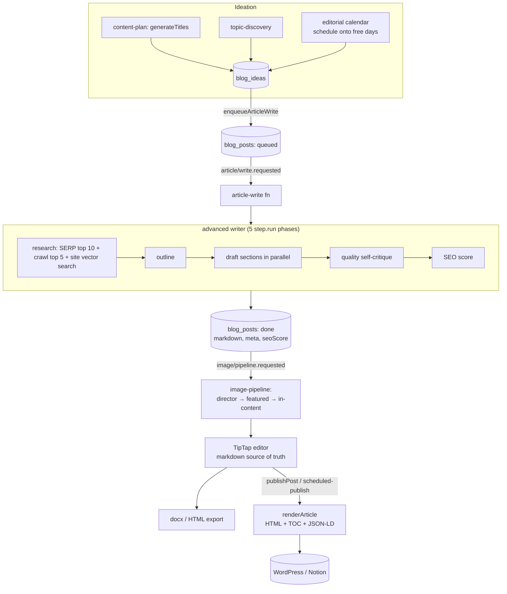

The content engine turns a workspace's keyword strategy into published, SEO- and GEO-optimized
blog posts. It spans idea planning (`lib/seo/content-plan/*`), the advanced writer
(`lib/writer/*`, `lib/research/*`), image generation (`lib/images/*`), the TipTap editor, and
publishing (`lib/publish/*`). The slow stages run as [background jobs](/backend/background-jobs);
the request handlers only enqueue and poll.



## 1. Ideation — the content plan

Ideas live in the `blog_ideas` table with an `idea_status` of `suggested`, `approved`, `sent`,
or `needs_review` (`lib/db/schema.ts:52`). They arrive three ways:

- **The content plan** (`lib/seo/content-plan/*`) — the `blog-plan` job
  (`ideas/plan.requested`) assembles a 30-day plan. It builds a `BusinessProfile`, gathers and
  gates keyword candidates (relevance, ranking, GEO), then calls `generateTitles()` to turn
  gated candidates into on-brand `PlannedIdea`s with an LLM (`lib/seo/content-plan/assemble.ts:25-52`).
  Each idea carries a `primaryKeyword`, `longTails`, `intent`, `funnelStage`, `difficulty`, a
  pillar, and a two-sentence SEO+GEO brief.
- **Topic discovery** (`lib/inngest/fns/topic-discovery.ts`, `ideas/discover.requested`) — the
  `findRankableTopics` agent tool persists up to 50 `suggested` ideas per workspace and updates
  `topic_discovery_runs`.
- **The editorial calendar** (`lib/calendar/*`) — `scheduleIdeas` places approved ideas onto the
  next free `YYYY-MM-DD` days without double-booking, tagged with a `batchId`
  (`lib/calendar/mutations.ts`). The dashboard polls plan progress through
  `GET /api/content-plan/[workspaceId]` (`app/api/content-plan/[workspaceId]/route.ts`).

The LLM titles come from `getLLM().generateJson(...)` at the `capable` tier — see
[AI](/backend/ai) for the provider stack (OpenRouter primary).

## 2. Enqueue and write

Every "write this" action — the writer form, an approved idea, the chat agent, or the
autonomous cron — funnels through `enqueueArticleWrite()` (`lib/writer/enqueue.ts:42`). It
inserts a `blog_posts` row with `status: "queued"`, returns the id immediately, and emits
`article/write.requested`. The writer UI then polls. If Inngest is unreachable, the same
function runs the entire writer inline — see the
[enqueue-and-poll pattern](/backend/background-jobs#enqueue-and-poll-and-the-inline-fallback).

## 3. The advanced writer

`lib/writer/advanced.ts` is the pipeline, exposed as five JSON-serializable phase functions so
the `article-write` Inngest job can run each as its own `step.run` (one Vercel invocation each,
under the 300s ceiling) and retry a single failed phase without re-billing the whole writer
(`lib/writer/advanced.ts:18-24`):

<Steps>
  <Step title="Research">
    SERP top 10 for the primary keyword, crawl the top 5 results to learn the structure to
    beat, and vector-search the workspace's own site index for internal-link candidates and a
    voice sample (`lib/writer/advanced.ts:1-13`). Live web research runs through
    `lib/research/web.ts`, which drives **Kimi K2 via OpenRouter's `:online` suffix** (Exa-backed
    search) with **Jina Reader** as a verification layer — failures degrade to a SERP-only run
    rather than throwing (`lib/research/web.ts:1-16`).
  </Step>
  <Step title="Outline">
    A capable model returns a JSON outline (sections, slug).
  </Step>
  <Step title="Write">
    Each section is drafted in parallel (~400 words each → ~2400-2600 total), in the workspace's
    derived business voice (`req.tone`).
  </Step>
  <Step title="Quality">
    A self-critique pass (`lib/writer/quality.ts` `checkArticle`) returns a JSON verdict; if it
    finds critical issues, the affected section is regenerated once. Deterministic enforcers then
    fix mechanics — `enforceTitle`, `splitLongParagraphs`, `ensureKeywordInFirst100`,
    `nudgeDensity` (`lib/writer/enforce.ts`) — and `stripDashes` sanitizes
    (`lib/writer/sanitize.ts`).
  </Step>
  <Step title="Score">
    `scoreArticle` (`lib/seo/article-score.ts`) computes the SEO score stored on the post. See
    [SEO Engine](/backend/seo-engine).
  </Step>
</Steps>

The finished `blog_posts` row is updated with `status: "done"`, `markdown`, `metaTitle`,
`metaDescription`, `wordCount`, `seoScore`, `qualityChecks`, `slug`, and `articleType`
(`lib/writer/enqueue.ts:127-142`). On a non-mocked completion the writer meters one blog:

```ts
// lib/writer/enqueue.ts:143
if (!written.mocked) await addUsage(args.userId, "blogs", 1);
```

This is the **core credit-metered unit** — the plan's `blogsPerMonth` allowance (30 on both Pro
and Agency). See [Billing](/backend/billing#usage-metering--limit-enforcement).

## 4. Images

When a draft finishes, `article-write` emits `image/pipeline.requested`, and the
`image-pipeline` job runs **director → featured → in-content**. A directing pass plans the
images; `runImageGeneration` (`lib/images/run.ts:24`) generates the brand-aware featured banner
(default 1280×720, `:18`) and up to `inContentImagesPerPost` (3) between-section images. The
module handles generation providers (`lib/images/openai.ts`, `lib/images/openrouter.ts`), alt
text (`alt.ts`), charts (`chart.ts`), real screenshots (`screenshotone.ts`), and resizing. The
pipeline owns the post's `imageStatus`, so the editor only opens once every image is finished
(`lib/images/run.ts:20-23`).

## 5. The editor and exports

The writer page (`app/(app)/[org]/[workspace]/writer/[id]/page.tsx`) renders a **TipTap**
editor where **markdown is the source of truth** — the editor is seeded from a markdown string
and emits markdown on every edit (`components/app/writer/article-editor.tsx:37-41`). It composes
`StarterKit`, `TableKit`, `Placeholder`, `Image`, `tiptap-markdown`, a Notion-style
`SlashCommand`, and a selection `BubbleMenu` (`article-editor.tsx:10-16`).

Two export routes serve the finished post:

- **`GET .../writer/[id]/docx`** — `markdownToDocx` (`lib/writer/docx.ts`) does a light
  markdown→Word conversion (headings, paragraphs, bullets) and streams a `.docx` attachment
  (`app/(app)/[org]/[workspace]/writer/[id]/docx/route.ts`). It is gated by `requireAccess`
  and only serves posts whose `status === "done"`.
- **`GET .../writer/[id]/html`** — serves the rendered HTML.

`GET /api/blog-post/[postId]` is the status poller used by the chat agent after a `draftArticle`
handoff — it returns `status`, `imageStatus`, `wordCount`, and an `href` once `done`
(`app/api/blog-post/[postId]/route.ts:33-44`).

## 6. Render

Publishing always goes through `renderArticle()` (`lib/publish/render/index.ts:73`), which
converts the post into clean, publish-ready HTML:

- **TOC** — it strips the writer's own `## Table of Contents` markdown section and generates an
  accessible `<nav class="toc">` from the extracted headings, inserted after the quick-answer
  blockquote (`render/index.ts:60-89`).
- **JSON-LD schema** — `buildSchema` assembles Article + FAQ (parsed from the `## FAQ` section) +
  HowTo step data; `schemaToScript` emits the `<script type="application/ld+json">`. Schema is
  only injected when the target has no SEO plugin of its own (`render/index.ts:96-116`).
- **Meta** — title, description, canonical URL (`siteUrl/slug`), focus keyword, and slug
  (`render/index.ts:122-128`).

## 7. Publish to a CMS

`lib/publish/index.ts` registers three real publish providers — no mock path:

```ts
// lib/publish/index.ts:9-19
const REGISTRY: Record<PublishProviderId, PublishProvider> = {
  wordpress_org: wordpressOrgProvider,
  wordpress_com: wordpressComProvider,
  notion: notionProvider,
};
```

`dispatchPublish()` (`lib/publish/dispatch.ts:22`) is the server-only path shared by the
`publishPost` action and the background scheduler. It loads the post and the integration,
decrypts the credentials (`decryptJson(conn.secretCipher)`), resolves the author, renders the
article, calls `impl.publish(...)`, and writes `publishedProvider`, `publishedUrl`, and
`publishedAt` back to `blog_posts` (`lib/publish/dispatch.ts:97-105`). WordPress posts are
created as **drafts** by default — see [Integrations](/backend/integrations#wordpress-publishing-push).

Scheduling and fan-out run as jobs: the `scheduled-publish` cron (`*/30 * * * *`) publishes
posts whose `scheduled_at` has arrived, and `post-fanout` runs durable follow-up after a manual
publish. The advanced writer can also auto-publish on completion when `autoPublish` is set.

## Related

- [Background Jobs](/backend/background-jobs) — the `article-write`, `blog-plan`, `image-pipeline`, `topic-discovery`, `scheduled-publish`, and `post-fanout` functions
- [AI](/backend/ai) — `getLLM()` provider tiers, the research model, and prompts
- [SEO Engine](/backend/seo-engine) — `scoreArticle`, keyword data, and SERP grounding
- [GEO Engine](/backend/geo-engine) — the GEO half of the SEO+GEO briefs
- [Integrations](/backend/integrations) — WordPress / Notion publishing and credentials
- [Billing](/backend/billing) — the `blogsPerMonth` metered unit and `inContentImagesPerPost` cap
- [Database](/backend/database) — the `blog_ideas`, `blog_posts`, `blog_plans`, and `article_research` tables
