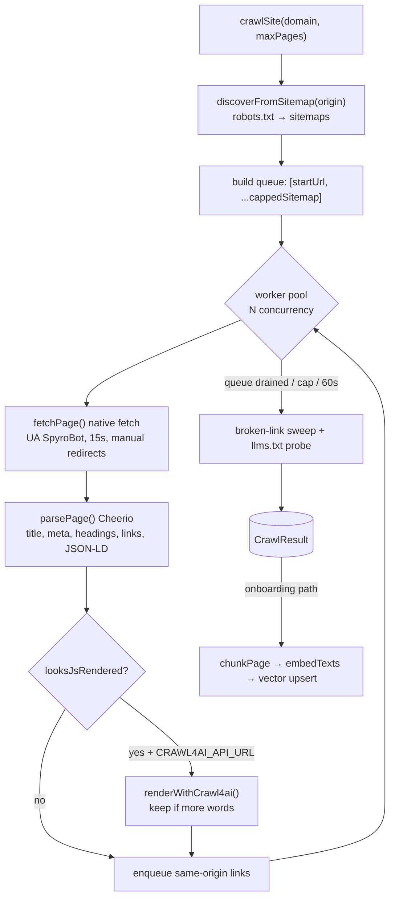

The crawler (`lib/crawler/*`) is a **same-origin breadth-first crawler** built on
native `fetch` (undici) and **Cheerio**, with an optional headless re-render
offloaded to a self-hosted crawl4ai server. It produces the `CrawledPage` data that
the [SEO engine](/backend/seo-engine), [GEO engine](/backend/geo-engine),
[Audit](/backend/audit), and RAG indexer all consume.

<Note>
  There is no Playwright in the bundle. JS rendering is opt-in and remote — see
  [crawl4ai render](#fetching-and-optional-js-render) below.
</Note>

## Two entry points

The crawler exposes two orchestration paths because the Inngest onboarding pipeline
must never pass raw HTML across a step boundary:

| Entry point | Used by | Behavior |
|---|---|---|
| `crawlSite(domain, maxPages, opts)` | free-audit tool | one call: discover → BFS fetch → parse → score |
| `discoverUrls()` + `crawlUrls()` / `processCrawlBatch()` | onboarding (Inngest) | discovery and per-batch fetch+chunk+store are separate steps |



The free-audit path then **scores** the result; the onboarding path chunks each
page (`chunkPage`), embeds in batches of 96, and upserts into the vector store
(`lib/onboarding/crawl-batch.ts:66-87`). Both the audit-issue and audit-page writes
are delete-then-insert so an Inngest retry is idempotent.

## Discovery

Discovery resolves the URL queue from `robots.txt` and sitemaps before any page
body is fetched (`discoverFromSitemap`, `lib/crawler/sitemap.ts:183`):

1. Fetch `robots.txt`, extract `Sitemap:` lines (max 5).
2. Probe those plus default paths (including WordPress `/wp-sitemap.xml`).
3. Parse each sitemap with Cheerio in XML mode, distinguishing `<sitemapindex>`
   from `<urlset>`, recursing into child sitemaps up to depth 2.
4. Keep only same-origin URLs, dedupe, cap.

Hard limits keep discovery bounded (`sitemap.ts:10-24`):

| Limit | Value |
|---|---|
| `MAX_TOTAL_URLS` | 5000 |
| `MAX_CHILD_SITEMAPS` | 5 |
| `MAX_BODY_BYTES` | 5 MB |
| `MAX_INDEX_DEPTH` | 2 |
| `DISCOVERY_DEADLINE_MS` | 25,000 |

`fetchText` retries only transient failures — a `404`/`410` means "definitively
absent" and is not retried.

## robots.txt handling

The crawler identifies as **`SpyroBot`** and respects robots rules at two points:
the seed/homepage and every discovered link. The parser groups rules by user-agent,
correctly handling consecutive `User-agent` lines that share one rule block
(`lib/crawler/robots.ts:25`).

Allow/disallow follows the RFC 9309 / Google **longest-match-wins** rule, with
`Allow` beating `Disallow` on an equal-length tie:

```ts
// lib/crawler/robots.ts:168
export function pathAllowedByGroup(group: RobotsGroup | null, path: string): boolean {
  if (!group) return true;
  let disallow = -1, allow = -1;
  for (const d of group.disallow)
    if (robotsPatternMatches(d, path)) disallow = Math.max(disallow, ruleLength(d));
  if (disallow < 0) return true;              // nothing disallows it
  for (const a of group.allow)
    if (robotsPatternMatches(a, path)) allow = Math.max(allow, ruleLength(a));
  return allow >= disallow;                    // equal-or-longer Allow overrides
}
```

Pattern matching supports the `*` wildcard and the trailing `$` anchor, falling
back to prefix matching (`robots.ts:127`). `effectiveRobotsGroup` resolves the
`SpyroBot` group, falling back to `*`, then to "no rules → everything crawlable".

The same module also reports **AI-bot access** for the audit: whether `GPTBot`,
`ClaudeBot`, `PerplexityBot`, `Google-Extended`, `CCBot`, `Bytespider`,
`Amazonbot`, or `Applebot-Extended` are disallowed from `/` (`AI_BOTS`,
`robots.ts:12`). This feeds the GEO `ai_crawler_access` issue.

## Fetching and optional JS render

The primary fetch is native `fetch`. When a `validateUrl` SSRF guard is present,
redirects are handled **manually** (max 6 hops) so each hop is re-validated:

```ts
// lib/crawler/index.ts:268, 92 (UA)
// UA = "SpyroBot/1.0 (+https://spyro.app/bot)"
const res = await fetch(current, {
  headers: { "User-Agent": UA, Accept: "text/html,application/xhtml+xml" },
  redirect: "manual",
  signal: AbortSignal.timeout(15000),
});
```

Fetches retry up to twice on `429`/`5xx` with exponential backoff.

**JS render is optional** and only fires when `CRAWL4AI_API_URL` is set and the page
*looks* JS-rendered — `looksJsRendered` returns true when `wordCount < 30`, or SPA
markers (`__next`, `data-reactroot`, `__nuxt`) are present with `wordCount < 120`
(`lib/crawler/render.ts:37`). The render is POSTed to a self-hosted crawl4ai server:

```ts
// lib/crawler/render.ts:105
const res = await fetch(`${API_URL}/crawl`, {
  method: "POST",
  headers: { "Content-Type": "application/json", ...authHeaders() },
  body: JSON.stringify({
    urls: [url], priority: 10,
    crawler_params: {
      headless: true, verbose: false,
      magic: true,                  // dismiss cookie/consent popups
      wait_for: "body", delay_before_return_html: 1.5, page_timeout: 30000,
    },
  }),
  signal: AbortSignal.timeout(90000),
});
```

A rendered page is **only kept if it yields more words** than the Cheerio parse
(`index.ts:552`), and the render never throws — it returns `null` on any failure.
`scripts/test-crawl4ai.ts` is a standalone smoke test for this endpoint.

## Parsing with Cheerio

`parsePage` (`lib/crawler/index.ts:310`) loads the HTML with Cheerio and extracts
everything the downstream engines need:

```ts
// lib/crawler/index.ts:310
export function parsePage(url, html, status, loadMs, redirectChain, origin): CrawledPage {
  const $ = cheerio.load(html);
  const text = $("body").text().replace(/\s+/g, " ").trim();
  // ...
}
```

| Field | Selector / logic |
|---|---|
| `title` / `metaTitle` | `$("title")`, `meta[name=description]` for `metaDescription` |
| `h1` / `h2` / `h3` | heading text arrays |
| JSON-LD types + `sameAs` | `script[type="application/ld+json"]`, recurses into `@graph` |
| internal vs external links | `a[href]` normalized, split by www-agnostic origin, self-links excluded |
| images missing alt | `img` count of empty/missing `alt` |
| `headingLevels` | `h1..h6` in document order |
| mixed content | `http://` subresources across `script/img/iframe/link[stylesheet]/...` |
| `hreflang` | `link[rel="alternate"][hreflang]` |
| canonical / robots / viewport / OG | `link[rel=canonical]`, `meta[name=robots]`, viewport, `og:*` |
| `needsJsRender` | `looksJsRendered(...)` |

`normalizeUrl` strips the hash and tracking params (`utm_*`, `fbclid`, `gclid`),
rejects non-http(s), and trims the trailing slash (`index.ts:240`).

A **separate** Cheerio parse drives RAG chunking (`lib/embed/chunker.ts`):
`extractBodyText` strips `script/style/nav/header/footer/aside/noscript/form`,
prefers `<main>` → `<article>` → `<body>`, and walks block elements into
heading-delimited sections. The chunker targets ~500 tokens with 50-token overlap
and skips error/empty/`wordCount < 30` pages.

## Concurrency and limits

`p-limit` is listed as a dependency (`package.json:76`), but `crawlSite` does **not**
use it for page crawling — that concurrency is hand-rolled with a fixed-size worker
pool. `concurrency` workers (default 1; the free-audit passes 5) pull from a shared
queue, marking `visited` at dequeue and gating an in-flight `active` count so the pool
never overshoots `maxPages`:

```ts
// lib/crawler/index.ts:677
await Promise.all(Array.from({ length: concurrency }, () => worker()));
```

| Limit | Value / source |
|---|---|
| Wall-clock per crawl | `CRAWL_MAX_MS = 60_000` (`index.ts:535`) |
| Page cap | `maxPages` (free-audit site = 20, single page = 1) |
| Queue growth cap | enqueue only while `pages + queue < maxPages * 2` |
| Per-fetch timeout | 15s |
| Broken-link sweep | up to `min(maxPages*3, 150)` sampled links, HEAD-then-GET via an **unbounded** `Promise.all` (`index.ts:685-692`); skipped when `checkLinks: false` |
| Skipped paths | `SKIP_PATH_RE` — login/account/legal/cart/search/feed/sitemap |

A generic `mapWithLimit<T>` helper (`index.ts:184`) provides bounded parallelism, but
it is used by the onboarding `checkLinkStatuses` path (`index.ts:762-768`), **not** the
`crawlSite` broken-link sweep above (which is unbounded).

## SSRF protection

Because the free-tool crawl path is **public and unauthenticated**, it injects an
SSRF guard (`assertPublicUrl`, `lib/free-tools/shared/ssrf.ts`) as the crawler's
`validateUrl`, run **before every fetch including each redirect hop**
(`index.ts:267`). The internal onboarding crawl does not pass a validator because
its URLs come from trusted sitemap discovery, not user input.

```ts
// lib/free-tools/shared/ssrf.ts (excerpt)
export async function assertPublicUrl(rawUrl: string): Promise<void> {
  let u: URL;
  try { u = new URL(rawUrl); } catch { throw new SsrfError("Invalid URL"); }
  if (u.protocol !== "http:" && u.protocol !== "https:") throw new SsrfError(`Blocked scheme: ${u.protocol}`);
  if (u.username || u.password) throw new SsrfError("Credentials in URL are not allowed");
  if (u.port && u.port !== "80" && u.port !== "443") throw new SsrfError(`Blocked port: ${u.port}`);
  const host = u.hostname.replace(/^\[|\]$/g, "");           // unwrap IPv6 brackets
  const lowered = host.toLowerCase();
  if (lowered === "localhost" || lowered.endsWith(".localhost") || lowered.endsWith(".internal") || lowered.endsWith(".local"))
    throw new SsrfError(`Blocked host: ${host}`);
  if (net.isIP(host)) { if (isPrivateIp(host)) throw new SsrfError(`Blocked private IP: ${host}`); return; }
  const records = await lookup(host, { all: true });          // resolve ALL A/AAAA records
  for (const r of records) if (isPrivateIp(r.address)) throw new SsrfError(`Host resolves to private IP: ${host}`);
}
```

The defenses, layered:

- **Scheme allowlist** — `http`/`https` only.
- **No URL credentials**, **default ports only** (80/443).
- **Hostname blocklist** — `localhost`, `.local`, `.internal`, `.localhost`.
- **Private-range IP blocking** for both IPv4 and IPv6, including loopback,
  RFC-1918, CGNAT (`100.64.0.0/10`), link-local, and the cloud metadata address
  `169.254.169.254`.
- **DNS rebinding defense** — resolves the host and checks **all** A/AAAA records;
  per-hop re-validation bounds the TOCTOU window.

`normalizeDomainInput` (`lib/url/normalize-domain.ts`) does shape-level filtering
only (rejects `localhost`, IPv6, ports) and defers the real IP/DNS check to
`assertPublicUrl`. See [Security](/backend/security) for the broader picture.

## site-intel — off-domain intelligence

`lib/site-intel/*` is a sibling, not part of page crawling. It provides
**off-domain competitive intelligence** — backlinks, domain authority, the keywords
a domain ranks for, and its SERP competitors — behind a vendor-agnostic
`SiteIntelProvider` seam. It uses DataForSEO when credentials exist, else a
deterministic keyless mock (`lib/site-intel/index.ts:15`):

```ts
_provider = env.DATAFORSEO_LOGIN && env.DATAFORSEO_PASSWORD
  ? createDataForSeoSiteIntel()
  : createMockSiteIntel();
```

`runSiteIntel` (used by onboarding and a weekly cron) fetches ranked keywords,
competitor domains (filtered against a ~90-entry mega-site blocklist so the results
aren't flooded with YouTube/Reddit), and Ahrefs DR, then writes one
`workspaceIntelSnapshots` row and warms the keyword cache. It does **no** tech-stack
detection and never fetches the target's own pages — that is the crawler's job.

## Related

- [SEO Engine](/backend/seo-engine) — consumes `CrawledPage` for issue detection
- [GEO Engine](/backend/geo-engine) — reads JSON-LD, `sameAs`, headings, `needsJsRender`
- [Audit](/backend/audit) — drives `crawlSite` and stores pages/issues
- [AI Engine](/backend/ai) — RAG indexer chunks + embeds crawled pages
- [Free Tools](/backend/free-tools) — the public, SSRF-guarded crawl path
- [Background Jobs](/backend/background-jobs) — the onboarding + intel crawls
- [Security](/backend/security) — SSRF, validation, and the public-tool perimeter
