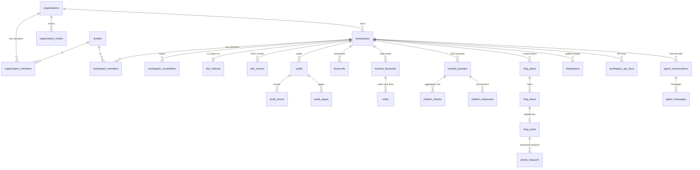

Spyro stores everything in a single **Postgres** database hosted on **Supabase**. The schema is defined in TypeScript with **Drizzle ORM** (`lib/db/schema.ts`), queried through a **postgres.js** connection (`lib/db/index.ts`), and protected by **Row-Level Security (RLS)** policies that key off org/workspace membership. Vector embeddings for retrieval-augmented generation (RAG) live in the same database via the **pgvector** extension.

This page is the reference for the schema: how tables are grouped by domain, the multi-tenancy pattern, the ER model of the core entities, how migrations work, and the rules you must follow when touching the database.

<Note>
The single source of truth is `lib/db/schema.ts` (≈1,360 lines). Every table, column type, index, and enum on this page is pulled from that file with line citations. When this page and the schema disagree, the schema wins — open the file.
</Note>

## Overview

<CardGroup cols={2}>
  <Card title="Postgres on Supabase" icon="database">
    Managed Postgres. Supabase also provides Auth (`auth.users`), and the anon/publishable keys that the RLS policies guard against.
  </Card>
  <Card title="Drizzle ORM" icon="layer-group">
    Schema-as-code in `lib/db/schema.ts`. `drizzle-kit` generates SQL migrations into `drizzle/` from that file.
  </Card>
  <Card title="pgvector for RAG" icon="brain">
    1536-dim embeddings in `site_chunks`, searched with an HNSW cosine index. See [AI](/backend/ai).
  </Card>
  <Card title="RLS for multi-tenancy" icon="lock">
    Membership-driven policies in `drizzle/rls.sql`. Defense-in-depth — the app's own connection bypasses them.
  </Card>
</CardGroup>

### The service-role connection

The app talks to Postgres through one Drizzle client, exported from `lib/db/index.ts`. It connects with the database connection string (`DATABASE_URL`), which means it connects **as the database owner role and bypasses RLS entirely**. This is intentional: authorization is enforced in application code (see [Authorization](/backend/authorization)), and RLS is a second line of defense for anything that might reach the tables with a Supabase anon/publishable key.

```ts
// lib/db/index.ts:6-18
/**
 * Server-side Drizzle client. Uses the Supabase Postgres connection string.
 * This bypasses RLS (it connects as the DB user), so it must only ever be
 * imported from server code / Inngest jobs — never shipped to the client.
 *
 * If DATABASE_URL is absent we still export a proxy that throws on use, so the
 * app can build and run pages that don't touch the DB.
 *
 * Connection cap: max:1 keeps serverless invocations from exhausting the
 * Supabase 200-connection limit. ...
 */
```

The connection is tuned for Supabase's serverless reality (`lib/db/index.ts:32-54`):

- **`max: 1` in production**, `8` in dev — one connection per serverless instance avoids exhausting Supabase's 200-connection ceiling; dev gets a small pool so background crons can't head-of-line-block the UI.
- **`idle_timeout: 60` + `max_lifetime: 1800`** — Supabase's pooler sits behind an AWS NLB that silently drops sockets idle ~350s; connections are retired well before that so the next query never writes to a half-open socket.
- **`prepare: false`** — set for Supabase pooler compatibility.
- **`statement_timeout: 30000`** — admin aggregation queries (e.g. `GROUP BY` over `api_cost_events`) need more headroom than Supabase's short default.

The export is a `Proxy` that lazily initializes the pool on first use and caches it on `globalThis` in dev so hot-module reloads reuse the same pool instead of leaking new ones (`lib/db/index.ts:60-81`). If `DATABASE_URL` is missing the proxy throws on use, so pages that don't touch the DB still build. `dbAvailable` exposes whether a URL is configured.

<Warning>
**Never import `db` from client code.** This client owns the database and ignores RLS. Importing it into a Client Component or any browser bundle would ship a service-role-equivalent surface to the client. The DB is only ever touched from Server Components, server actions, route handlers, and Inngest jobs.
</Warning>

### Retry helper for public tools

Public free-tool DB operations wrap their queries in `withDbRetry()` (`lib/db/retry.ts:39-51`), which retries **only transient connection failures** (`CONNECT_TIMEOUT`, `ECONNRESET`, `terminating connection`, …) on a fresh socket. It is deliberately **not** applied to the shared `db` client, because that would silently retry arbitrary, possibly non-idempotent, paid queries (`lib/db/retry.ts:11-13`).

## Connecting and configuring

`drizzle.config.ts` points `drizzle-kit` at the schema and the migrations folder:

```ts
// drizzle.config.ts:8-17
export default {
  schema: "./lib/db/schema.ts",
  out: "./drizzle",
  dialect: "postgresql",
  dbCredentials: { url: process.env.DATABASE_URL ?? "" },
  verbose: true,
  strict: true,
} satisfies Config;
```

It loads `.env.local` then `.env` itself, because `drizzle-kit` does not read Next.js env files. See [Environment variables](/reference/environment-variables) for `DATABASE_URL`.

## Table reference by domain

The schema defines **52 tables**. They fall into a handful of domains. For each table below: its purpose, the key columns (with types from the schema), important indexes, and how it relates to others. Foreign keys are mostly **logical** — the repo convention is to scope by `user_id` / `workspace_id` / `org_id` columns rather than declare database-level `REFERENCES` constraints, so "relationship" means "joined on this column in code", not an enforced FK.

### Identity, organizations, and workspaces

This is the tenancy backbone. A **profile** is one user. An **organization** is the billing root and owns **workspaces**; a **workspace** is exactly one website (1:1) and is the scope every piece of user data hangs off.

<AccordionGroup>
  <Accordion title="profiles — identity only (schema.ts:64)">
    `id` (uuid PK, equals `auth.users.id`), `email` (text), `createdAt`. Billing columns were moved out to `organizations` in migration `0006` and dropped here in `0007`. A row is created by the `handle_new_user` trigger when a user confirms their email (see [Multi-tenancy](#new-user-trigger)).
  </Accordion>
  <Accordion title="organizations — tenancy + billing root (schema.ts:73)">
    `id` (uuid PK), `name`, `slug` (unique), `ownerUserId` (uuid, unique index `organizations_owner_idx`), `plan` (enum `growth|pro|agency`, default `pro`), `planInterval` (`month|year`).

    **Billing:** `dodoCustomerId` / `dodoSubscriptionId` are the current Dodo Payments columns; `polarCustomerId` / `polarSubscriptionId` are legacy and kept nullable but receive no new writes (`schema.ts:82-87`). `subscriptionActive` (bool), `trialEndsAt`, `creditsBalance` (int).

    **Limits:** `purchasedWorkspaces` (Agency seat count), `workspaceLimitOverride`, `memberLimitOverride`. See [Billing](/backend/billing).
  </Accordion>
  <Accordion title="organization_members / workspace_members — membership (schema.ts:101, 117)">
    Join tables linking users to orgs/workspaces with a `role`. `organization_members.role` is `org_role` (`owner|admin|manager|member`); `workspace_members.role` is `workspace_role` (`admin|member`). Both have a unique `(scope_id, user_id)` index and per-column indexes. These tables drive every RLS policy.
  </Accordion>
  <Accordion title="organization_invites — pending invites (schema.ts:133)">
    `email`, `role`, `wsAssignments` (jsonb — which workspaces the invitee gets), `token` (unique), `status` (`pending|accepted|revoked`), `invitedBy`, `expiresAt`. Indexed by email and by `(orgId, email)`.
  </Accordion>
  <Accordion title="workspaces — one website each (schema.ts:159)">
    The widest table in the schema. `id` (uuid PK), `userId`, `orgId` (nullable), `domain` (the site), `slug`, `label`, `timezone` (IANA, default `UTC` — drives per-workspace local-time job fan-out).

    **Scores & crawl bookkeeping (1:1 with the site):** `seoScore`, `geoScore`, `weeklyAudit`, `lastCrawledAt`.

    **Derived profiles (jsonb):** `toneProfile`, `brandProfile`, `businessProfile`, `audienceTags`, `businessDescription` — captured at onboarding and used by the writer/image pipeline.

    **Article defaults:** `defaultImagePreset`, `featuredImageWidth/Height` (default 1280×720), `contentFocus`, `publishingPace`, `geoModeDefault`, `articleStyle`, `internalLinksCount`, `globalInstructions`, `contentLanguage`, `targetCountry`, author E-E-A-T fields (`authorName/Bio/Url`). Indexed by `userId` and `orgId`.
  </Accordion>
  <Accordion title="workspace_competitors — competitive landscape (schema.ts:256)">
    One row per competitor `domain` per workspace (unique `(workspaceId, domain)`). `signalCount`, `sources` (jsonb per-source counts), `firstSeen`/`lastSeen`, `confirmedByUser`/`dismissedByUser`, `topicGaps`, `topKeywordsShared`. Seeded at onboarding and accumulated by the competitor-signals cron.
  </Accordion>
</AccordionGroup>

### Billing & usage

| Table | Purpose | Key columns | Notes |
| --- | --- | --- | --- |
| `usage_counters` (`schema.ts:285`) | Monthly metered usage, one row per `(user, periodStart, metric)` | `userId`, `periodStart`, `metric` (`keywords`/`serp`/`audit_pages`/`blog_ideas`/`blogs`), `count` | Indexed `(userId, periodStart)`. See [Billing](/backend/billing). |
| `processed_events` (`schema.ts:1254`) | Webhook idempotency | `id` (external event/order id, PK), `createdAt` | Server-only, RLS-enabled with no policy. |
| `api_cost_events` (`schema.ts:554`) | Per-call cost ledger, **attributed** to user/org/workspace | `provider`, `operation`, `model`, token counts, `costUsd` (numeric 12,6), `refId`, `meta` | Superadmin spend/margin reporting. Service-role only; written best-effort. Indexes on `occurredAt`, `userId`, `orgId`, `provider`. |
| `dataforseo_usage` (`schema.ts:539`) | Global daily DataForSEO spend | `day` (date PK), `costUsd`, `calls` | Powers the daily-budget circuit breaker (`lib/dataforseo/budget.ts`). Not user-scoped. |
| `api_rate_counters` (`schema.ts:893`) | Durable fixed-window rate limiting for `/api/v1` | `bucket` (text PK encoding scope+window), `count`, `expiresAt` | Shared across serverless instances; increment is one atomic upsert. See [Public API](/backend/public-api) and [Security](/backend/security). |

### SEO: keywords, SERP, ranks

| Table | Purpose | Key columns | Notes |
| --- | --- | --- | --- |
| `keywords` (`schema.ts:298`) | Researched keyword ideas | `keyword`, `volume`, `difficulty`, `cpc` (numeric 8,2), `intent` (`kw_intent` enum), `clusterLabel`, `aiVolume` | `workspaceId` nullable (legacy). Indexed by `userId`. |
| `keyword_metrics_cache` (`schema.ts:514`) | Global keyword-metric cache (public SEO data) | `keyword`+`locationCode`+`languageCode` (unique `kmc_pk`), `volume`, `cpc`, `competition`, `difficulty`, `source`, `raw` | **Not** user-scoped — owned by the app connection; 30-day TTL in app. |
| `serp_snapshots` (`schema.ts:319`) | Cached SERP results per keyword | `keyword`, `country`, `fetchedAt`, `results` (jsonb), `features` (jsonb), `volatility` | User-scoped. Cache index `(userId, keyword, country, fetchedAt)`. |
| `ai_overview_checks` (`schema.ts:611`) | Whether a Google AI Overview shows and cites you | `keyword`, `shown`, `userCited`, `userPosition`, `sources` | Workspace-scoped. |
| `tracked_keywords` (`schema.ts:1095`) | Watchlist of keywords to rank-track | `keyword`, `workspaceId` | Indexed by workspace. |
| `ranks` (`schema.ts:1107`) | Rank-tracking time series | `keyword`, `position` (null = outside top 100), `url`, `engine` (default `google`), `checkedAt` | Indexed `(workspaceId, keyword)`. See [SEO Engine](/backend/seo-engine). |

The `kw_intent` enum is `informational|commercial|transactional|navigational`; `funnel_stage` is `tofu|mofu|bofu` (`schema.ts:40-41`).

### Citations & AI engines (GEO)

These power the "is my brand cited by AI engines" tracker. See [GEO Engine](/backend/geo-engine).

| Table | Purpose | Key columns | Notes |
| --- | --- | --- | --- |
| `tracked_prompts` (`schema.ts:449`) | Prompts to run against AI engines | `promptText`, `engines` (jsonb `CitationEngineId[]`), `active` | Workspace-scoped. |
| `citation_checks` (`schema.ts:463`) | Aggregated per-run citation stats (trend chart) | `engine`, `runs`, `citedCount`, `frequency` (numeric 5,4), `citedUrls`, `competitorCitations` | Joined to `tracked_prompts` via `trackedPromptId`. |
| `citation_responses` (`schema.ts:484`) | Full per-run LLM answers (live feed) | `engine`, `responseText` (full answer), `cited`, `citedUrls`, `mentionSnippet`, `sentiment` (`positive|neutral|negative`) | Indexes `(workspaceId, runAt desc)` and by prompt. |

### Audit

The site/page audit subsystem. See [Audit](/backend/audit).

| Table | Purpose | Key columns | Notes |
| --- | --- | --- | --- |
| `audits` (`schema.ts:338`) | One audit run per workspace | `status` (`audit_status`: `queued|running|done|error`), `pagesCrawled`, `billablePages`, `seoScore`, `geoScore`, `cwv`, `botAccess` (jsonb `BotAccess`), `fixedIssueTypes`, `aiSuggestions` | Indexed by workspace. |
| `audit_issues` (`schema.ts:365`) | Issues found in an audit | `url`, `type`, `severity` (`critical|warning|info`), `category` (`seo|geo`), `message`, `fixText` | Joined via `auditId`; carries `userId` for RLS. |
| `audit_pages` (`schema.ts:381`) | Per-page audit results | `url`, `templateKey/Label`, `seoScore`, `geoScore`, `status`, `wordCount`, `isBillable`, `geoChecks`, `linkMeta` | Lets the aggregate step recompute scores. |
| `tracked_urls` (`schema.ts:410`) | Manual single-URL watchlist | `url`, `checkStatus`, `lastSeoScore`, `lastGeoScore`, `lastStatus`, `lastIssueCount` | Latest result denormalized for the list view. |
| `tracked_url_checks` (`schema.ts:429`) | History of each tracked-URL re-check | `seoScore`, `geoScore`, `status`, `wordCount`, `issues` (jsonb) | Joined via `trackedUrlId`. |

### Crawler, site intelligence & vector chunks (RAG)

| Table | Purpose | Key columns | Notes |
| --- | --- | --- | --- |
| `site_indexes` (`schema.ts:1148`) | One row per site-index run (1:1 with workspace) | `workspaceId` (**PK**), `status` (`site_index_status`), `pagesCrawled`, `chunksEmbedded`, per-track statuses (`seoStatus`/`geoStatus`/`serpStatus`/`intelStatus` — onboarding fan-out), `seedNotes` | Polled by the UI without scanning chunks. |
| `site_chunks` (`schema.ts:1184`) | Embedded page chunks for RAG | `url`, `title`, `heading`, `chunkText`, `tokenCount`, `embedding` (`vector(1536)`), `metadata` | HNSW cosine index — see [pgvector / RAG](#pgvector-rag-storage). |
| `workspace_intel_snapshots` (`schema.ts:1127`) | Off-domain intelligence time series | `domainRank`, `backlinks`, `referringDomains`, `rankedKeywordsCount`, `avgPosition`, `topKeywords`, `competitors`, `source` | One row per onboarding/weekly run. See [Crawler](/backend/crawler). |

The `site_index_status` enum is `queued|crawling|embedding|ready|partial|error`; onboarding tracks use `pending|running|ready|error` (`schema.ts:42-44`).

### Blog / content pipeline

The ideation → research → drafting → image → publish pipeline. See [Content Engine](/backend/content-engine).

<AccordionGroup>
  <Accordion title="blog_plans — a 30-day content plan (schema.ts:770)">
    `topic`, `status` (`blog_plan_status`: `queued|running|ready|error`), `targetCount`, `ideaCount`, `strategyBrief` (jsonb — business framing, pillars, content-gap findings). Workspace-scoped.
  </Accordion>
  <Accordion title="blog_ideas — individual ideas (schema.ts:628)">
    `batchId`, `planId` (→ `blog_plans.id`), `scheduledDay`/`scheduledDate` (content calendar), `status` (`idea_status`: `suggested|approved|sent|needs_review`), `title`, `primaryKeyword`, `longTails`, `volume`/`aiVolume`/`difficulty`, `intent`, `funnelStage`, `pillar`, `brief`, `estimated`.
  </Accordion>
  <Accordion title="blog_posts — drafted articles (schema.ts:668)">
    The pipeline's main row. `title`, `primaryKeyword`, `modelUsed`, `geoMode`, `wordCount`, `markdown`, `metaTitle/Description`, `status` (reuses `audit_status`), `creditsSpent`.

    **Image:** `imageStatus` (`image_status`: `none|queued|running|done|error`), `imagePreset/Prompt`, `featuredImageUrl`, `imageSource`, `inContentImages` (jsonb), `imagePlan`.

    **Publishing:** `publishedProvider/Url/At`, `scheduledAt`, `scheduledIntegrationId`, `scheduledStatus`, `autoPublish`, `slug`.

    **Research link:** `researchId` → `article_research.id`. `qualityChecks`, `stepStatus`, `seoScore`.
  </Accordion>
  <Accordion title="article_research — versioned research packs (schema.ts:743)">
    `blogPostId`, `version`, `articleType`, `intent`, `pack` (jsonb), `outline`, `researchStatus`. Unique `(blogPostId, version)`; each re-run inserts version+1 and `blog_posts.researchId` points at the current one.
  </Accordion>
  <Accordion title="topic_discovery_runs — async 'find more topics' (schema.ts:793)">
    `status` (`running|ready|error`), `candidateCount`, `seed`. Polled by the planner rail.
  </Accordion>
</AccordionGroup>

### Integrations (publishing & analytics)

See [Integrations](/backend/integrations) and [Public API](/backend/public-api).

| Table | Purpose | Key columns | Notes |
| --- | --- | --- | --- |
| `integrations` (`schema.ts:813`) | Connected publishing/analytics destination | `provider` (`integration_provider` enum), `meta` (non-secret), `secretCipher` (AES-256-GCM, `lib/crypto`), `platform`, `targetUrl`, `status` (`integration_status`), failure counters | Partial unique index `(workspaceId, platform, targetUrl)` where `targetUrl IS NOT NULL`. |
| `integration_deliveries` (`schema.ts:844`) | Webhook/push delivery log | `deliveryId`, `event`, `requestBody`, `statusCode`, `responseBody`, `durationMs`, `attempts` | Indexed `(integrationId, deliveredAt)`. |
| `workspace_api_keys` (`schema.ts:865`) | API keys for the public `/api/v1` surface | `name`, `slot` (legacy), `tokenPrefix`, `tokenHash` (unique), `tokenCipher` (AES-256-GCM, revealable) | Indexes on hash, prefix, workspace. |
| `gsc_*` (`schema.ts:903-1039`) | Google Search Console performance | per-window aggregates: `gsc_query_perf`, `gsc_page_perf`, `gsc_query_page_perf`, `gsc_daily_stats`, plus gen-AI surfaces `gsc_ai_daily_stats`, `gsc_ai_page_perf` | Each has a unique `(workspace, property, window, dimension)` index; re-imports upsert in place. |
| `ga4_referral_daily` / `ga4_referral_pages` (`schema.ts:1046, 1066`) | Real AI-engine referral traffic from GA4 | `engine`, `source`, `sessions`, `totalUsers`, `engagedSessions` / `landingPage` | Only AI-attributable rows stored; complements the synthetic citation tracker. |

The `integration_provider` enum is `wordpress_org|wordpress_com|notion|google_search_console|google_analytics`; `integration_status` is `not_connected|connected|paused|failing` (`schema.ts:50-54`).

### Spyro agent (persisted chat)

| Table | Purpose | Key columns | Notes |
| --- | --- | --- | --- |
| `agent_conversations` (`schema.ts:1208`) | One chat thread per workspace | `title`, `updatedAt`, `lastActiveTools` (jsonb — sticky follow-up routing) | Indexed `(workspaceId, updatedAt)`. |
| `agent_messages` (`schema.ts:1228`) | One AI-SDK `UIMessage` per row | `conversationId`, `role`, `parts` (jsonb — text/tool-calls/reasoning, stored verbatim) | Indexed `(conversationId, createdAt)`. See [AI](/backend/ai). |

### Free-tool reports (public, no auth)

These back the public marketing tools and have **no FK to auth** — they are fully public. See [Free tools](/backend/free-tools).

| Table | Purpose | Key columns | Notes |
| --- | --- | --- | --- |
| `free_audit_reports` (`schema.ts:1266`) | One SEO/GEO audit per domain | `domain` (unique), `status` (doubles as concurrency lock), `reportJson` (self-sufficient), `seoScore`, `geoScore`, `expiresAt` (30-day TTL) | The `?website=` page renders entirely from `reportJson`. |
| `free_tool_reports` (`schema.ts:1314`) | Shared store for the crawl-based tools | `tool`+`domain` (unique), `status`, `reportJson`, `expiresAt` | `tool` discriminator (AI Visibility, AI Crawler & robots, Schema Validator); 24h cache. |
| `free_audit_subscribers` (`schema.ts:1292`) | Email leads from the free-tool modal | `domain`, `email` (unique `(domain,email)`) | No sending built yet. |
| `waitlist` (`schema.ts:1246`) | Marketing waitlist | `email` (unique), `source` | Server-only, RLS with no policy. |

### Admin

| Table | Purpose | Key columns | Notes |
| --- | --- | --- | --- |
| `admin_impersonation_sessions` (`schema.ts:589`) | Superadmin "view as user" audit log | `adminUserId` (admin username, **text** not uuid), `targetUserId`, `targetEmail`, `startedAt`, `expiresAt`, `endedAt`, `endedBy` | Service-role only, RLS with no policy. See [Middleware](/backend/middleware). |

## Multi-tenancy

Every user-data row is scoped by one or more of three columns:

- **`user_id`** — the owning Supabase user (`auth.users.id`). Present on almost every table.
- **`workspace_id`** — the website the data belongs to. The primary scope for SEO/GEO/blog/agent data. A workspace is exactly one site.
- **`org_id`** — the billing/tenancy root that owns workspaces and members.

The chain is **org → workspace → data**. A user reaches data through membership: they are an `organization_members` row (with an org role) and/or a `workspace_members` row (with a workspace role). Org owners/admins/managers implicitly reach every workspace in their org; plain members reach only the workspaces they are explicitly added to.

### How RLS enforces it

<Info>
RLS is **defense-in-depth, not the primary guard.** The app's Drizzle connection is the table owner and bypasses RLS, so application-level checks (see [Authorization](/backend/authorization)) are what actually gate requests. RLS protects the tables only if something reaches them with a Supabase anon/publishable key.
</Info>

The policies live in `drizzle/rls.sql` and are **membership-driven**, not simple `user_id = auth.uid()` ownership (`rls.sql:5`). Two `security definer` helper functions drive everything:

```sql
-- drizzle/rls.sql:54-66
create or replace function public.has_workspace_access(ws uuid)
returns boolean language sql stable security definer set search_path = public as $$
  select exists (
    select 1 from public.workspaces w
    where w.id = ws and (
      public.org_role(w.org_id) in ('owner', 'admin', 'manager')
      or exists (
        select 1 from public.workspace_members m
        where m.workspace_id = w.id and m.user_id = auth.uid()
      )
    )
  )
$$;
```

`org_role(org)` returns the caller's role in an org (or `NULL`). Workspace-scoped tables then get one membership policy each, created in a loop. Here is the **rendered** form of that `format()` template (`rls.sql:103-108`) for a representative table:

```sql
-- rendered from the format() template at drizzle/rls.sql:103-108,
-- applied in a loop to audits, integrations, ranks, agent_messages, …
create policy "audits membership" on public.audits for all
  using (public.has_workspace_access(workspace_id))
  with check (public.has_workspace_access(workspace_id));
```

Tables are bucketed by how they are scoped (`rls.sql:14-31`):

- **Workspace-scoped** (`has_workspace_access(workspace_id)`): `audits`, `tracked_prompts`, `ai_overview_checks`, `blog_plans`, `integrations`, `tracked_keywords`, `ranks`, `agent_conversations`, `agent_messages`, `workspace_intel_snapshots`, `citation_responses`, and `workspaces` itself (keyed on `id`).
- **Workspace-scoped but nullable** (`keywords`, `blog_ideas`, `blog_posts`): legacy rows with `workspace_id = NULL` are allowed through only for the owning `user_id`.
- **User-only** (no `workspace_id`): `usage_counters`, `serp_snapshots`, `citation_checks`, `audit_issues`, `audit_pages` → `user_id = auth.uid()`.
- **Org tables** (`organizations`, `organization_members`, `workspace_members`, `organization_invites`): scoped by `org_role`.
- **Self-only**: `profiles` (`id = auth.uid()`).
- **Server-only** (RLS on, zero policies → deny-all for anon/auth keys): `waitlist`, `processed_events`, and the global service-role tables `keyword_metrics_cache`, `dataforseo_usage`, `api_cost_events`, `admin_impersonation_sessions`.

`site_indexes` and `site_chunks` are handled **exclusively** by `drizzle/rls_site_chunks.sql` (same `has_workspace_access` model) so the two files never define conflicting policy names. `drizzle/rls_enable_all.sql` is a catch-all that turns RLS on for *every* table in `public`, guaranteeing nothing is ever left "Unrestricted" in Supabase — even a table without an explicit policy becomes deny-all for the anon key.

<a id="new-user-trigger" />
### The new-user trigger

App rows are materialized by a Postgres trigger on `auth.users`, defined in `rls.sql:212-285` and re-asserted by migration `0047_gate_handle_new_user`. When a user **confirms their email**, `handle_new_user()`:

1. Inserts a `profiles` row (identity only).
2. Creates a personal `organizations` row (deriving a unique slug from the email local-part).
3. Seeds an `organization_members` owner row.

The function is **gated on `email_confirmed_at`** and fires on `INSERT OR UPDATE`:

```sql
-- drizzle/0047_gate_handle_new_user.sql:27-35
-- Only materialize app rows once the email is actually confirmed.
if new.email_confirmed_at is null then
  return new;
end if;
-- On UPDATE, act only on the NULL→confirmed transition ...
if tg_op = 'UPDATE' and old.email_confirmed_at is not null then
  return new;
end if;
```

This fixes a bug where `supabase.auth.signUp()` inserts an *unconfirmed* row first, which previously created a profile + org for every abandoned signup. OAuth users arrive already-confirmed, so the `INSERT` path still handles them. The org starts **inactive** (`subscription_active = false`) — there is no local no-card trial; the trial is Dodo-managed. See [Authentication](/backend/authentication).

## Entity-relationship diagram

The central ~18 tables and their (logical) relationships. The rest are listed in the [table reference](#table-reference-by-domain) above.



<Note>
These are **logical** relationships. The repo convention is to scope by `user_id`/`workspace_id`/`org_id` columns rather than declare database `REFERENCES` constraints, so most "FKs" are enforced in application code and indexed (not by the database). The `||--o|` between `blog_ideas` and `blog_posts` reflects `blog_posts.ideaId`; `||--o{` between `blog_posts` and `article_research` reflects the versioned `researchId` pointer.
</Note>

<a id="pgvector-rag-storage" />
## pgvector / RAG storage

Spyro embeds crawled pages so the agent can answer questions grounded in the user's own site (RAG). The `vector` extension and the two RAG tables were introduced in `drizzle/0001_pgvector_site_chunks.sql`.

Embeddings are **1536-dimensional**. The migration explains the choice (`0001_pgvector_site_chunks.sql:1-6`): requesting OpenAI's `text-embedding-3-large` with `dimensions: 1536` keeps ~95% of full 3072-dim retrieval quality, halves storage, and stays under pgvector's 2000-dim HNSW ceiling.

<Warning>
The embedding model is ambiguous across sources. The migration comment says `text-embedding-3-large@1536`, but `lib/env.ts:87` defaults to `text-embedding-3-small`, and `.env.local.example` says `text-embedding-3-large@1536`. Treat the configured env var as authoritative at runtime; don't hard-assert one model. See [AI](/backend/ai).
</Warning>

The column is declared with a Drizzle `customType` that renders `vector(1536)` and serializes arrays to/from pgvector's bracket string form (`schema.ts:19-32`):

```ts
// lib/db/schema.ts:1195
embedding: vector("embedding", { dimensions: 1536 }).notNull(),
```

The HNSW index for fast approximate cosine search is created in SQL (Drizzle's schema builder doesn't emit it), with pgvector's default tuning (`0001_pgvector_site_chunks.sql:55-58`):

```sql
CREATE INDEX "site_chunks_embedding_hnsw"
  ON "site_chunks"
  USING hnsw ("embedding" vector_cosine_ops)
  WITH (m = 16, ef_construction = 64);
```

The chunking/embedding/search logic lives in `lib/vector` and is documented in [AI](/backend/ai).

## Migrations & workflow

Migrations are plain SQL files in `drizzle/`, numbered `0000` → `0061`, with snapshot/journal metadata in `drizzle/meta/` (`_journal.json` lists every applied migration; one `NNNN_snapshot.json` per step records the schema state Drizzle diffs against).

The workflow uses `drizzle-kit` via npm scripts (`package.json`):

<Steps>
  <Step title="Edit the schema">
    Change `lib/db/schema.ts` — add a table, column, index, or enum.
  </Step>
  <Step title="Generate a migration">
    `pnpm db:generate` (`drizzle-kit generate`) diffs the schema against the latest `meta/` snapshot and writes a new `drizzle/NNNN_*.sql` plus an updated snapshot.
  </Step>
  <Step title="Apply it">
    `pnpm db:migrate` (`drizzle-kit migrate`) runs pending migrations. `pnpm db:push` (`drizzle-kit push`) pushes the schema directly without a migration file — handy in dev. `pnpm db:studio` opens Drizzle Studio.
  </Step>
  <Step title="Re-apply RLS">
    After any new table, re-run `drizzle/rls.sql`, `drizzle/rls_site_chunks.sql`, then `drizzle/rls_enable_all.sql` in the Supabase SQL editor so the new table gets policies (or at least deny-all). All three are idempotent.
  </Step>
</Steps>

The migration history doubles as a changelog of the product's evolution. Notable entries:

| Migration | What it added |
| --- | --- |
| `0000_common_dracula` | Base schema (profiles, keywords, audits, …). |
| `0001_pgvector_site_chunks` | pgvector extension + `site_indexes` / `site_chunks`. |
| `0006_organizations` | Org tenancy layer; billing moved off `profiles`. |
| `0022_dodo_payments` | Dodo Payments billing columns (replacing Polar). |
| `0041_api_cost_events` | Attributed per-call cost ledger. |
| `0046_api_rate_counters` | Durable cross-instance rate limiting. |
| `0047_gate_handle_new_user` | New-user trigger gated on email confirmation. |
| `0058_free_tool_reports` | Shared store for the public crawl tools. |

<Warning>
Some migrations (e.g. `api_cost_events`) note that `pnpm db:migrate` can **hang** on this Supabase database and must be applied manually with a raw `postgres()` connection (`0041_api_cost_events.sql:6-7`). The RLS `.sql` files are likewise applied by hand in the Supabase SQL editor, not by `drizzle-kit`.
</Warning>

<Note>
**Billing is Dodo Payments, not Polar.** The `organizations` table keeps `polar*` columns only for legacy data and writes nothing new to them (`schema.ts:82-87`); the live columns are `dodoCustomerId` / `dodoSubscriptionId`, and the webhook route is `app/api/webhooks/dodo`. If you see Polar references in older README prose, the code is the source of truth.
</Note>

## Best practices & common mistakes

<AccordionGroup>
  <Accordion title="Never import the service-role db from client code">
    `db` from `lib/db/index.ts` connects as the DB owner and **bypasses RLS**. It must only be imported from server code, server actions, route handlers, and Inngest jobs — never a Client Component or anything that ends up in a browser bundle (`lib/db/index.ts:8-9`).
  </Accordion>
  <Accordion title="RLS is defense-in-depth, not your only guard">
    Because the app connection bypasses RLS, you cannot rely on policies to scope queries the app itself makes. Always filter by `workspaceId` / `userId` / `orgId` in code and enforce roles via the [authorization](/backend/authorization) helpers. RLS only saves you if a query somehow runs under a Supabase anon/auth key.
  </Accordion>
  <Accordion title="Use the abstractions, not raw SQL ad hoc">
    Query through the typed Drizzle schema (`schema.ts` exports `$inferSelect` row types for every table) and the domain modules in `lib/*`. Wrap public free-tool reads/writes in `withDbRetry()` (`lib/db/retry.ts`) — but do **not** wrap the shared `db` client globally, or you'll silently retry non-idempotent paid queries.
  </Accordion>
  <Accordion title="Mirror partial-index predicates on upsert">
    `integrations` has a **partial** unique index `(workspaceId, platform, targetUrl) WHERE target_url IS NOT NULL` (`schema.ts:836-841`). Upserts must repeat that predicate via Drizzle's `targetWhere`, or the conflict target won't match. The same care applies to every `gsc_*` / `ga4_*` unique constraint.
  </Accordion>
  <Accordion title="Secrets are encrypted, not plaintext">
    Integration credentials and revealable API keys are AES-256-GCM ciphertext (`secretCipher`, `tokenCipher`) via `lib/crypto`; `tokenHash` is what lookups match against. Never store a plaintext secret in `meta`. See [Security](/backend/security).
  </Accordion>
  <Accordion title="Re-run RLS after every schema change">
    A new table created by `db:push` starts with **no RLS**. Re-run `rls_enable_all.sql` (and add a policy in `rls.sql` if users should reach it) so it's never left "Unrestricted".
  </Accordion>
</AccordionGroup>

## Related

<CardGroup cols={2}>
  <Card title="APIs" icon="plug" href="/backend/apis">
    The route handlers that read and write these tables.
  </Card>
  <Card title="AI & RAG" icon="brain" href="/backend/ai">
    How `site_chunks` embeddings are produced and searched.
  </Card>
  <Card title="Authorization" icon="user-shield" href="/backend/authorization">
    Org/workspace roles, auth guards, and plan gating that back RLS.
  </Card>
  <Card title="Security" icon="shield" href="/backend/security">
    RLS, secret encryption, rate limiting, and the service-role boundary.
  </Card>
  <Card title="Architecture" icon="sitemap" href="/getting-started/architecture">
    Where the database sits in the overall system.
  </Card>
</CardGroup>
