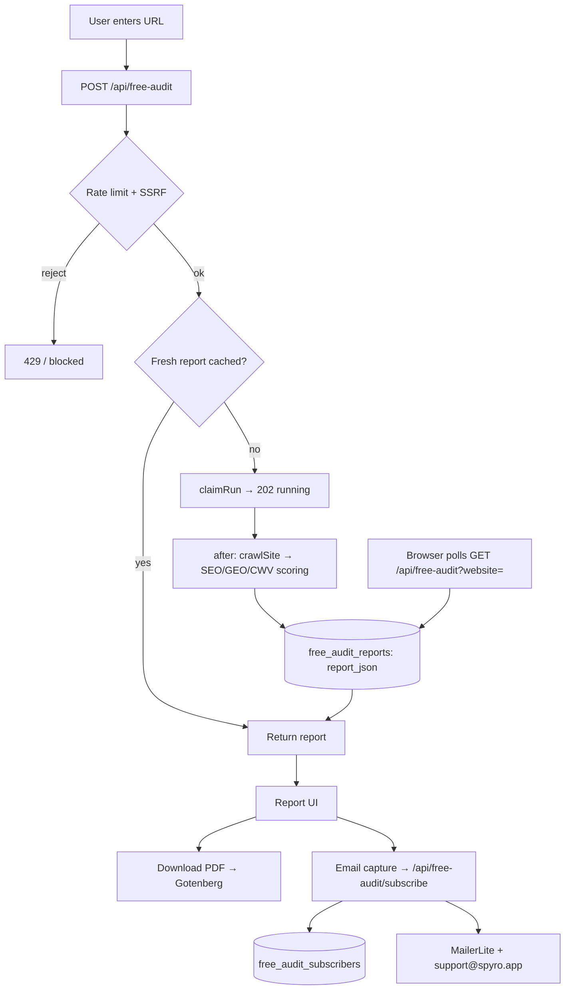

Spyro ships **five public tools** on the marketing site. They need no account,
run real Spyro engines under the hood, and exist to capture leads. They are
deliberately **isolated** from the authed app: you can delete
`lib/free-tools/**` and the free-tool routes and nothing else breaks.

| Tool | Route page | What it does |
| --- | --- | --- |
| **SEO & GEO Audit** | `/free-tools/seo-geo-audit` | Full site audit: 7 category scores, issues, CWV, GEO readiness |
| **AI Visibility Checker** | `/free-tools/ai-visibility-checker` | Citation-readiness score across 6 categories |
| **AI Crawler & Robots Checker** | `/free-tools/ai-crawler-robots-checker` | Whether answer-engine bots can crawl you; builds a recommended `robots.txt` |
| **Schema Markup Validator** | `/free-tools/schema-markup-validator` | Validates JSON-LD/structured data across the site |
| **Meta & Snippet Preview** | `/free-tools/meta-snippet-preview` | Pixel-accurate SERP preview + title/description scoring |

The five public pages are listed in `app/(marketing)/free-tools/page.tsx`. None
of the free-tool API routes call `getCurrentUser()` or `requireAccess()` - they
are genuinely public. See also [Marketing site](/frontend/marketing-site).

## The isolation boundary

Every free tool reaches the core Spyro engines through **one re-export file**,
`lib/free-tools/shared/engine.ts`. Nothing under `lib/free-tools/**` imports
`@/lib/crawler`, `@/lib/seo`, `@/lib/geo`, or `@/lib/audit` directly:

```ts
// lib/free-tools/shared/engine.ts:23-43 (excerpt)
export { crawlSite, probeLlmsTxt } from "@/lib/crawler";
export { parseRobotsUserAgents, AI_BOTS } from "@/lib/crawler/robots";
export { detectSeoIssues } from "@/lib/seo/issues";
export { runGeoChecks, geoChecksToIssues } from "@/lib/geo/checks";
export { buildPageReports } from "@/lib/audit/pages";
```

It is a **pure re-export - no logic, no forking** (`engine.ts:19-21`). The point
is that free-tool output and paid output stay byte-for-byte identical (same
engine), and a developer changing a core engine has exactly one integration
point to audit. The `shared/` folder also re-exports the `db` client and the
free-tool tables (`shared/db.ts`) and `normalizeDomainInput` (`shared/normalize.ts`).

## Shared runtime: async jobs, SSRF, rate limits

The four **crawl-based** tools (audit, AI visibility, AI crawler, schema) follow
one request pattern because a real crawl can outlive a serverless response. The
**Meta & Snippet Preview** is the exception - it is synchronous.

### The async job pattern

A crawl-based tool's `POST` route:

<Steps>
<Step title="Validate + normalise">
Read the URL, `normalizeDomainInput()` it into a canonical cache key.
</Step>
<Step title="Rate-limit (per IP)">
Apply the free-tool sliding-window limiter (e.g. 8/10min for the audit).
</Step>
<Step title="SSRF guard">
`assertPublicUrl(entryUrl)` before any fetch (see [Security](/backend/security#ssrf-protection)).
</Step>
<Step title="Cache + claim">
If a fresh report exists, return it. Otherwise atomically **claim** the job
(`claimRun`) so two requests can't crawl the same domain at once.
</Step>
<Step title="Run in the background">
Kick off the crawl with Next.js `after()` and return **202 `{ state: "running" }`**.
Progress is streamed into the DB row as it runs.
</Step>
<Step title="Client polls">
The browser polls the `GET` route (`?domain=…`) every 2.5s until the report is
`done`, then renders it.
</Step>
</Steps>

<Note>
These tools do **not** use Inngest - they use the Next.js `after()` callback to
keep work alive after the 202 response (e.g.
`app/api/ai-crawler-check/route.ts:72`). The shared
[background jobs](/backend/background-jobs) system is for the authed app.
</Note>

The job store (`lib/free-tools/shared/job-store.ts`) is DB-backed so jobs
survive across serverless instances. It defines the tool keys, a 24-hour TTL and
cooldown, and the atomic `claimRun`/`setProgress`/`finalize`/`fail` lifecycle
(`job-store.ts:19-23, 82-143`).

### SSRF and rate limiting

Both guards are mandatory on every free-tool fetch and are documented in full on
the [Security](/backend/security) page:

- `assertPublicUrl` (`lib/free-tools/shared/ssrf.ts`) blocks private IPs,
  localhost, cloud-metadata, non-default ports, and DNS-rebinding - injected as
  the crawler's `validateUrl`.
- `rateLimit` (`lib/free-tools/shared/rate-limit.ts`) is a per-IP sliding window;
  per-route limits are tabulated in [Security → rate limiting](/backend/security#free-tool-sliding-window).

## Per-tool reference

<AccordionGroup>
<Accordion title="SEO & GEO Audit (free-audit)">
**Route:** `POST/GET /api/free-audit` · **render page:** `app/pdf-report/page.tsx`

Crawls up to 20 pages (`run.ts:30`), runs SEO + GEO + CWV checks, and produces a
v4 report with 7 category scores plus headline `seo`/`geo`/`overall` scores
(`lib/free-tools/free-audit/types.ts:15,24-31,71-76`). **Output:**
`FreeAuditReport` JSON. Has a hard concurrency gate (`MAX_CONCURRENT = 4`,
`route.ts:29`) returning 503 when saturated. Persists to **`free_audit_reports`**
(its own table), and this is the only tool with a **subscriber** table and
PDF/email capture wired end to end.
</Accordion>

<Accordion title="AI Visibility Checker (ai-visibility)">
**Route:** `POST/GET /api/ai-visibility`

Crawls up to 20 pages plus probes ~21 common paths (`about`, `faq`, …) for
existence (`run.ts:18-67`), then scores **citation readiness** across 6 weighted
categories - citation readiness, entity clarity, content coverage, GEO
readiness, knowledge signals, citation authority
(`ai-visibility/types.ts:25-32`). **Output:** `AiVisibilityReport` (v2). No LLM
calls - scoring is deterministic. Persists to **`free_tool_reports`** under tool
key `ai-visibility`.
</Accordion>

<Accordion title="AI Crawler & Robots Checker (ai-crawler-check)">
**Route:** `POST/GET /api/ai-crawler-check`

Fetches `robots.txt` (with retries), the homepage, the sitemap, and `llms.txt`,
and live-probes answer-engine bot user-agents (`run.ts:107-166`). Scores 3
categories - answer-engine access (0.5), robots config (0.25), content discovery
(0.25) - and **generates a copy-paste recommended `robots.txt`**
(`scoring.ts:261-269`). **Output:** `AiCrawlerReport` (v1). Persists to
**`free_tool_reports`** under tool key `ai-crawler`.
</Accordion>

<Accordion title="Schema Markup Validator (schema-validator)">
**Route:** `POST/GET /api/schema-validator`

Crawls up to 20 pages, extracts and validates JSON-LD/microdata/RDFa, and scores
6 categories - availability, validity, completeness, presence coverage, rich
results, connectivity (`schema-validator/types.ts:35-42`). **Output:**
`SchemaReport` (v1) with a per-page `SchemaSummary`. Persists to
**`free_tool_reports`** under tool key `schema`.
</Accordion>

<Accordion title="Meta & Snippet Preview (meta-snippet)">
**Route:** `POST /api/meta-snippet/extract` (synchronous - no job store)

The only **non-crawl** tool. `extract` server-side fetches up to 3 URLs
(`route.ts:11`), parses `title`/`description`/`og:*`/`canonical`/`favicon` with
cheerio, and returns `ExtractResult[]`. **All scoring is client-side and
zero-token** (`lib/free-tools/meta-snippet/scoring.ts`) - pixel-accurate field
status, a 0-100 score, and rule-based CTR recommendations, with **no
persistence**. The folder has no `run.ts` or `store.ts`, by design. It still has
a Gotenberg PDF (`/api/meta-snippet/pdf`), but because nothing is stored the
route takes the snippet state from the **query string** rather than a DB row.
</Accordion>
</AccordionGroup>

## Persistence: a three-way split

This is the part most likely to trip you up - the five tools do **not** persist
uniformly:

| Tools | Table | Migration |
| --- | --- | --- |
| AI Visibility, AI Crawler, Schema Validator | `free_tool_reports` (one row per `tool` + `domain`) | `drizzle/0058_free_tool_reports.sql` |
| SEO & GEO Audit | `free_audit_reports` + `free_audit_subscribers` | in `lib/db/schema.ts` |
| Meta & Snippet Preview | *none* | - |

The shared `free_tool_reports` table replaces per-tool in-memory maps so jobs
survive serverless restarts. It is **server-only, no RLS** - it holds no
user-scoped data:

```sql
-- drizzle/0058_free_tool_reports.sql:6-19
CREATE TABLE IF NOT EXISTS "free_tool_reports" (
  "id" uuid PRIMARY KEY DEFAULT gen_random_uuid() NOT NULL,
  "tool" text NOT NULL,
  "domain" text NOT NULL,
  "status" "audit_status" DEFAULT 'queued' NOT NULL,
  "report_json" jsonb,
  "error" text,
  "report_generated_at" timestamp with time zone,
  "expires_at" timestamp with time zone,
  "created_at" timestamp with time zone DEFAULT now() NOT NULL,
  "updated_at" timestamp with time zone DEFAULT now() NOT NULL
);
CREATE UNIQUE INDEX "free_tool_reports_tool_domain_idx" ON "free_tool_reports" ("tool", "domain");
```

Reports carry a 24-hour TTL (`expires_at`) and a matching cooldown, so a domain
can't be re-audited for free repeatedly. See [Database](/backend/database).

## Email capture

Every tool's report screen offers a lead-capture form, and **all five POST to
the same shared endpoint**, `/api/free-audit/subscribe` (confirmed across all
`_components/email-capture.tsx`). The handler:

```ts
// app/api/free-audit/subscribe/route.ts:24-62 (abridged)
const email = (body.email ?? "").trim().toLowerCase();
if (!EMAIL_RE.test(email) || email.length > 254) return … 400;
const norm = normalizeDomainInput(body.domain ?? "");
const rl = rateLimit(`sub:${clientIp(req)}`, 12, 10 * 60 * 1000);
// …
await addSubscriber(norm.domain, email);                // free_audit_subscribers
if (env.MAILERLITE_API_KEY) void addToMailerLite(email, …); // best-effort
void notifyNewLead(email, norm.domain);                 // best-effort team email
return NextResponse.json({ ok: true });
```

So a captured lead is: **(1)** stored in `free_audit_subscribers`
(`onConflictDoNothing`), **(2)** synced to **MailerLite** when
`MAILERLITE_API_KEY` is set, and **(3)** emailed to `support@spyro.app` via
`sendEmail` (Resend). Both side-effects are fire-and-forget - a failure never
blocks the response.

<Warning>
The route's own docstring says *"Store-only; no email is sent yet (spec §7)"*
(`subscribe/route.ts:20-23`) - that comment is **stale**. The code does send the
MailerLite sync and the `support@spyro.app` team notification. Trust the code.
</Warning>

## PDFs

**All five tools** expose `GET /api/<tool>/pdf` (the meta-snippet route is
`/api/meta-snippet/pdf`). Each renders its public report page with the
**external Gotenberg service** (real Chromium) - a different path from the authed
audit's react-pdf export. The four crawl-based tools render from their stored
report row; **meta-snippet has no DB row, so its PDF route passes the snippet
state entirely via query string** to its `/meta-snippet-report` render page and
generates on demand (`app/api/meta-snippet/pdf/route.ts:4, 29-35`). The full
mechanism, env vars, and download flow are documented in
[PDF engine](/backend/pdf-engine).

## End-to-end flow (SEO & GEO Audit)



## Related

- [PDF engine](/backend/pdf-engine) - the Gotenberg path these reports use.
- [Security](/backend/security) - SSRF guard and rate limits in full.
- [Crawler](/backend/crawler) / [SEO engine](/backend/seo-engine) / [GEO engine](/backend/geo-engine) - the engines behind the scores.
- [Database](/backend/database) - `free_tool_reports`, `free_audit_reports`, subscribers.
- [Marketing site](/frontend/marketing-site) - where the tool pages live.
- [Background jobs](/backend/background-jobs) - why these use `after()`, not Inngest.
