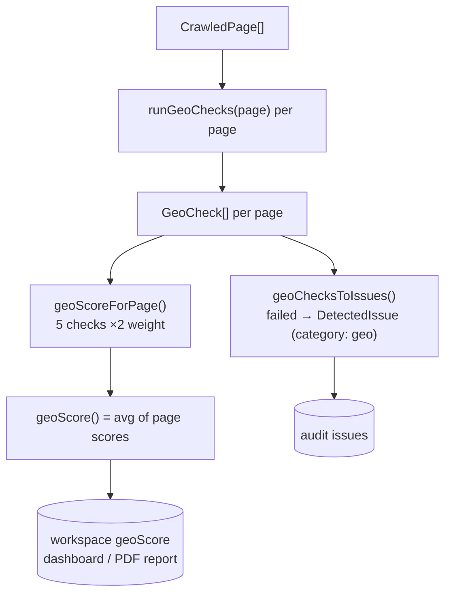

The GEO engine (`lib/geo/*`) measures how ready a page is to be **cited by
generative AI engines** (ChatGPT, Gemini, Perplexity, Google AI Overviews) - the
practice often called GEO (Generative Engine Optimization) or AEO (Answer Engine
Optimization). It is small and entirely deterministic: two files, no LLM, no
external API.

<Info>
  GEO is the **complement** of two neighbours. The [SEO engine](/backend/seo-engine)
  scores classic ranking signals (`category: "seo"`). This GEO engine scores
  answer-readiness signals (`category: "geo"`). The [AI engine](/backend/ai)'s
  citation checks measure the *outcome* - whether engines actually cite the site.
  GEO here is the on-page *readiness* that drives that outcome.
</Info>

## The 16-point page check

`runGeoChecks(page, crawl)` runs sixteen pass/fail checks on a page using cheerio
over the crawled HTML, returning a `GeoCheck[]`. Each check carries a concrete fix.

```ts
// lib/geo/checks.ts:5-14
/** The 16-point GEO (Generative Engine Optimization) page check. Each returns
 *  pass/fail with a concrete fix. Run per page; aggregated into a GEO score. */
export interface GeoCheck {
  id: string;
  label: string;
  passed: boolean;
  detail: string;
  fix: string;
  evidence?: string;
}
```

| # | id | Passes when |
|---|----|----|
| 1 | `answer_first` | The opening delivers a direct answer (BLUF) in the first ~50 words - first paragraph 40–600 chars, not a fluff opener, first sentence ≥30 chars and ≥8 words |
| 2 | `qa_structure` | ≥3 sub-headings and (≥1 phrased as a question OR ≥5 headings) |
| 3 | `schema` | ≥1 JSON-LD type in `FAQPage / HowTo / Article / NewsArticle / BlogPosting / QAPage / ProfilePage / FactCheck / Dataset` |
| 4 | `stats` | ≥2 statistic patterns in the body |
| 5 | `quotable` | A standalone, liftable sentence of 60–200 chars exists |
| 6 | `lists_tables` | Has tables + lists, a comparison table, or multiple lists under comparative headings |
| 7 | `author` | Person schema or an author byline |
| 8 | `llms_txt` | The site serves an `llms.txt` file |
| 9 | `freshness` | "Updated/reviewed/published" text, a `<time datetime>`, or Article-family schema |
| 10 | `concise_meta` | Meta description 70–160, title ≤65, descriptive headings |
| 11 | `outbound_authority` | ≥1 external link to a recognised authority domain |
| 12 | `expert_quotes` | Blockquotes, citations, Review/Quotation schema, or attributed speech |
| 13 | `entity_schema` | ≥1 JSON-LD type in `Organization / Product / LocalBusiness / Service / SoftwareApplication / Brand` |
| 14 | `internal_cluster` | Enough inbound + same-origin internal links to form a topic cluster |
| 15 | `content_extractable` | The page does **not** require JS to render its content |
| 16 | `entity_sameas` | The entity has `sameAs` links - or passes "not applicable" if no entity schema |

### High-impact checks (verbatim)

The checks the engine weights double are worth seeing in full. **Answer-first
(BLUF)** is the single highest-value signal - generative engines lift direct
answers verbatim:

```ts
// lib/geo/checks.ts:52-66
const firstWords = bodyText.split(/\s+/).slice(0, 60).join(" ");
const firstSentence = (firstPara.match(/^[^.!?]{20,260}[.!?]/) ?? [""])[0].trim();
const bluf =
  firstPara.length >= 40 && firstPara.length <= 600 &&
  !FLUFF_OPENER_RE.test(firstPara) &&
  firstSentence.length >= 30 &&
  firstSentence.split(/\s+/).length >= 8 &&
  firstWords.length > 0;
checks.push({
  id: "answer_first", label: "Answer-first opening (BLUF)", passed: bluf,
  detail: bluf ? "Direct answer sentence sits inside the first ~50 words." : /* ... */,
  fix: "Benefit: Generative engines prefer lifting direct answers verbatim.\n...",
  evidence: bluf ? firstSentence : undefined,
});
```

**Question-style structure** - so an LLM can map a section directly to a user
prompt:

```ts
// lib/geo/checks.ts:68-77
const questionyList = headings.filter((h) => /\?$/.test(h) || /^(how|what|why|when|where|who|can|should|is|are|do|does)\b/i.test(h));
const questiony = questionyList.length;
const hasStructure = headings.length >= 3 && (questiony >= 1 || headings.length >= 5);
checks.push({ id: "qa_structure", label: "Question-style headings / clear structure", passed: hasStructure, /* ... */ });
```

**Outbound authority** - LLMs verify claims against trusted sources, so citing
them makes a page credible. Authority is classified by host allowlist + TLD set:

```ts
// lib/geo/checks.ts:32-41
function isAuthorityUrl(href: string): boolean {
  try {
    const host = new URL(href).hostname.toLowerCase().replace(/^www\./, "");
    if (AUTHORITY_HOSTS.has(host)) return true;        // wikipedia.org, nih.gov, nytimes.com, ...
    for (const tld of AUTHORITY_TLDS) if (host.endsWith(tld)) return true; // .gov, .edu, .ac.uk, ...
    return false;
  } catch { return false; }
}
```

## Entity signals

There is **no standalone entity-extraction model**. "Entities" here are the JSON-LD
types and `sameAs` links the [crawler](/backend/crawler) already extracted into
`page.jsonLdTypes` and `page.sameAs`. The GEO engine consumes them in two checks.

`entity_schema` (check 13) passes when an entity type is present; `entity_sameas`
(check 16) binds that entity to external authorities, and cleverly passes as **"not
applicable"** when there is no entity to check - so a content page isn't penalised
for lacking brand schema:

```ts
// lib/geo/checks.ts:228-236
const hasEntity = page.jsonLdTypes.some((t) => ENTITY_SCHEMA_TYPES.includes(t));
const sameAsOk = page.sameAs.length > 0 || !hasEntity;
checks.push({
  id: "entity_sameas", label: "Entity sameAs links", passed: sameAsOk,
  detail: !hasEntity ? "No Organization/Product entity schema to check."
        : page.sameAs.length ? `${page.sameAs.length} sameAs link(s).`
        : "Entity schema present but no sameAs links.",
  fix: "Benefit: Helps engines disambiguate your entity and trust your brand.\n...",
  evidence: page.sameAs.length > 0 ? page.sameAs.slice(0, 3).join(", ") : undefined,
});
```

## The GEO score

The score is a weighted pass-rate. Five high-impact checks count **double**; the
rest count single. A page with all 16 checks therefore has a denominator of 21
weight units (16 + 5 doubled).

```ts
// lib/geo/score.ts (entire file)
import type { GeoCheck } from "./checks";

/** GEO readiness 0–100: average pass-rate across pages, weighted so the
 *  high-impact checks (answer-first, Q&A structure, schema) count double. */
const DOUBLE = new Set(["answer_first", "qa_structure", "schema", "entity_schema", "outbound_authority"]);

export function geoScoreForPage(checks: GeoCheck[]): number {
  let got = 0;
  let total = 0;
  for (const c of checks) {
    const w = DOUBLE.has(c.id) ? 2 : 1;
    total += w;
    if (c.passed) got += w;
  }
  return total === 0 ? 0 : Math.round((got / total) * 100);
}

export function geoScore(perPage: GeoCheck[][]): number {
  if (perPage.length === 0) return 0;
  const avg = perPage.reduce((s, checks) => s + geoScoreForPage(checks), 0) / perPage.length;
  return Math.round(avg);
}
```

- **Per page** (`geoScoreForPage`): `round( weighted passed / weighted total × 100 )`.
- **Site** (`geoScore`): the rounded **unweighted average** of per-page scores -
  every page counts equally regardless of size. Empty input → `0`. There are no
  other clamps or thresholds.



## Turning checks into issues

Failed checks become `DetectedIssue`s (the same shape the [SEO engine](/backend/seo-engine)
uses), with five checks marked `warning` and the rest `info`:

```ts
// lib/geo/checks.ts:241-254
export function geoChecksToIssues(url: string, checks: GeoCheck[]): DetectedIssue[] {
  return checks
    .filter((c) => !c.passed)
    .map((c) => ({
      url,
      type: `geo_${c.id}`,
      severity: (["answer_first", "qa_structure", "schema", "entity_schema", "content_extractable"].includes(c.id) ? "warning" : "info"),
      category: "geo" as const,
      message: c.id === "llms_txt" ? "Missing llms.txt file" : `${c.label}: ${c.detail}`,
      fixText: c.fix,
      evidenceDetail: c.evidence,
      confidence: "Medium",
    }));
}
```

<Warning>
  The "important" set differs slightly between scoring and issue severity. The
  scoring `DOUBLE` set includes `outbound_authority`; the issue-severity set
  includes `content_extractable` instead. This is intentional in the source, not a
  typo - scoring weights answer quality, issue severity weights crawlability.
</Warning>

## Where GEO runs

`lib/geo` is consumed across the app:

- **Audit pipeline** - `lib/actions/audit.ts`, `lib/audit/url-check.ts`,
  `lib/audit/pages.ts`, and the Inngest job `lib/inngest/fns/audit.ts` run
  `runGeoChecks` per page then aggregate. See [Audit](/backend/audit).
- **Onboarding** - `lib/onboarding/crawl-batch.ts` and `aggregate.ts` score GEO
  during the initial crawl into the workspace's `geoScore`.
- **Free tools** - `lib/free-tools/shared/engine.ts` re-exports the checks for the
  public AI-visibility checker. See [Free Tools](/backend/free-tools).
- **Agent** - `lib/agent/tools.ts` exposes `runGeoChecks` as an agent tool.

The `geoScore` value surfaces on the dashboard, the PDF report, and superadmin
workspace views.

## Related

- [SEO Engine](/backend/seo-engine) - the `category: "seo"` companion scoring
- [Crawler](/backend/crawler) - extracts `jsonLdTypes`, `sameAs`, headings, `needsJsRender`
- [AI Engine](/backend/ai) - citation checks that measure the GEO outcome
- [Audit](/backend/audit) - the main per-page-then-aggregate consumer
- [Free Tools](/backend/free-tools) - the public AI-visibility checker
- [Background Jobs](/backend/background-jobs) - the audit + onboarding crawls
