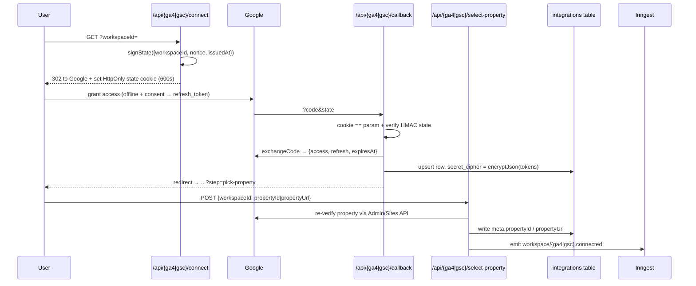

Spyro has two kinds of integrations: **inbound data** (read-only OAuth connections to Google
Analytics 4 and Google Search Console, plus the headless WordPress blog reader) and
**outbound delivery** (publishing drafts to a customer's CMS and the generic, HMAC-signed
push system that powers the WordPress plugin). Email is handled by Resend.

All connections - Google tokens, CMS credentials, and push targets - live in one
`integrations` table, with secrets encrypted into `secret_cipher` and non-secret context in a
`meta` jsonb column.

## Google OAuth (GA4 and GSC)

GA4 and GSC share **one Google OAuth app** (`GOOGLE_OAUTH_CLIENT_ID` / `_SECRET` and the
`GSC_OAUTH_STATE_SECRET` HMAC secret) but use **separate scopes, redirect URIs, state
cookies, and `provider` enum values** (`google_analytics` vs `google_search_console`). Both
request read-only scopes only:

- **GA4** - `analytics.readonly` + `openid email` (`lib/ga4/oauth.ts:18`, `:112`). The code
  comment is explicit: "We never request write scopes."
- **GSC** - `webmasters.readonly` + `openid email` (`lib/gsc/oauth.ts:18`, `:112`).

The flow is identical for both; GA4 mirrors the original GSC implementation.



### connect → callback → select-property → disconnect

- **connect** (`app/api/ga4/connect/route.ts`, `app/api/gsc/connect/route.ts`) - a `GET` with
  `?workspaceId=`. It resolves the workspace via `resolveWorkspaceForUser` (which gates on
  `requireAccess(orgSlug)`, shared by both - `lib/gsc/workspace-access.ts:15`), signs an
  HMAC state (`{workspaceId, nonce, issuedAt}`, 10-min TTL), sets an HttpOnly state cookie
  (`spyro_ga4_oauth_state` / `spyro_gsc_oauth_state`, `path` scoped to the API, `maxAge: 600`),
  and redirects to Google with `access_type: "offline"`, `prompt: "consent"` (to force a
  refresh token), and `include_granted_scopes: "true"`.
- **callback** - validates the cookie matches the `state` param and its HMAC, exchanges the
  code (`exchangeCode` throws if no `refresh_token`), fetches the Google account email, and
  **upserts one row per (workspace, provider)** with `secret_cipher = encryptJson(tokens)`.
  GSC's callback builds its post-connect redirect against the public origin
  (`oauthRedirectOrigin()`) so it survives ngrok/proxy hosts.
- **select-property** - a `POST` that **never trusts the body alone**: it re-verifies the
  chosen property against the live Google API (`client.listProperties()` for GA4,
  `client.listSites()` for GSC) before writing `meta.propertyId` / `meta.propertyUrl`, then
  emits the Inngest event `workspace/ga4.connected` or `workspace/gsc.connected` to trigger
  the on-connect import.
- **disconnect** - a `POST` that best-effort revokes the refresh token, then deletes the
  provider's row unconditionally.

### Token storage and refresh

Both providers store an encrypted token JSON (`accessToken`, `refreshToken`, `expiresAt`,
`scope`) in **`integrations.secret_cipher`** (AES-256-GCM via `lib/crypto`). Non-secret
context - `googleAccountEmail`, the selected property, `lastImportedAt`, `needsReconnectAt` -
lives in the **`meta`** jsonb. The clients (`lib/ga4/client.ts`, `lib/gsc/client.ts`)
auto-refresh within 60s of expiry, retry once on 401, honour `Retry-After` on 429, and on a
403 / failed refresh raise a `*ReconnectRequiredError`. When tokens refresh, the client calls
`onTokensRefreshed(encryptJson(tokens))` to re-persist them.

<Note>
  `needs_reconnect` is **not** an `integration_status` enum value - a reconnect requirement is
  recorded as `meta.needsReconnectAt`. The enum has only four states (see below).
</Note>

### What gets imported

The imports run as Inngest jobs (see [Background Jobs](/backend/background-jobs)):

- **GA4** (`lib/ga4/import.ts`) classifies referral traffic into AI sources and upserts
  `ga4_referral_daily` (90-day) and `ga4_referral_pages` (28-day).
- **GSC** (`lib/gsc/import.ts`) imports 28-day and 90-day windows (anchored 3 days behind
  today) into `gsc_query_perf`, `gsc_page_perf`, `gsc_query_page_perf`, and site-wide
  `gsc_daily_stats` (~16 months). `lib/gsc/diagnose.ts` then joins this data with audit issues
  to emit diagnosis cards (low-CTR pages, almost-ranking queries, content decay).

## Headless WordPress blog (read)

`lib/wordpress.ts` is the **read-only** client for Spyro's own marketing blog at
`blog.spyro.app`. Its base URL is `env.WORDPRESS_BASE_URL` and every call hits the WP REST
API at `…/wp-json/wp/v2/{path}` (`lib/wordpress.ts:103-107`). The fetch wrapper uses Next ISR
(`revalidate: 300`), a 10s timeout, and up to 2 retries on network error / 5xx / 429.

It exposes the full blog surface - `getWordPressPosts` (paginated, with search / category /
tag / sticky / order filters, reading `x-wp-total` headers), `getWordPressPostBySlug`,
categories and tags, sitemap refs, trending and related posts - plus `sanitizeWordPressHtml`
(a cheerio allow-list that forces `rel="noopener"` and lazy images) and TOC extraction. This
is what the marketing site renders; see [Marketing Site](/frontend/marketing-site).

## WordPress publishing (push)

Spyro can publish a finished draft **to a customer's** WordPress site two ways
(see [Content Engine](/backend/content-engine) for where this sits in the pipeline):

- **`lib/publish/wordpress-org.ts`** - self-hosted WP via the REST API with an Application
  Password (HTTP Basic auth). It detects Yoast / RankMath, uploads the featured image to
  `/wp-json/wp/v2/media`, then POSTs to `/wp-json/wp/v2/posts` with **`status: "draft"`** and
  the SEO meta fields. It only injects its own JSON-LD when no SEO plugin is present.
- **`lib/publish/wordpress-com.ts`** - WordPress.com via the public REST API with an OAuth2
  bearer token. Same media-then-post flow, also `status: "draft"`, always injecting its own
  JSON-LD (WP.com can't expose plugin namespaces).

### The Spyro Autopilot plugin

`wordpress-plugin/spyro-autopilot/` is a WordPress plugin that **receives pushes from Spyro**
over a signed webhook - an alternative to handing Spyro credentials. Content flows
app → plugin; the plugin's only outbound call is a daily heartbeat.

- **Receiver** (`includes/class-spyro-receiver.php`) registers `POST spyro/v1/receive` with
  `permission_callback => '__return_true'` - "auth is the HMAC, not WP login." It reads the
  `X-Spyro-Timestamp` / `X-Spyro-Signature` headers, verifies them, and ingests the post
  (draft unless `publish_immediately`), mapping SEO meta to Yoast or RankMath. Ingestion is
  **idempotent** on `_spyro_post_id` + `_spyro_delivery_id` (a replay returns
  `deduped: true`).
- **Cron** (`includes/class-spyro-cron.php`) schedules a **daily** `spyro_autopilot_heartbeat`
  that POSTs to `/api/v1/integrations/{id}/heartbeat` - a keep-alive, **not a content pull**.
  On deactivation it best-effort `DELETE`s the integration.

The signature is the same scheme on both sides. The Node signer
(`lib/api/signing.ts:5-10`):

```ts
// lib/api/signing.ts:5-10
export function signRequest(secret: string, timestampSec: number, rawBody: string): string {
  const mac = createHmac("sha256", secret)
    .update(`${timestampSec}.${rawBody}`)
    .digest("hex");
  return `sha256=${mac}`;
}
```

The PHP verifier (`includes/class-spyro-signature.php:21-23`) - note `secret =
sha256(plaintext_key)`, so Spyro never has to store the plaintext key:

```php
// wordpress-plugin/spyro-autopilot/includes/class-spyro-signature.php:21-23
$secret   = hash('sha256', $plaintext_key);
$expected = 'sha256=' . hash_hmac('sha256', ((int) $ts) . '.' . $raw_body, $secret);
return hash_equals($expected, $header);
```

Both enforce a `MAX_DRIFT_SECS = 300` clock-skew window. The app signs with the stored
`workspace_api_keys.tokenHash`, which equals `sha256(plaintext key)`.

## The generic push-integration system

The push targets above are rows in the same `integrations` table, extended with delivery
columns. The connection-health enum has exactly four values
(`lib/db/schema.ts:54`):

```ts
// lib/db/schema.ts:54
export const integrationStatusEnum = pgEnum("integration_status", ["not_connected", "connected", "paused", "failing"]);
```

The push columns (`platform`, `target_url`, `status`, `registered_via`, `last_seen_at`,
`last_delivery_at`, `consecutive_failures`, …) and the `integration_deliveries` audit table
were added by `drizzle/0024_integrations_push_columns.sql`; `drizzle/0044_integration_status_enum.sql`
later promoted `status` from a text CHECK to the enum above. There is a partial unique index
on `(workspace_id, platform, target_url)`.

### Delivery worker

`lib/inngest/fns/integration-deliver.ts` (`integrationDeliverFn`, event `integration/deliver`,
4 retries) is the durable delivery path:

1. Load the target; skip if there's no URL or `status === "paused"`.
2. Resolve the signing key hash (prefers `meta.signingKeyId` → `workspace_api_keys.tokenHash`,
   else the newest workspace key).
3. Sign and POST the JSON body with `X-Spyro-Event`, `X-Spyro-Delivery`,
   `X-Spyro-Workspace`, `X-Spyro-Timestamp`, and `X-Spyro-Signature` headers (30s timeout).
4. Record a row in `integration_deliveries`. A non-2xx response throws so Inngest retries;
   success sets `status: "connected"`, `last_delivery_at`, and `consecutive_failures: 0`.

A companion `integrationDeliverFailedFn` listens for `inngest/function.failed` and flips the
integration to **`"failing"` after ≥3 consecutive failures**, and a nightly prune keeps the
last 200 deliveries per integration.

### Public v1 API

External clients (like the WordPress plugin) self-register over the
[Public API](/backend/public-api) with a workspace API key:

- **`POST /api/v1/integrations/register`** - Bearer-authenticated and rate-limited. Validates
  `platform ∈ {wordpress_org, wordpress_com, shopify, webhooks}` and `target_url` (https, or
  http localhost only), enforces the plan's `integrationsMax` (402 `plan_limit` when exceeded),
  upserts the row with `meta.signingKeyId`, `status: "connected"`, `registered_via: "self"`,
  and returns `{ integration_id, status }`.
- **`POST /api/v1/integrations/{id}/heartbeat`** - sets `last_seen_at = now`.
- **`DELETE /api/v1/integrations/{id}`** - workspace-scoped delete.

## Email (Resend)

Transactional and digest email goes through Resend (`lib/email/`), gated by
`featureFlags.resendConfigured` (`RESEND_API_KEY`). The sender is `Spyro
<support@spyro.app>` (a verified Resend domain), and every template renders through a branded
`emailShell`:

```ts
// lib/email/index.ts:13-26 (abridged)
const resend = new Resend(env.RESEND_API_KEY);
await resend.emails.send({ from: FROM, to, subject, html });
return { sent: true };
```

Templates (`lib/email/templates.ts`) include OTP verification, org invites, welcome / trial
start, **trial-ending**, payment-failed, subscription-cancelled, site-ready, audit-complete,
article-ready / -published, first-citation, and the **weekly digest** (`digestEmail` - rank
moves, AI-citation changes, new audit issues). `lib/email/recipients.ts` resolves the
workspace's notify target (the workspace owner, or an override) and builds absolute links from
`env.APP_URL`; it returns null to skip silently rather than throw.

## Editorial calendar

`lib/calendar/*` is **not** a third-party calendar integration - it's the internal editorial
scheduler for AI blog ideas (the `blog_ideas` table). `free-days.ts` picks the next N
unoccupied `YYYY-MM-DD` days; `mutations.ts` (`scheduleIdeas`, `rescheduleIdea`, `editIdea`)
places, moves, and edits planned ideas without double-booking; `candidates.ts` provides the
planner-rail helpers (easy-win tagging, dedupe, sorting). See
[Content Engine](/backend/content-engine).

## Related

- [Public API](/backend/public-api) - workspace API keys, the v1 register / heartbeat / ping routes, and HMAC signing
- [Background Jobs](/backend/background-jobs) - `ga4-import`, `gsc-import`, and `integration-deliver`
- [Content Engine](/backend/content-engine) - where WordPress / Notion publishing fits the pipeline
- [Database](/backend/database) - the `integrations`, `integration_deliveries`, and GA4/GSC perf tables
- [Marketing Site](/frontend/marketing-site) - the headless WordPress blog reader
- [Billing](/backend/billing) - the transactional emails Resend sends on subscription events
