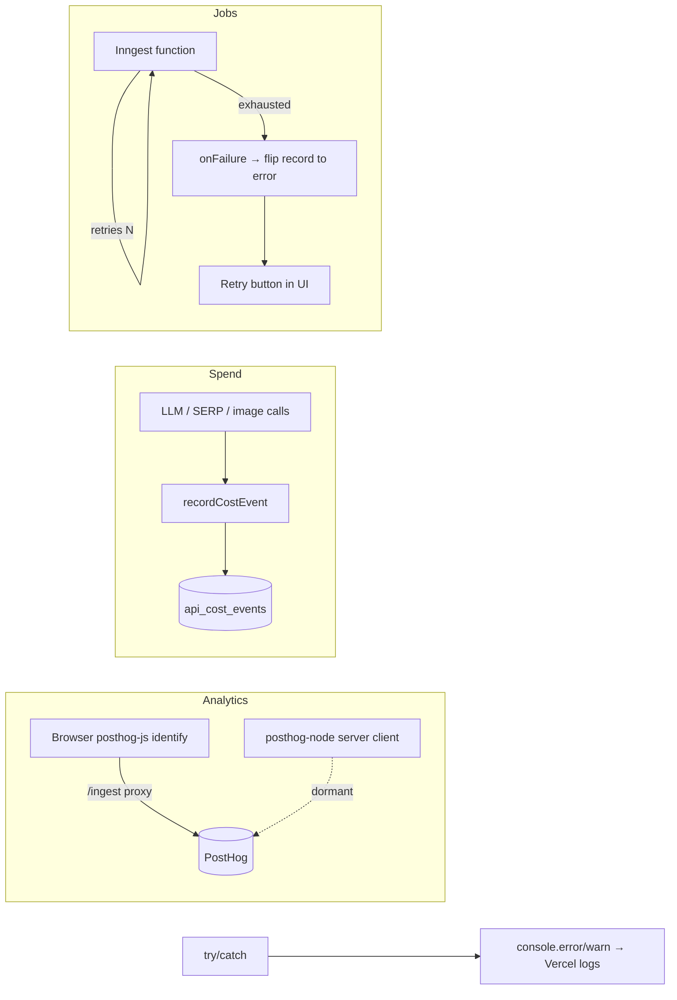

Spyro's observability is deliberately lightweight: **PostHog** for product
analytics, a **Postgres cost ledger** for spend, **Inngest** for job
retry/recovery, and plain `console` logging for errors. There is **no Sentry, no
central logger abstraction, and no APM** - knowing that up front saves you
hunting for one.

## Product analytics: PostHog

### The `/ingest` first-party proxy

`next.config.ts` rewrites `/ingest/*` to PostHog's US ingestion and asset hosts:

```ts
// next.config.ts:13-27
async rewrites() {
  return [
    { source: "/ingest/static/:path*", destination: "https://us-assets.i.posthog.com/static/:path*" },
    { source: "/ingest/array/:path*",  destination: "https://us-assets.i.posthog.com/array/:path*" },
    { source: "/ingest/:path*",        destination: "https://us.i.posthog.com/:path*" },
  ];
}
```

**Why a proxy?** Analytics requests sent straight to `*.posthog.com` are widely
blocked by ad-blockers and tracking-protection lists, which silently drops a
chunk of your data. Routing them through a **same-origin** path
(`yourdomain.com/ingest/*`) makes them look first-party, so they aren't blocked,
while the rewrite forwards them to PostHog server-side. The two `static`/`array`
rules proxy the PostHog JS bundle and feature-flag payloads from the *assets*
host; the catch-all proxies event capture.

### Server-side client

`lib/posthog-server.ts` lazily constructs a `posthog-node` client tuned for
serverless (flush immediately, since the function may freeze right after):

```ts
// lib/posthog-server.ts:5-14
export function getPostHogClient(): PostHog {
  if (!client) {
    client = new PostHog(process.env.NEXT_PUBLIC_POSTHOG_PROJECT_TOKEN!, {
      host: process.env.NEXT_PUBLIC_POSTHOG_HOST,
      flushAt: 1,
      flushInterval: 0,
    });
  }
  return client;
}
```

The relevant env vars are `NEXT_PUBLIC_POSTHOG_PROJECT_TOKEN` and
`NEXT_PUBLIC_POSTHOG_HOST` (see [Environment variables](/reference/environment-variables)).

### Client-side identify

On the client, `components/app/posthog-identify.tsx` (rendered in
`app/layout.tsx:150`) ties the PostHog identity to the Supabase user - calling
`posthog.identify(...)` on load and on `SIGNED_IN`, and `posthog.reset()` on
`SIGNED_OUT`:

```tsx
// components/app/posthog-identify.tsx:11-28 (abridged)
if (user) posthog.identify(user.id, { email: user.email, name: … });
// onAuthStateChange:
if (event === "SIGNED_IN" && session?.user) posthog.identify(session.user.id, { … });
if (event === "SIGNED_OUT") posthog.reset();
```

<Warning>
**PostHog is wired but largely dormant in the committed code.** There is **no
`posthog.init()` call anywhere**, the server `getPostHogClient()` helper has **no
consumers** outside its own file, and no `posthog.capture(...)` event calls were
found. The infrastructure exists - the `/ingest` proxy, the identify component,
and the server client factory - but custom event capture is effectively not yet
emitting. Treat analytics coverage as "scaffolded," not "comprehensive," and
verify in the PostHog project before relying on a given event.
</Warning>

## Error handling conventions

There is **no logger utility** (no `lib/logger.ts`, no structured-logging
wrapper). Errors are handled with `try/catch` and **`console.error` /
`console.warn`** - roughly **88 call sites across 55 files** in `lib` and `app`.
Two patterns dominate:

<Tabs>
<Tab title="Catch, log, return a clean error">
User-facing routes catch, log a tagged message, and return a safe response:

```ts
// lib/free-tools/shared/pdf/browser.ts:130-135
} catch (error) {
  const message = error instanceof Error ? error.message : String(error);
  console.error(`[pdf:${tool}] generation failed :: ${message}`);
  return new NextResponse("Failed to generate PDF. Please try again in a moment.", { status: 500 });
}
```
</Tab>
<Tab title="Best-effort, swallow on failure">
Non-critical side-effects are wrapped so a failure never breaks the primary
operation - sometimes silently, sometimes with a `console.warn`:

```ts
// lib/admin/cost.ts:73-75
} catch (e) {
  console.warn("[admin/cost] recordCostEvent failed:", (e as Error).message);
}
```

The email/MailerLite side-effects in the free-tool subscribe route are swallowed
entirely (`app/api/free-audit/subscribe/route.ts:77-79`).
</Tab>
</Tabs>

The convention is to **tag** logs with a `[area]` prefix (`[pdf:…]`,
`[admin/cost]`, `[crypto]`) so they're greppable in Vercel's function logs.
There is no log level beyond `error`/`warn` and no log shipping - production logs
live in the Vercel dashboard.

## Cost & usage tracking

Every billable external call (LLM completion, embeddings, DataForSEO task, image
generation) is recorded into the **`api_cost_events`** ledger for per-user /
per-org spend attribution and margin analysis in the superadmin panel.

### The ledger table

```sql
-- drizzle/0041_api_cost_events.sql:9-24 (excerpt)
CREATE TABLE IF NOT EXISTS api_cost_events (
  id                uuid PRIMARY KEY DEFAULT gen_random_uuid(),
  occurred_at       timestamptz NOT NULL DEFAULT now(),
  user_id           uuid,  org_id uuid,  workspace_id uuid,
  provider          text NOT NULL,
  operation         text NOT NULL,
  model             text,
  prompt_tokens     integer NOT NULL DEFAULT 0,
  completion_tokens integer NOT NULL DEFAULT 0,
  total_tokens      integer NOT NULL DEFAULT 0,
  cost_usd          numeric(12,6) NOT NULL DEFAULT 0,
  ref_id            text,
  meta              jsonb NOT NULL DEFAULT '{}'::jsonb
);
```

It is **service-role only - RLS enabled with no policy**, so only the
server-role key (which bypasses RLS) ever reads or writes it
(`0041_api_cost_events.sql:31-33`). See [Database](/backend/database) and
[Security](/backend/security#row-level-security-recap).

### The recorder + ambient attribution

`recordCostEvent` (`lib/admin/cost.ts`) writes one row per billable call. It is
**best-effort - it never throws** (a ledger failure must not break a call that
already cost money), and it **skips zero-signal writes** (no cost and no tokens):

```ts
// lib/admin/cost.ts:57-72 (abridged)
if (!(cost > 0) && total <= 0) return;       // skip $0 no-ops
await db.insert(apiCostEvents).values({
  provider: input.provider,
  operation: input.operation ?? ctx.operation ?? "other",
  // … tokens, costUsd: cost.toFixed(6), refId, userId, orgId, workspaceId …
  meta: estimated ? { ...input.meta, estimated: true } : (input.meta ?? {}),
});
```

When the provider doesn't report a dollar cost (the AI-SDK chat path returns
tokens only), the recorder **estimates** from a price table and stamps
`estimated: true` in `meta` (`cost.ts:48-56`).

Attribution is solved with `AsyncLocalStorage`, not by threading `userId`
through every signature. Entry points wrap work in `withCostContext({...}, fn)`
and the recorder reads the ambient scope via `getCostContext()`
(`lib/admin/cost-context.ts:32-40`):

```ts
// lib/admin/cost-context.ts:32-35
export function withCostContext<T>(ctx: CostContext, fn: () => T): T {
  const parent = storage.getStore() ?? {};
  return storage.run({ ...parent, ...ctx }, fn);
}
```

`recordCostEvent`/`withCostContext` are used across ~14 files - the providers
(`lib/llm/openrouter.ts`, `lib/embed/openai.ts`, `lib/images/openrouter.ts`,
`lib/dataforseo/budget.ts`) record, and the entry points (server actions,
Inngest functions) set the context. Recognised providers are
`openrouter | dataforseo | openai | moonshot | screenshotone | flux`
(`lib/admin/cost.ts:7-13`).

## Background-job retries & failure

Spyro's durable work runs on [Inngest](/backend/background-jobs), served from
`app/api/inngest/route.ts`. Each function declares its own **retry count and
concurrency cap** - there is no single global policy:

| Function | Retries | Source |
| --- | --- | --- |
| `audit-crawl-site` | 2 | `lib/inngest/fns/audit.ts:20` |
| `citations-check-one` | 2 | `lib/inngest/fns/citations.ts:181` |
| `integration-deliver` | 4 | `lib/inngest/fns/integration-deliver.ts:30` |
| `post-fanout` | 3 | `lib/inngest/fns/post-fanout.ts:12` |
| `article-write` | 1 | `lib/inngest/fns/article.ts:43` |

<Note>
Several functions deliberately **lower** Inngest's default of 5 retries - e.g.
citations runs at `retries: 2` *"+ a concurrency cap so a workspace's …"* runs
don't stampede (`lib/inngest/fns/citations.ts:212-215`).
</Note>

### Terminal failure backstops

The recovery pattern is an **`onFailure` handler that flips the owning record to
`error`** once retries are exhausted, so the UI escapes its "running" spinner and
shows a Retry button instead of hanging forever:

```ts
// lib/inngest/fns/article.ts:50-63 (abridged)
onFailure: async ({ event }) => {
  const original = (event as …).data?.event?.data;
  const postId = original?.postId;
  if (!postId) return;
  await db.update(blogPosts)
    .set({ status: "error", error: "Article generation failed after retries." })
    .where(eq(blogPosts.id, postId));
},
```

This DB-status-flip is the closest thing Spyro has to alerting: failures surface
as `error` states in the product, not as pages or notifications.

There is also one **degraded-mode fallback**: if Inngest itself is unreachable
when an audit is requested, the action logs a warning and runs the crawl
**inline** (capped) instead of dropping it (`lib/actions/audit.ts:104-109`):

```ts
// lib/actions/audit.ts:104-109 (abridged)
} catch {
  console.warn("[audit] Inngest unavailable - running inline fallback (capped).");
  await runInline(audit.id, ws.id, access.userId, ws.domain, maxPages);
}
```

## Monitoring & recovery summary



<Warning>
Things to *not* assume exist: **no Sentry / error-tracking SaaS**, **no
`/api/health` endpoint**, **no central logger**, and (per the section above) **no
active PostHog event capture**. Recovery is human-driven via Vercel logs, the
superadmin spend panel, and in-product `error` states.
</Warning>

## Related

- [Background jobs](/backend/background-jobs) - Inngest functions, crons, and the serve route.
- [Billing](/backend/billing) - how `api_cost_events` feeds margin/usage reporting.
- [Database](/backend/database) - the `api_cost_events` ledger and RLS posture.
- [Security](/backend/security) - best-effort patterns and the swallow-on-failure convention.
- [AI](/backend/ai) - the LLM providers that record cost events.
- [Deployment: Vercel](/deployment/vercel) - where production logs and the `/ingest` proxy run.
