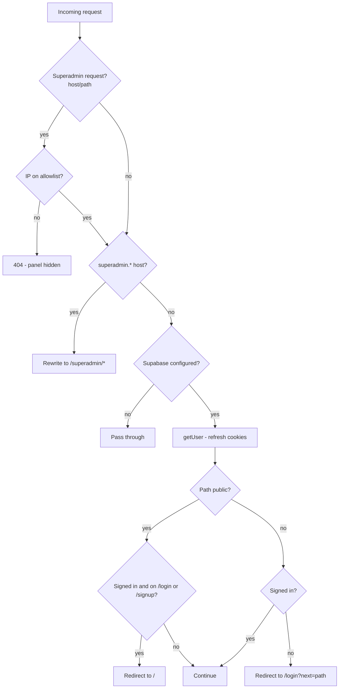

Spyro runs a single piece of edge middleware on every matched request. On
**Next.js 16** the convention file is named `proxy.ts` (the root-level
replacement for the older `middleware.ts`), and the exported function is named
`proxy` rather than `middleware`.

```ts
// proxy.ts:62
export async function proxy(request: NextRequest) {
```

The file does four jobs, in this order:

1. **IP allowlist** for the superadmin surface (404 off-list IPs).
2. **Superadmin subdomain rewrite** (`superadmin.<domain>` → `/superadmin/*`).
3. **Supabase session refresh** + the **auth redirect** for protected pages.
4. **Bounce signed-in users** away from `/login` and `/signup`.

<Note>
The middleware does **not** manage impersonation cookies. The `spyro_impersonation`
cookie is *set* by [`/api/admin/impersonate`](/backend/authorization#admin-impersonation)
and *read by a banner component* in the app - `proxy.ts` never touches it.
</Note>

## The matcher

The `config.matcher` decides which paths run the middleware. It excludes Next's
static assets, the favicon, and common image extensions - everything else runs
through the gate:

```ts
// proxy.ts:115-117
export const config = {
  matcher: ["/((?!_next/static|_next/image|favicon.ico|.*\\.(?:svg|png|jpg|jpeg|gif|webp)$).*)"],
};
```

## Public prefixes and the auth gate

Spyro is "private by default": any matched path that is **not** explicitly public
requires a signed-in Supabase user. The allowlist of public paths is a small,
auditable list. It includes two **anonymous PDF render pages** (`/pdf-report`,
`/audit-report`) that the Gotenberg PDF service fetches without a session -
`/audit-report` is additionally guarded by a short-lived HMAC token verified in
the page (see [PDF engine](/backend/pdf-engine)):

```ts
// proxy.ts:5-30
const PUBLIC_PREFIXES = [
  "/login", "/signup", "/reset", "/invite", "/onboarding",
  "/auth", "/api", "/pricing", "/privacy", "/terms", "/about",
  // Anonymous PDF render pages fetched by Gotenberg (no user session):
  "/pdf-report", "/audit-report",
];

const isPublic = (p: string) =>
  p === "/" ||
  p === "/sitemap.xml" ||
  p === "/robots.txt" ||
  PUBLIC_PREFIXES.some((x) => p === x || p.startsWith(x + "/")) ||
  p.startsWith("/_next") ||
  /\.(svg|png|jpg|jpeg|gif|webp|ico)$/.test(p);
```

<Warning>
`"/api"` is in `PUBLIC_PREFIXES`, so **the middleware never blocks API routes** -
each route handler is responsible for its own auth. That's why internal routes
call `getCurrentUser()`/`requireAccess()` themselves and the public
[`/api/v1`](/backend/public-api) routes check the `Bearer` key. Don't assume an
endpoint is protected just because the app is private.
</Warning>

### Session refresh and redirect

For non-public paths, the middleware constructs a request-bound Supabase client
and calls `getUser()`. This both **validates** the session and **refreshes** the
auth cookies onto the outgoing response. If there is no user, it redirects to
`/login`, preserving the original path as `?next=`:

```ts
// proxy.ts:96-110
const {
  data: { user },
} = await supabase.auth.getUser();

const path = request.nextUrl.pathname;

if (!isPublic(path) && !user) {
  const redirectUrl = new URL("/login", request.url);
  redirectUrl.searchParams.set("next", path);
  return NextResponse.redirect(redirectUrl);
}

if (user && (path === "/login" || path === "/signup")) {
  return NextResponse.redirect(new URL("/", request.url));
}
```

<Info>
The middleware reads `NEXT_PUBLIC_SUPABASE_ANON_KEY` directly (`proxy.ts:82`).
If either `NEXT_PUBLIC_SUPABASE_URL` or the anon key is missing, the gate is a
no-op (`proxy.ts:86`) so the app can still boot before Supabase is configured.
The browser client's publishable-key fallback is a *different* file
([`lib/supabase/client.ts`](/backend/authentication)).
</Info>

The cookie plumbing uses `@supabase/ssr`'s `getAll`/`setAll` cookie adapter, so
refreshed tokens ride back on the response:

```ts
// proxy.ts:83-94
const supabase = createServerClient(url, anon, {
  cookies: {
    getAll() {
      return request.cookies.getAll();
    },
    setAll(cookiesToSet) {
      cookiesToSet.forEach(({ name, value, options }) =>
        response.cookies.set(name, value, options),
      );
    },
  },
});
```

## Superadmin subdomain rewrite

In production, `superadmin.<domain>` is a domain alias on the same Vercel
project. The middleware rewrites its requests onto the internal `/superadmin/*`
segment so the admin panel ships in one codebase, and the Supabase cookie (set
on the parent domain) carries across the subdomain.

```ts
// proxy.ts:37-53
function superadminRewrite(request: NextRequest): URL | null {
  const host = request.headers.get("host") ?? "";
  if (!host.startsWith("superadmin.")) return null;
  const path = request.nextUrl.pathname;
  if (
    path.startsWith("/superadmin") ||
    path.startsWith("/_next") ||
    path.startsWith("/api") ||
    path === "/favicon.ico" ||
    /\.[a-z0-9]+$/i.test(path)
  ) {
    return null;
  }
  const url = request.nextUrl.clone();
  url.pathname = path === "/" ? "/superadmin" : `/superadmin${path}`;
  return url;
}
```

The panel is **also** reachable at `/superadmin` on the main host (used in local
dev where there's no subdomain). That's safe because the real boundary is the
dedicated admin session gate in `app/superadmin/(panel)/layout.tsx` plus the IP
allowlist below - both of which 404 everyone else.

## IP allowlist

Before anything renders, requests targeting the superadmin panel or its admin API
are checked against an optional IP allowlist. Off-list requests get a bare
**404** - Spyro never reveals that the panel exists.

```ts
// proxy.ts:55-70
function isSuperadminRequest(request: NextRequest): boolean {
  const host = request.headers.get("host") ?? "";
  const path = request.nextUrl.pathname;
  return host.startsWith("superadmin.") || path.startsWith("/superadmin") || path.startsWith("/api/admin");
}

export async function proxy(request: NextRequest) {
  if (isSuperadminRequest(request)) {
    const allow = parseAllowlist(process.env.ADMIN_IP_ALLOWLIST);
    if (allow.length > 0 && !ipAllowed(clientIp(request.headers), allow)) {
      return new NextResponse(null, { status: 404 });
    }
  }
  // …
```

The matching logic lives in `lib/admin/ip.ts` (pure, no `server-only` import, so
it runs at the edge):

- `clientIp(headers)` reads `x-forwarded-for` (first hop) then `x-real-ip`
  (`lib/admin/ip.ts:11-15`).
- `parseAllowlist(raw)` splits the comma-separated `ADMIN_IP_ALLOWLIST` env var
  (`lib/admin/ip.ts:45-50`).
- `ipAllowed(ip, allowlist)` supports exact IPs (IPv4 and IPv6) and **IPv4
  CIDR** ranges. An **empty allowlist means the feature is off** (no
  restriction); a non-empty allowlist denies unknown IPs
  (`lib/admin/ip.ts:56-60`).

```ts
// lib/admin/ip.ts:56-60
export function ipAllowed(ip: string | null, allowlist: string[]): boolean {
  if (allowlist.length === 0) return true; // not configured → no restriction
  if (!ip) return false;
  return allowlist.some((entry) => matchesEntry(ip, entry));
}
```

<Tip>
The same `ipAllowed`/`parseAllowlist` helpers are reused server-side in
`lib/admin/auth.ts` (`assertIpAllowed`, `getAdminSession`) - defense in depth:
the edge 404s off-list IPs, and the panel's own layout re-checks before rendering.
</Tip>

## Request flow



## Related

- [Authentication](/backend/authentication) - the login/signup flows the redirect protects.
- [Authorization](/backend/authorization) - roles, admin sessions, and impersonation.
- [Public API](/backend/public-api) - why `/api` is public at the edge and self-guards.
- [Security](/backend/security) - the IP allowlist as part of the security posture.
- [Architecture](/getting-started/architecture) - where middleware sits in the request lifecycle.
