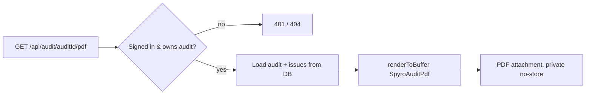

Spyro generates PDFs through **two completely separate paths**, chosen per
report. They share nothing but the goal:

| Path | Library | Used by | How it renders |
| --- | --- | --- | --- |
| **react-pdf** | `@react-pdf/renderer` | the authed **Site Audit** export | builds a PDF document tree in Node, no browser |
| **Gotenberg** | external headless-Chrome service | the **five free tools** | POSTs a public HTML page's URL to Chromium and streams the PDF back |

Knowing which path a report uses tells you where its layout lives, how it is
styled, and what can break.

<Note>
There is **no Chromium binary in the Vercel bundle**. The old
`puppeteer-core`/`@sparticuz/chromium` approach was removed — free-tool PDFs are
rendered by the external Gotenberg service instead. See the comment in
`next.config.ts:34-36`.
</Note>

## Path 1 — react-pdf (the Site Audit export)

The signed-in dashboard's **Site Audit** is exported with
[`@react-pdf/renderer`](https://react-pdf.org), which renders a React component
tree straight to a PDF buffer in the Node runtime. No browser, no HTML, no
network round-trip.

### The document component

`lib/audit/pdf-report.tsx` defines `SpyroAuditPdf`, a React component built from
react-pdf primitives — `Document`, `Page`, `View`, `Text`, `Image`, plus a
`StyleSheet` (`lib/audit/pdf-report.tsx:5-13`). It is a **server-only** module:

```tsx
// lib/audit/pdf-report.tsx:1-4
/**
 * @react-pdf/renderer document for the Spyro site audit PDF export.
 * Only imported server-side (API route) — never bundled for the client.
 */
```

Key facts that come straight from the source:

- **Fonts are the built-in PDF faces** — `Helvetica` / `Helvetica-Bold`
  (`lib/audit/pdf-report.tsx:64-73`). No web fonts are embedded, so the export is
  fast and deterministic.
- **Colours are hard-coded hex tokens** because react-pdf does not support CSS
  variables (`lib/audit/pdf-report.tsx:47-60`).
- **Markdown fix-text is parsed manually.** GEO checks emit lightweight
  `**bold**` markdown; rendered raw it would print literal asterisks, so
  `PdfFixText` splits bold spans and newlines into `Text` primitives
  (`lib/audit/pdf-report.tsx:22-45`).
- The document is two `Page size="A4"` pages: a **cover** with score boxes and a
  **fixed footer** (`render={({ pageNumber, totalPages }) => …}`), then an
  **issues** page grouped by severity (`lib/audit/pdf-report.tsx:321-365`).

### The download route

`app/api/audit/[auditId]/pdf/route.ts` is the `GET` handler. It is fully
**auth-gated and scoped to the owner** — this is a private report, not a public
one:

```ts
// app/api/audit/[auditId]/pdf/route.ts:30-45
const user = await getCurrentUser();
if (!user) {
  return new NextResponse("Unauthorized", { status: 401 });
}

// 2. Fetch audit scoped to this user (prevents cross-user access).
const auditRow = await db
  .select()
  .from(audits)
  .where(and(eq(audits.id, auditId), eq(audits.userId, user.id)))
  .limit(1)
  .then((r) => r[0] ?? null);

if (!auditRow || auditRow.status !== "done") {
  return new NextResponse("Not found", { status: 404 });
}
```

It then loads the audit, workspace domain, and issue rows, and renders the
buffer with `renderToBuffer`:

```ts
// app/api/audit/[auditId]/pdf/route.ts:71-83
const pdfBuffer = await renderToBuffer(
  createElement(SpyroAuditPdf, {
    audit: { … },
    issues: issueRows as PdfIssueData[],
    domain,
    logoSrc,
  }) as ReactElement<DocumentProps, …>,
);
```

The logo is read from disk once and memoised at module scope as a base64 data
URI, so warm invocations skip the `fs.readFileSync` (`route.ts:14-21`). The
buffer is returned with `Content-Disposition: attachment` and
`Cache-Control: private, no-store` (`route.ts:91-98`).

## Path 2 — Gotenberg (the free-tool reports)

The five [free tools](/backend/free-tools) produce full HTML/CSS report pages,
not react-pdf trees. To turn one into a pixel-perfect PDF, Spyro renders it with
**real Chromium** running in an external [Gotenberg](https://gotenberg.dev)
container (self-hosted on Railway). The Vercel function never touches a browser
binary — it just calls Gotenberg over HTTP.

### The render helper

All free-tool PDF routes funnel through one helper, `renderReportPdf`, in
`lib/free-tools/shared/pdf/browser.ts`:

```ts
// lib/free-tools/shared/pdf/browser.ts:3-9
/**
 * PDF engine: Gotenberg (self-hosted headless Chrome on Railway).
 *
 * The free-tool reports are full HTML/CSS pages. We render them with real Chromium
 * by POSTing the report's PUBLIC URL to a Gotenberg container and streaming back
 * the PDF, so the Vercel function carries no browser binary.
 */
```

It builds a public URL to the report page, POSTs it as multipart form data to
Gotenberg's URL-conversion endpoint, and streams the result back:

```ts
// lib/free-tools/shared/pdf/browser.ts:92-115
const form = new FormData();
form.append("url", reportUrl);
form.append("paperWidth", "8.27");   // A4
form.append("paperHeight", "11.69");
form.append("marginTop", "0.55");
// … margins + printBackground …
form.append("waitDelay", "1s");      // let Inter/Lato web fonts settle

res = await fetch(`${GOTENBERG_URL}/forms/chromium/convert/url`, {
  method: "POST",
  body: form,
  headers: authHeaders(),
  signal: controller.signal,
});
```

<Warning>
Gotenberg fetches the report page **itself**, over the public internet — it
cannot reach `localhost`. The origin it fetches is resolved by
`resolveReportOrigin` (`browser.ts:42-59`), which tries, in order:
`GOTENBERG_REPORT_ORIGIN` → `NEXT_PUBLIC_APP_URL` →
`VERCEL_PROJECT_PRODUCTION_URL` → `VERCEL_URL` → the request's own host, and
**rejects any localhost/127.0.0.1 candidate**. For local dev you must point
`GOTENBERG_REPORT_ORIGIN` at a public origin (e.g. the prod domain, which reads
the same shared DB).
</Warning>

### Environment variables

All Gotenberg config is read at the top of `browser.ts` (`:19-21`,
documented in `:10-17`):

| Variable | Purpose |
| --- | --- |
| `GOTENBERG_URL` | Base URL of the Gotenberg service (required; trailing slashes stripped). |
| `GOTENBERG_USER` / `GOTENBERG_PASSWORD` | Optional HTTP basic-auth credentials, sent as a `Basic` header when both are set (`browser.ts:27-33`). |
| `GOTENBERG_REPORT_ORIGIN` | Optional override for the public origin Gotenberg fetches the report from. Must be publicly reachable. |

See [Environment variables](/reference/environment-variables) for the full list.

### The report render pages

The HTML that Gotenberg screenshots is an ordinary Next.js **server component**.
For the free audit it is `app/pdf-report/page.tsx` — a Tailwind-styled,
print-tuned page that reads the cached report from the database and lays out the
cover, scores, issues, GEO checklist, Core Web Vitals, link inventory, and a
CTA:

```tsx
// app/pdf-report/page.tsx:107-122
export default async function PdfReportPage({ searchParams }: { searchParams: Promise<{ website?: string }> }) {
  const { website } = await searchParams;
  const norm = website ? normalizeDomainInput(website) : null;
  if (!norm) return notFound();

  let report: FreeAuditReport | null = null;
  try {
    const row = await getReportRow(norm.domain);
    if (row && isFresh(row)) {
      report = normalizeReport(row.reportJson);
    }
  } catch { /* falls through to notFound */ }
  if (!report) return notFound();
```

Because Chromium renders this page, the PDF can use the site's **real fonts,
Tailwind classes, gradients, and `@media print` rules** (`page.tsx:579-587`) —
things react-pdf can't do. The score gauges, for example, are plain CSS
`conic-gradient` divs (`page.tsx:57-77`).

### The PDF download routes

Each free tool exposes a small `GET` route under `app/api/<tool>/pdf/route.ts`
that validates input, checks the report exists and is fresh, then delegates to
`renderReportPdf`. The free-audit route is representative:

```ts
// app/api/free-audit/pdf/route.ts:6-36
export const runtime = "nodejs";
export const maxDuration = 300; // the Vercel function just waits on Gotenberg

export async function GET(req: NextRequest) {
  const website = new URL(req.url).searchParams.get("website");
  if (!website) return new NextResponse("Missing website parameter", { status: 400 });

  const norm = normalizeDomainInput(website);
  if (!norm) return new NextResponse("Invalid website", { status: 400 });

  const row = await getReportRow(norm.domain).catch(() => null);
  if (!row || !isFresh(row)) {
    return new NextResponse("Report not found or expired. Please run the audit again.", { status: 404 });
  }

  return renderReportPdf({
    req,
    tool: "free-audit",
    reportPath: "/pdf-report",
    query: `website=${encodeURIComponent(norm.domain)}`,
    filename: `Spyro_Audit_${norm.domain}.pdf`,
  });
}
```

The five Gotenberg-backed routes are
`app/api/{ai-crawler-check,ai-visibility,free-audit,meta-snippet,schema-validator}/pdf/route.ts`
— each points `reportPath` at its own render page and passes its own filename.

### Client download

In the browser, the **Download PDF** button does not `window.open` — it fetches
the route as a blob and triggers a real file download with the right filename,
via the shared `downloadFreeToolPdf` helper:

```ts
// lib/free-tools/shared/download-pdf.ts:11-29
export async function downloadFreeToolPdf(pdfUrl: string, filename: string): Promise<PdfDownloadResult> {
  const res = await fetch(pdfUrl, { method: "GET", headers: { Accept: "application/pdf" } });
  if (!res.ok) { … return { ok: false, error: `HTTP ${res.status}` }; }
  const blob = await res.blob();
  const a = document.createElement("a");
  a.href = URL.createObjectURL(blob);
  a.download = filename;
  a.click();
  // … cleanup …
  return { ok: true };
}
```

Returning `{ ok }` lets the button show a retry state when generation fails.

## Generate → download flow

```mermaid
sequenceDiagram
  participant U as Browser
  participant R as /api/free-audit/pdf (Vercel)
  participant DB as free_audit_reports
  participant G as Gotenberg (Railway, Chromium)
  participant P as /pdf-report page (public)

  U->>R: GET ?website=example.com
  R->>DB: getReportRow + isFresh
  alt missing or expired
    R-->>U: 404 "run the audit again"
  else fresh
    R->>G: POST /forms/chromium/convert/url (reportUrl + A4 opts)
    G->>P: GET https://origin/pdf-report?website=example.com
    P->>DB: read cached report JSON
    P-->>G: rendered HTML + CSS
    G-->>R: application/pdf bytes
    R-->>U: PDF (attachment; no-store)
    U->>U: blob → <a download> click
  end
```

The react-pdf path is simpler — no Chromium, no second HTTP hop:



## A note on `@resvg/resvg-js`

`@resvg/resvg-js` sits beside `@react-pdf/renderer` in `serverExternalPackages`
(`next.config.ts:37`), so it is easy to assume it is part of PDF generation. It
is **not**. Its only consumer is the **content/image pipeline**:
`lib/images/chart.ts` hand-rolls a grouped-bar SVG and rasterises it to PNG with
`Resvg` (`lib/images/chart.ts:1-2, 66-67`), and the only callers are
`lib/images/in-content.ts` and `lib/images/run.ts` (the blog in-content chart
generator). Neither PDF path embeds a resvg chart — `pdf-report.tsx` contains
only a base64 logo, and the Gotenberg page draws its gauges as CSS
`conic-gradient` divs. See [Content engine](/backend/content-engine).

## Common mistakes and tips

<AccordionGroup>
<Accordion title="Free-tool PDF 404s in local dev">
Gotenberg can't fetch `http://localhost:3000`. Set `GOTENBERG_REPORT_ORIGIN` to
a public origin that serves the same database (`browser.ts:35-41`), or the route
returns *"No public origin for the report page."*
</Accordion>
<Accordion title="The PDF is blank / fonts look wrong">
The Gotenberg render waits `1s` (`waitDelay`) for Inter/Lato to settle
(`browser.ts:101`). The react-pdf path can only use the built-in Helvetica faces
— do not reference a web font there (`pdf-report.tsx:64-73`).
</Accordion>
<Accordion title="Changing PDF layout">
Edit the **render page** for free tools (`app/pdf-report/page.tsx`, real
Tailwind/CSS) but the **component** for the audit
(`lib/audit/pdf-report.tsx`, react-pdf primitives only — no arbitrary CSS).
</Accordion>
</AccordionGroup>

## Related

- [Free tools](/backend/free-tools) — the five tools whose reports become Gotenberg PDFs.
- [Audit](/backend/audit) — the site audit whose data feeds the react-pdf export.
- [Content engine](/backend/content-engine) — the real home of `@resvg/resvg-js`.
- [Database](/backend/database) — `free_tool_reports` / `free_audit_reports` persistence.
- [Deployment: Vercel](/deployment/vercel) — `serverExternalPackages` and file tracing.
- [Security](/backend/security) — auth scoping on the audit PDF route.
