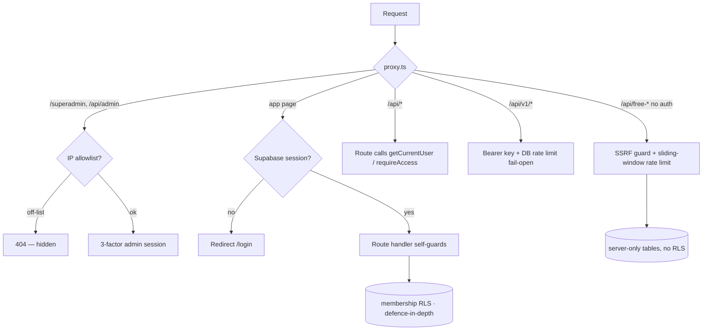

This page is the security map for Spyro's backend. It describes the controls
that exist **in the code**, quotes the load-bearing implementations, and is
explicit about the protections that are **not** present — so you don't assume a
defence that isn't there.

<Note>
Auth and access control have their own pages. This page recaps them and
cross-links; see [Authentication](/backend/authentication),
[Authorization](/backend/authorization), and [Middleware](/backend/middleware).
</Note>

## Trust model at a glance

| Surface | Primary control |
| --- | --- |
| App pages (`/`, dashboard) | Supabase session, enforced in [`proxy.ts`](/backend/middleware) |
| Internal API routes (`/api/*`) | **Self-guarded** — middleware lets `/api` through; each route calls `getCurrentUser()`/`requireAccess()` |
| Public API (`/api/v1/*`) | `Bearer` workspace key + DB rate limiting ([Public API](/backend/public-api)) |
| Free tools (`/api/{tool}`) | No auth, but **SSRF-guarded + rate-limited** |
| Superadmin (`/superadmin`, `/api/admin`) | IP allowlist (edge 404) + 3-factor admin session |
| Database | Membership-driven [RLS](/backend/authorization) (defence-in-depth) + at-rest encryption for integration secrets |

## Rate limiting

Spyro runs **three** distinct rate limiters. Pick the right mental model for
each — they have different storage and durability guarantees.

### In-memory fixed window (`lib/rate-limit.ts`)

Pure logic, also callable from the edge (`proxy.ts`). The counter lives in one
warm instance's memory — best-effort, not globally shared:

```ts
// lib/rate-limit.ts:23-42
export function rateLimit(key: string, limit = 10, windowMs = 60_000): RateLimitResult {
  const now = Date.now();
  const b = buckets.get(key);
  if (!b || b.resetAt <= now) {
    buckets.set(key, { count: 1, resetAt: now + windowMs });
    if (buckets.size > 10_000) { /* opportunistic cleanup */ }
    return { ok: true, remaining: limit - 1, retryAfterSeconds: 0 };
  }
  if (b.count >= limit) {
    return { ok: false, remaining: 0, retryAfterSeconds: Math.ceil((b.resetAt - now) / 1000) };
  }
  b.count += 1;
  return { ok: true, remaining: limit - b.count, retryAfterSeconds: 0 };
}
```

<Warning>
This is explicitly **best-effort on serverless** — *"a request that lands on a
cold/another instance starts a fresh window"* (`lib/rate-limit.ts:5-9`). It
blunts scripted spam at the 10/min scale; it is not a hard global cap.
</Warning>

### Free-tool sliding window (`lib/free-tools/shared/rate-limit.ts`)

A separate, in-memory **sliding-window** limiter keyed by IP + bucket name,
used by every free tool. Every free-tool route applies it before doing any
work. Observed limits, per IP per 10 minutes:

| Route | Limit | Source |
| --- | --- | --- |
| `/api/ai-crawler-check` | 8 | `route.ts:39` (`aicrawler:${ip}`) |
| `/api/ai-visibility` | 6 | `route.ts:41` |
| `/api/free-audit` | 8 | `route.ts:68` (`run:${ip}`) |
| `/api/schema-validator` | 6 | `route.ts:41` (`schema:${ip}`) |
| `/api/meta-snippet/extract` | 30 | `route.ts:45` (`metasnippet:${ip}`) |
| `/api/free-audit/subscribe` | 12 | `route.ts:42` (`sub:${ip}`) |

### Durable DB-backed window (`lib/api/rate-limit-db.ts`)

The public `/api/v1` surface needs a **cross-instance** limit, so it uses
Postgres (`api_rate_counters`) with an atomic upsert per window bucket:

```ts
// lib/api/rate-limit-db.ts:36-62
const rows = await db.execute(sql`
  insert into api_rate_counters (bucket, count, expires_at)
  values (${bucket}, 1, ${expiresAt})
  on conflict (bucket) do update set count = api_rate_counters.count + 1
  returning count
`);
// …
if (count > limit) return { ok: false, … };
return { ok: true, … };
// catch → return { ok: true, remaining: limit, retryAfterSeconds: 0 }; // FAIL OPEN
```

Two layers are applied around auth (`lib/api/rate-limit-db.ts:77-90`):
`ipRateLimit` runs **before** auth (120 req/min default) so bad-token floods are
blunted, and `keyRateLimit` runs **after** auth (240 req/min) so one valid key
can't hammer the API.

<Warning>
The DB limiter **fails open** by design (`rate-limit-db.ts:60-61`): a DB outage
returns `ok: true` so the limiter can't take down legitimate traffic. The
trade-off is that during a DB outage there is effectively no `/api/v1` rate cap.
</Warning>

The backing table (`drizzle/0046_api_rate_counters.sql`):

```sql
create table if not exists "api_rate_counters" (
  "bucket"     text primary key,
  "count"      integer not null default 0,
  "expires_at" timestamptz not null
);
```

## SSRF protection

The free tools fetch **arbitrary user-supplied URLs** from the server with no
auth — a textbook SSRF vector. The guard is `assertPublicUrl` in
`lib/free-tools/shared/ssrf.ts`. It is injected into the crawler as
`validateUrl`, so it runs **before every fetch — including each redirect hop and
discovered link**, not just the entry URL (`ssrf.ts:4-9`).

`assertPublicUrl` rejects, in order (`ssrf.ts:60-105`):

<Steps>
<Step title="Non-http(s) schemes">
`file:`, `gopher:`, `ftp:`, etc. are blocked (`ssrf.ts:68-70`).
</Step>
<Step title="Embedded credentials">
URLs with `username:password@` are rejected (`ssrf.ts:71-73`).
</Step>
<Step title="Non-default ports">
Only `80` and `443` — *"a custom port on a public host is a common SSRF pivot"*
(`ssrf.ts:75-77`).
</Step>
<Step title="Internal hostnames">
`localhost`, `*.localhost`, `*.internal`, `*.local` (`ssrf.ts:83-85`).
</Step>
<Step title="Private/literal IPs">
`isPrivateIpv4` blocks `0/8`, `10/8`, `127/8`, **`169.254/16` (incl. cloud
metadata `169.254.169.254`)**, `172.16/12`, `192.168/16`, `100.64/10`,
multicast, and more (`ssrf.ts:19-35`); `isPrivateIpv6` blocks `::1`, `fe80::/10`,
`fc00::/7`, and IPv4-mapped addresses (`ssrf.ts:38-47`).
</Step>
<Step title="DNS rebinding">
For named hosts it resolves **all** addresses and blocks if **any** is private
(`ssrf.ts:93-104`):

```ts
// lib/free-tools/shared/ssrf.ts:96-104
records = await lookup(host, { all: true });
// …
for (const r of records) {
  if (isPrivateIp(r.address)) throw new SsrfError(`Host resolves to private IP: ${host}`);
}
```
</Step>
</Steps>

<Note>
This is a **resolve-then-check** guard, which closes the basic DNS-rebinding
hole at resolution time. The code is candid about the residual: TOCTOU is only
*bounded*, not eliminated — *"the crawler re-validates each hop"* but the kernel
could still resolve a different address at connect time (`ssrf.ts:93-94`). There
is no pinned-IP connection. This guard lives only in the free-tools layer; the
authed [crawler](/backend/crawler) accepts an injected `validateUrl`.
</Note>

## Input validation

Validation is **inconsistent by design**, and you should know where each style
applies:

- **Zod schema validation** is used on the public API — e.g.
  `app/api/v1/integrations/register/route.ts:13-17` parses the body with
  `z.object({ platform: z.enum([...]), target_url: z.string().url(), … })` and
  additionally enforces `https` (`:36-39`).
- **Free-tool routes do *semantic* validation, not Zod.** They normalise the
  domain (`normalizeDomainInput`) and run the SSRF guard rather than parsing a
  schema. The `subscribe` route validates email with a regex and a 254-char cap
  (`app/api/free-audit/subscribe/route.ts:18, 32-35`).

<Warning>
Do not assume every route validates its body with Zod — most internal and
free-tool routes do not. When you add a route that accepts JSON, validate it
explicitly; there is no global request-validation middleware.
</Warning>

## Superadmin: IP allowlist + impersonation

The superadmin panel is protected by **three independent gates**, any one of
which 404s an unauthorised request.

### Edge IP allowlist

Before anything renders, `proxy.ts` checks superadmin requests against
`ADMIN_IP_ALLOWLIST` and returns a bare **404** for off-list IPs (the panel's
existence is never revealed). The matcher lives in `lib/admin/ip.ts` and
supports exact IPv4/IPv6 and **IPv4 CIDR**; an **empty allowlist means the
feature is off**. See [Middleware](/backend/middleware#ip-allowlist) for the
full breakdown.

### 3-factor admin session

`app/api/admin/login/route.ts` requires username **+** password **+** TOTP, all
compared in constant time, behind a per-IP brute-force throttle (5 fails →
15-minute lockout, `login/route.ts:16-34`):

```ts
// app/api/admin/login/route.ts:36-44 (abridged)
const userOk = safeEqual(username, env.ADMIN_USERNAME ?? "\0");
const passOk = verifyAdminPassword(password, env.ADMIN_PASSWORD_HASH, env.ADMIN_PASSWORD);
const totpOk = verifyTotp(env.ADMIN_TOTP_SECRET ?? "", totp);
if (!(userOk && passOk && totpOk)) { recordFail(key, now); return … 401; }
```

The session is a stateless HMAC-SHA256 token (`lib/admin/session.ts`) stored in
an `HttpOnly`, `SameSite=strict`, `Secure`-in-prod cookie with a 1-hour TTL
(`login/route.ts:70-76`). `requireAdmin` re-checks *configured → IP → session*
on every panel request (`lib/admin/auth.ts:20-27`). The whole panel **404s
entirely** if the admin env vars aren't set (`featureFlags.adminConfigured`).

### Impersonation (audited)

A superadmin can impersonate a user. The flow mints a **one-time Supabase
magic-link token**, writes an audit row, and never touches the admin's own
session (`lib/admin/impersonate.ts:30-70`). The audit table
(`drizzle/0042_admin_impersonation.sql`):

```sql
CREATE TABLE IF NOT EXISTS admin_impersonation_sessions (
  id              uuid PRIMARY KEY DEFAULT gen_random_uuid(),
  admin_user_id   uuid NOT NULL,
  target_user_id  uuid NOT NULL,
  target_email    text,
  started_at      timestamptz NOT NULL DEFAULT now(),
  expires_at      timestamptz NOT NULL,
  ended_at        timestamptz,
  ended_by        text
);
ALTER TABLE admin_impersonation_sessions ENABLE ROW LEVEL SECURITY;
```

Impersonation is time-boxed to 30 minutes (`IMPERSONATION_MINUTES`), the cookie
is `HttpOnly`/`SameSite=lax`/`Secure`-in-prod, and ending it signs out and
records `ended_by = "manual"` (`app/api/admin/{impersonate,end-impersonation}/route.ts`).
See [Authorization](/backend/authorization#admin-impersonation).

## Secret handling and at-rest encryption

### Integration credential encryption (`lib/crypto.ts`)

Publishing tokens and app passwords are encrypted at rest with **AES-256-GCM**
(authenticated). The module is `server-only`:

```ts
// lib/crypto.ts:38-44
export function encryptSecret(plaintext: string): string {
  const iv = randomBytes(12);
  const cipher = createCipheriv("aes-256-gcm", key(), iv);
  const ct = Buffer.concat([cipher.update(plaintext, "utf8"), cipher.final()]);
  const tag = cipher.getAuthTag();
  return `v1:${Buffer.concat([iv, tag, ct]).toString("base64")}`;
}
```

The key is `SHA-256(INTEGRATION_SECRET || SUPABASE_SERVICE_ROLE_KEY)`
(`lib/crypto.ts:16-36`). The ciphertext format is
`v1:<base64(iv | authTag | ciphertext)>`, version-tagged for future rotation.

<Warning>
If **neither** `INTEGRATION_SECRET` nor `SUPABASE_SERVICE_ROLE_KEY` is set,
`keyMaterial()` falls back to a **hard-coded dev key** and logs a one-time
warning (`lib/crypto.ts:21-31`). Always set `INTEGRATION_SECRET` before
production — encrypting with the dev key is equivalent to not encrypting.
</Warning>

### Env access (`lib/env.ts`)

Secrets are read through a thin `opt()` accessor that returns `undefined` for
missing/empty vars — there is **no Zod env schema**; missing values surface as
`featureFlags.*` booleans instead (`lib/env.ts`). Document variable *names and
purposes* only; see [Environment variables](/reference/environment-variables).
Server-only secrets include `SUPABASE_SERVICE_ROLE_KEY`, `DATABASE_URL`,
`INTEGRATION_SECRET`, and the `ADMIN_*` set.

## Row-level security (recap)

RLS is **membership-driven**, not `user_id = auth.uid()` ownership. Two
`security definer` helpers — `org_role(org)` and `has_workspace_access(ws)` —
back policies like:

```sql
-- drizzle/rls.sql (workspaces policy)
create policy "workspaces membership" on public.workspaces
  for all
  using (public.has_workspace_access(id))
  with check (public.has_workspace_access(id)
    or public.org_role(org_id) in ('owner', 'admin', 'manager'));
```

<Note>
RLS here is **defence-in-depth**: the app's own queries run through the
Drizzle/Postgres role which **bypasses RLS** (`drizzle/rls.sql` header comment).
RLS protects against direct access using a user's anon/JWT key; it does not
constrain the app server. The free-tool tables (`free_tool_reports`,
`free_audit_reports`) are intentionally **server-only with no RLS** — they hold
no user-scoped data. See [Authorization](/backend/authorization) and
[Database](/backend/database).
</Note>

## What is NOT implemented

Being explicit here prevents false confidence:

<Warning>
- **No custom security headers.** `next.config.ts` defines no `headers()` and
  `vercel.json` is empty (`{ "$schema": … }` only). There is **no CSP,
  HSTS, X-Frame-Options, X-Content-Type-Options, or Referrer-Policy** set by the
  app. (The "Server & Security" section in the audit PDF reports on *other
  sites'* headers — it does not set Spyro's own.)
- **No CORS configuration.** No `Access-Control-Allow-*` headers are emitted;
  routes rely on the browser's default same-origin policy.
- **No HTML sanitization library.** There is no DOMPurify and no
  `dangerouslySetInnerHTML` on untrusted input. The blog renderer
  (`lib/publish/render/html.ts`) hand-escapes `& < >` and passes pre-sanitised
  `<a>` tags through — adequate for first-party markdown, but it is not a
  general-purpose sanitizer.
- **Rate limiting is mostly per-instance/in-memory** (except `/api/v1`), so it
  is best-effort, not a hard global cap.
- **SSRF protection is free-tools-only** and does not pin the resolved IP at
  connect time.
</Warning>

## Security model overview



## Related

- [Authentication](/backend/authentication) — Supabase sessions and cookies.
- [Authorization](/backend/authorization) — roles, RLS, plan gating, impersonation.
- [Middleware](/backend/middleware) — the edge gate and IP allowlist.
- [Public API](/backend/public-api) — `Bearer` keys and the DB rate limiter.
- [Crawler](/backend/crawler) — where the injected `validateUrl` SSRF guard runs.
- [Free tools](/backend/free-tools) — the no-auth surface these guards protect.
- [Database](/backend/database) — RLS files and the free-tool tables.
