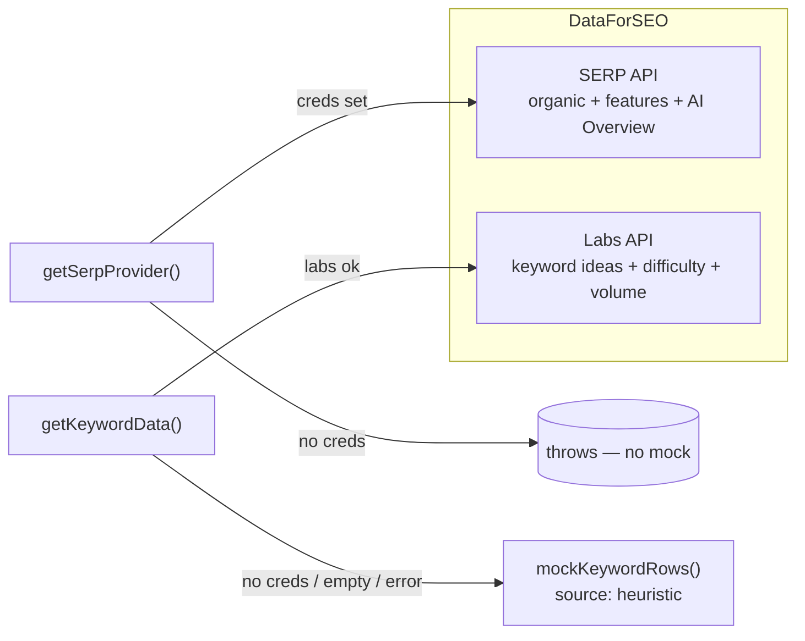

The SEO engine (`lib/seo/*`, `lib/serp/*`, `lib/dataforseo/*`, `lib/keyword-data/*`)
turns **real Google data** into the difficulty, intent, volume, clustering, issue,
and health numbers shown across the app. Everything here is deterministic and
testable — the LLM is not in this path. Where a score is computed, the real
function is quoted verbatim below.

## How SEO data is sourced

There are two external data layers, and they have **different failure policies**.



### SERP — DataForSEO only, no mock fallback

`getSerpProvider()` memoizes a single provider. DataForSEO is the **only** SERP
provider; if credentials are missing it **throws**, and on a request failure the
real error propagates. There is no mock SERP provider in the codebase.

```ts
// lib/serp/index.ts:9, 20-31
const dataForSeoCreds = Boolean(env.DATAFORSEO_LOGIN && env.DATAFORSEO_PASSWORD);

export function getSerpProvider(): SerpProvider {
  if (_provider) return _provider;
  if (!dataForSeoCreds) {
    throw new Error(
      "[serp] No SERP provider configured. Set DATAFORSEO_LOGIN and DATAFORSEO_PASSWORD in .env.local.",
    );
  }
  _provider = createDataForSeoProvider();
  return _provider;
}
export const serpIsLive = dataForSeoCreds;
```

<Note>
  `SerpResult` carries a `mocked` field, but every code path sets it to `false`
  (`lib/serp/dataforseo.ts:147`, `lib/serp/lookup.ts:58`) — a vestige of a removed
  mock. SERP data is always real or it is an error.
</Note>

### Keyword data — DataForSEO Labs with a heuristic fallback

Keyword metrics are different: `getKeywordData()` uses DataForSEO Labs when
credentials exist, and falls back to a deterministic mock in three cases — no
creds, Labs returns zero rows, or Labs throws. The source is tagged `"labs"` or
`"heuristic"`, and **only `"labs"` rows are cached**.

```ts
// lib/keyword-data/index.ts:31-50
if (hasCreds) {
  const provider = createDataForSeoKeywordProvider();
  try {
    labsRows = await provider.fetchIdeas(seed, opts);
    source = "labs";
    if (labsRows.length === 0) { labsRows = mockKeywordRows(seed); source = "heuristic"; }
  } catch (err) {
    console.warn("[keyword-data] Labs failed, heuristic fallback:", (err as Error).message);
    labsRows = mockKeywordRows(seed); source = "heuristic";
  }
} else {
  labsRows = mockKeywordRows(seed); source = "heuristic";
}
```

The mock (`lib/keyword-data/mock.ts`) is deterministic: ten fixed suffixes with
volume/cpc/competition/difficulty derived from a char-code hash. The `heuristic`
source surfaces to the UI as `mocked: true` so estimated data is never presented as
real (`lib/seo/keywords.ts:55`).

### The DataForSEO client

Every DataForSEO call goes through one HTTP client (`lib/dataforseo/client.ts`):

- **Base URL** `https://api.dataforseo.com` (v3 paths), 30s timeout, 3 retries.
- **Auth** HTTP Basic from `DATAFORSEO_LOGIN` / `DATAFORSEO_PASSWORD`.
- **Retries** on `408/429/500/502/503/504` with exponential backoff honoring
  `Retry-After`.
- **DataForSEO-aware errors** — an HTTP `200` whose top-level `status_code !==
  20000` is treated as a hard error and throws `DataForSeoError`.
- **Daily budget circuit breaker** — `assertWithinBudget()` runs before every call.

```ts
// lib/dataforseo/budget.ts:57-73
export async function assertWithinBudget(): Promise<void> {
  const cap = budgetCap(); // env.DATAFORSEO_DAILY_BUDGET_USD; null = unlimited
  if (cap == null) return;
  let spent: number;
  try { spent = await todaySpend(); }
  catch (e) { console.warn("[dataforseo] budget check skipped:", (e as Error).message); return; }
  if (spent >= cap) {
    throw new DataForSeoError(
      `Daily DataForSEO budget reached ($${spent.toFixed(2)} ≥ $${cap.toFixed(2)}) — ` +
        "calls are paused until UTC midnight.",
    );
  }
}
```

Spend is accumulated per UTC day in `dataforseo_usage` and attributed to the cost
ledger via `recordCostEvent({ provider: "dataforseo", operation: "serp" })`. See
[Logging & monitoring](/backend/logging).

<Tip>
  SERP has a **standard (queued)** mode (`task_post` → `task_get`) that is ~7×
  cheaper than **live advanced**, plus a 7-day snapshot cache in
  `lib/serp/lookup.ts` (`getOrFetchSerp`) that also enforces a monthly per-user
  SERP cap. Reach for cached/standard whenever freshness allows.
</Tip>

## Keyword difficulty

Spyro has two difficulty sources. The primary value is DataForSEO Labs'
`keyword_difficulty`, passed straight through. When only a SERP is available, the
app computes its own KD from the authority of who's already ranking:

```ts
// lib/seo/difficulty.ts:8-30
export function difficultyFromSerp(serp: SerpResult): number {
  const top10 = serp.organic.slice(0, 10);
  if (top10.length === 0) return 30;

  const avgDa = top10.reduce((s, r) => s + r.estDa, 0) / top10.length;
  const top3Da = top10.slice(0, 3).reduce((s, r) => s + r.estDa, 0) / Math.min(3, top10.length);
  const uniqueDomains = new Set(top10.map((r) => r.domain)).size;

  let kd = avgDa * 0.55 + top3Da * 0.25;        // authority of the competition
  kd += Math.min(serp.features.ads, 4) * 3;     // commercial SERPs (ads) are harder
  if (serp.features.aiOverview) kd += 4;        // AI Overview on top = harder to win clicks
  if (serp.features.featuredSnippet) kd += 3;
  kd -= (uniqueDomains - 5) * 1.5;              // more diversity = more opportunity

  return Math.max(1, Math.min(100, Math.round(kd)));
}
```

Label buckets: `<25` Easy, `<50` Medium, `<75` Hard, else Very hard
(`lib/seo/difficulty.ts:33-38`). During shortlist validation, KD is nudged down by
10 when ≥4 of the top-10 results are weak (`estDa < 45`) (`lib/seo/keywords.ts:46-48`).

## Search intent

Intent is classified by regex in priority order, defaulting to `informational`.
The four categories are `informational | commercial | transactional | navigational`.

```ts
// lib/seo/intent.ts:1-18
export type SearchIntent = "informational" | "commercial" | "transactional" | "navigational";

const TRANSACTIONAL = /\b(buy|purchase|order|cheap|price|pricing|cost|coupon|deal|discount|for sale|subscribe|download|sign ?up|free trial)\b/i;
const COMMERCIAL = /\b(best|top|review|reviews|vs\.?|versus|comparison|compare|alternative|alternatives|software|tool|tools|service|services|agency|company|companies|brands?)\b/i;
const INFORMATIONAL = /\b(how|what|why|when|where|who|guide|tutorial|tips|ideas|examples?|meaning|definition|learn|explained|checklist|template)\b/i;
const NAVIGATIONAL = /\b(login|log ?in|sign ?in|dashboard|account|app|portal|homepage|official site|customer service)\b/i;

export function classifyIntent(keyword: string): SearchIntent {
  const k = keyword.toLowerCase();
  if (NAVIGATIONAL.test(k)) return "navigational";
  if (TRANSACTIONAL.test(k)) return "transactional";
  if (COMMERCIAL.test(k)) return "commercial";
  if (INFORMATIONAL.test(k)) return "informational";
  return "informational"; // short head terms tend to be ambiguous → informational
}
```

## Keyword clustering

Clustering is a cheap TF/document-frequency anchor grouping — no LLM. Each keyword
is labeled by its highest-document-frequency token (the one most shared across the
set), ties broken by longer token:

```ts
// lib/seo/cluster.ts:20-46
export function clusterKeywords(keywords: string[]): string[] {
  const df = new Map<string, number>();
  const perKw = keywords.map((k) => {
    const t = new Set(tokens(k));
    for (const tok of t) df.set(tok, (df.get(tok) ?? 0) + 1);
    return t;
  });
  return perKw.map((toks, i) => {
    let best = ""; let bestDf = 0;
    for (const tok of toks) {
      const f = df.get(tok) ?? 0;
      if (f > bestDf || (f === bestDf && tok.length > best.length)) { best = tok; bestDf = f; }
    }
    if (!best) best = tokens(keywords[i])[0] ?? keywords[i].split(/\s+/)[0] ?? "general";
    return best.charAt(0).toUpperCase() + best.slice(1);
  });
}
```

`tokens()` lowercases, strips non-alphanumerics, drops a stopword set, and ignores
tokens of 2 characters or fewer.

## Opportunity and rankability

Two scores decide what to actually target.

**Opportunity** is volume per unit of softened difficulty — a fast sort key for
"high reward, low effort":

```ts
// lib/seo/opportunity.ts:14-26
const ASSUMED_KD = 50, KD_SOFTENER = 10;
export function opportunityScore(volume: number, difficulty: number | null): number {
  const v = Math.max(0, volume || 0);
  const kd = difficulty == null ? ASSUMED_KD : Math.max(0, Math.min(100, difficulty));
  return v / (kd + KD_SOFTENER);
}
```

**Rankability** blends a Google Search Console position signal (when you already
rank with enough impressions) with a KD-ease signal adjusted by your site's
authority. The threshold for "rankable" is `50`:

```ts
// lib/seo/rankability.ts:26-37
function positionScore(position: number): number {     // pos 1→100, 11→70, 20→43
  return Math.max(0, Math.min(100, Math.round(100 - (position - 1) * 3)));
}
function kdScore(kd: number | null, seoScore: number | null): number {
  if (kd == null) return 50;                            // null KD → neutral
  const ease = 100 - kd;
  const authorityAdj = seoScore == null ? 0 : (seoScore - 50) * 0.4;
  return Math.max(0, Math.min(100, Math.round(ease + authorityAdj)));
}
```

```ts
// lib/seo/rankability.ts:65-83
export function blendScore(gsc, kd, seoScore): Rankability {
  const kdHalf = kdScore(kd, seoScore);
  if (gsc && gsc.impressions >= GSC_MIN_IMPRESSIONS) { // GSC_MIN_IMPRESSIONS = 50
    const gscHalf = positionScore(gsc.position);
    return { score: Math.round((gscHalf + kdHalf) / 2), basis: "gsc+kd", reason: /* ... */ };
  }
  return { score: kdHalf, basis: "kd-only", reason: /* ... */ };
}
```

The content-plan stage adds a hard **ranking gate** that rejects sub-floor volume
and KD above a site-authority-scaled ceiling (`lib/seo/content-plan/ranking.ts`):

```ts
export const VOLUME_FLOOR = 10;
export function kdCeiling(siteDa: number): number {
  return 40 + Math.min(40, Math.max(0, Math.min(100, siteDa || 0)));
}
export function passesRanking(volume, difficulty, siteDa): boolean {
  if ((volume || 0) < VOLUME_FLOOR) return false;
  if (difficulty == null) return true;   // unknown KD — don't reject on missing data
  return difficulty <= kdCeiling(siteDa);
}
```

## Issue detection

Detected issues drive both the [Audit](/backend/audit) and the health score. The
shape and severity model live in `lib/seo/issues.ts`:

```ts
// lib/seo/issues.ts (shape)
type Severity = "critical" | "warning" | "info";
interface DetectedIssue {
  url: string; type: string; severity: Severity;
  category: "seo" | "geo";
  message: string; fixText: string; evidenceDetail?: string;
  confidence: "High" | "Medium" | "Low";
}
```

Thresholds: title 30–60, meta 70–160, slow page > 3000 ms, thin content < 250
words (`lib/seo/issues.ts:38-43`). There are three detectors:

| Detector | Scope | Example issue types |
|---|---|---|
| `detectPerPageSeoIssues` | one page | `missing_title` (critical), `short_title`, `thin_content`, `slow_page`, `no_https`, `noindex`, `missing_viewport`, `invalid_schema`, `images_missing_alt` |
| `detectCrossPageSeoIssues` | whole crawl | `duplicate_title`, `orphan_page`, `hreflang_no_return`, `broken_link` |
| `detectSeoIssues` | composes both | — |
| `detectSiteIssues` (`site-checks.ts`) | site-level / GEO | `ai_crawler_access` (critical, robots blocks GPTBot/ClaudeBot), `missing_sitemap`, `sitemap_dead_url` |

A nice example of severity context-sensitivity: a broken internal link is
**critical** if the target is in the sitemap (a confirmed dead canonical URL),
otherwise a warning:

```ts
// lib/seo/issues.ts:238-256 (excerpt)
const inSitemap = sitemapSet.has(stripWww(link));
issues.push({
  url: sources[0] ?? link,
  type: "broken_link",
  severity: inSitemap ? "critical" : "warning",
  category: "seo",
  message: inSitemap
    ? `Internal link to ${link} is broken (${detail}) — confirmed against the sitemap...`
    : `Internal link to ${link} appears broken (${detail}).`,
  confidence: inSitemap ? "High" : "Medium",
});
```

## Health scoring

The site health score is `100` minus weighted penalties, scaled by pages crawled
so one bad page on a big site doesn't tank the score. Severity weights are
`critical: 12, warning: 4, info: 1`, and **only `category === "seo"` issues count**
(GEO issues are scored separately by the [GEO engine](/backend/geo-engine)):

```ts
// lib/seo/health.ts:3-36
const WEIGHT = { critical: 12, warning: 4, info: 1 };

export function seoHealthScore(issues: DetectedIssue[], pagesCrawled: number): number {
  const seoIssues = issues.filter((i) => i.category === "seo");
  if (pagesCrawled === 0) return 0;
  const raw = seoIssues.reduce((sum, i) => sum + WEIGHT[i.severity], 0);
  const perPage = raw / pagesCrawled;
  const score = Math.round(100 - Math.min(100, perPage * 12.5)); // 0 issues→100, ~8/page→0
  return Math.max(0, Math.min(100, score));
}

export function scoreBand(score: number) {
  if (score >= 85) return "Excellent";
  if (score >= 70) return "Good";
  if (score >= 50) return "Needs work";
  return "Poor";
}

export function seoHealthScoreForPage(pageIssues: DetectedIssue[]): number {
  const seo = pageIssues.filter((i) => i.category === "seo");
  const raw = seo.reduce((sum, i) => sum + WEIGHT[i.severity], 0);
  return Math.max(0, Math.min(100, Math.round(100 - Math.min(100, raw * 5)))); // 1 warning≈80, 1 critical≈40
}
```

## Volume, demand, and labels

When a real volume API is present, demand is mapped from volume on a log scale;
otherwise it is estimated from signals. Bucket labels are shared across the UI
(`lib/seo/labels.ts`): `≥1000` very high, `≥300` high, `≥90` medium, `≥10` low,
else none. The `KeywordIdea` type carries everything downstream consumers (the
agent, content plan, RAG) need:

```ts
// lib/keyword-data/types.ts:4-21
export interface KeywordIdea {
  id: string; keyword: string; volume: number; cpc: number; competition: number;
  difficulty: number | null;                     // 0..100 or null
  intent: "informational" | "commercial" | "transactional" | "navigational";
  cluster: string;
  source: "labs" | "heuristic";                  // heuristic → mocked in UI
  seed: string;
  aiVolume: number | null;                        // AI-tool monthly searches
}
```

Labs volume is the 6-month average of `monthly_searches` (falling back to the
12-month `search_volume` when sparse). An optional **AI search volume** signal
(`ai_keyword_search_volume`) is gated behind a feature flag and opt-in cap because
it is expensive (`lib/keyword-data/ai-volume.ts`).

## Caching and freshness

| Layer | Table | TTL |
|---|---|---|
| Keyword metrics | `keyword_metrics_cache` | 30 days (`lib/keyword-data/freshness.ts`) |
| SERP snapshots | `serp_snapshots` | 7 days (`lib/serp/lookup.ts`) |
| DataForSEO spend | `dataforseo_usage` | per UTC day, in-process cache 30s |

`partitionByFreshness()` splits a wanted keyword set into fresh cache hits vs. a
refetch list, so a research run only pays for stale terms.

## Related

- [Crawler](/backend/crawler) — produces the `CrawledPage` data these detectors consume
- [GEO Engine](/backend/geo-engine) — scores the `category: "geo"` checks
- [Audit](/backend/audit) — runs these detectors + health scoring per site/page
- [AI Engine](/backend/ai) — the agent's SEO tools call this engine
- [Content Engine](/backend/content-engine) — the content plan uses the ranking gate
- [Database](/backend/database) — `keyword_metrics_cache`, `serp_snapshots`, `dataforseo_usage`
- [Background Jobs](/backend/background-jobs) — scheduled keyword/SERP refreshes
