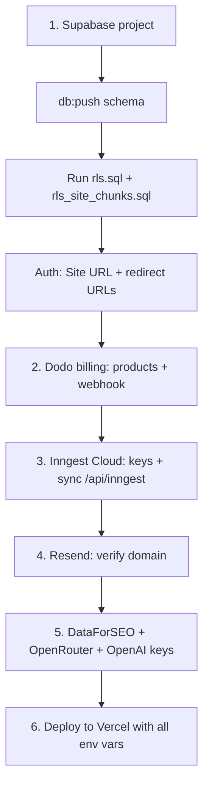

This is the end-to-end checklist to take Spyro from a fresh clone to a working
production deployment. It mirrors the README's "Going live" section but **corrects
the parts that have drifted from the code** — the billing provider, the LLM
provider, and the RLS files. Where the README and the source disagree, the source
wins.

<Info>
**The app degrades gracefully.** Most integrations fall back to a deterministic mock
when their key is absent, so you can click through the product with almost nothing
configured. The one hard requirement for a real flow is **DataForSEO** — it has no
mock, so keyword/SERP/rank/AI-Overview features error without it
*(`.env.local.example:3–18`, `lib/env.ts:1–6`)*.
</Info>

For the complete variable list see [Environment variables](/reference/environment-variables).
For Vercel-specific build settings see [Deploying to Vercel](/deployment/vercel).

## Order of operations



## 1. Supabase (database + auth)

<Steps>
<Step title="Create the project and copy four values">
Create a Supabase project. Copy into your environment:
`NEXT_PUBLIC_SUPABASE_URL`, a Supabase key (see note), `SUPABASE_SERVICE_ROLE_KEY`,
and `DATABASE_URL` (the Postgres connection string Drizzle uses).

<Note>
**Key choice.** Use **either** the new publishable key
(`NEXT_PUBLIC_SUPABASE_PUBLISHABLE_KEY`, `sb_publishable_…`, preferred) **or** the
legacy anon JWT (`NEXT_PUBLIC_SUPABASE_ANON_KEY`). Whichever is set wins —
`lib/env.ts:65–66` reads `PUBLISHABLE_KEY ?? ANON_KEY`. The README's table only
mentions the anon key; the code prefers the publishable one.
</Note>
</Step>

<Step title="Push the schema">
Create the tables from the Drizzle schema:

```bash
pnpm db:push      # drizzle-kit push — straight from lib/db/schema.ts
```

`db:push` is the dev-convenience path. For a production database where you want
committed, ordered migrations, use `pnpm db:migrate` instead — see
[Running migrations in production](/deployment/production#running-migrations).
`drizzle.config.ts` loads `.env.local` then `.env`, so `DATABASE_URL` must be present
in the environment when you run either command *(`drizzle.config.ts:5–6`)*.
</Step>

<Step title="Enable Row-Level Security — BOTH files">
In the Supabase **SQL editor**, run the RLS scripts in order. The README only
mentions `rls.sql`, but `rls.sql`'s own header defers `site_indexes` / `site_chunks`
to a second file *(`drizzle/rls.sql:1–4,30–31`)*:

1. Apply all Drizzle migrations (step above), then
2. Run **`drizzle/rls.sql`** — RLS policies + the `auth.users → profiles` trigger.
3. Run **`drizzle/rls_site_chunks.sql`** — the pgvector site-index tables.

<Warning>
RLS here is **membership-driven** (org/workspace membership), not the simple
`user_id = auth.uid()` model the README describes *(`drizzle/rls.sql:5–13`)*. The
app's own queries run through the service-role Drizzle connection, which **bypasses
RLS**; these policies are defence-in-depth for any path that touches tables with the
anon/auth key. See [Authorization](/backend/authorization).
</Warning>
</Step>

<Step title="Configure auth redirect URLs">
In **Authentication → URL Configuration**, set the **Site URL** to your public app
URL and add `<APP_URL>/auth/callback` as a redirect URL (the route lives at
`app/auth/callback`). If you enabled the Cloudflare Turnstile widget via
`NEXT_PUBLIC_TURNSTILE_SITE_KEY`, also enable CAPTCHA in **Authentication → Bot and
Abuse Protection** and paste the Turnstile **secret** there (it is *not* an env var)
*(`.env.local.example:30–34`)*. See [Authentication](/backend/authentication).
</Step>
</Steps>

## 2. Billing — Dodo Payments (not Polar)

<Warning>
**The README is stale here.** It documents Polar (`POLAR_ACCESS_TOKEN`,
`POLAR_PRODUCT_*`, `POLAR_WEBHOOK_SECRET`, webhook `/api/webhooks/polar`). The
shipped code uses **Dodo Payments** — `lib/dodo`, the `DODO_*` env vars
*(`lib/env.ts:90–108`)*, the webhook route `app/api/webhooks/dodo`, and migration
`drizzle/0022_dodo_payments.sql`. Configure Dodo, not Polar.
</Warning>

Dodo is a Merchant of Record (it handles tax/VAT). There are two plans — **Pro**
($99/mo flat) and **Agency** (per-site pricing, volume discounts). A card on file is
required before onboarding: checkout opens a Dodo-managed 7-day trial and access
gates on an active subscription *(`.env.local.example:75–97`)*.

<Steps>
<Step title="Create the subscription products in Dodo">
Create the Pro products (1-site monthly/annual and 2-site monthly/annual) and the
Agency per-site products (monthly/annual), then paste their IDs into:
`DODO_PRODUCT_PRO_MONTHLY`, `DODO_PRODUCT_PRO_ANNUAL`,
`DODO_PRODUCT_PRO_2SITE_MONTHLY`, `DODO_PRODUCT_PRO_2SITE_ANNUAL`,
`DODO_PRODUCT_AGENCY_MONTHLY`, `DODO_PRODUCT_AGENCY_ANNUAL`. Annual = pay 10 months
("2 months free").
</Step>
<Step title="Create the Agency volume-discount codes">
Percentage codes restricted to the Agency products with no cycle limit:
`DODO_DISCOUNT_AGENCY_10` (3–5 sites), `DODO_DISCOUNT_AGENCY_15` (6–10),
`DODO_DISCOUNT_AGENCY_20` (11–20). Checkout applies one by site-count tier.
</Step>
<Step title="Set the API key, webhook, and mode">
Set `DODO_API_KEY` (server-side) and `DODO_WEBHOOK_SECRET` (`whsec_…`, a Standard
Webhooks signing secret). Point a Dodo webhook at `<APP_URL>/api/webhooks/dodo`. Set
`DODO_ENV=test_mode` for staging and `DODO_ENV=live_mode` for launch (defaults to
`test_mode` *(`lib/env.ts:95`)*).
</Step>
</Steps>

See [Billing](/backend/billing) for checkout, the customer portal, the webhook
handler, credit packs, and trial logic.

## 3. Inngest Cloud (background jobs + cron)

All long-running work and every scheduled job run as Inngest functions — site
crawls, citation/rank/AI-Overview checks, blog generation, the weekly digest, and
the cron dispatchers *(`lib/inngest/functions.ts`)*. In production they run on
**Inngest Cloud**.

<Steps>
<Step title="Create the app and get the keys">
Create an app in Inngest Cloud. Set `INNGEST_EVENT_KEY` and `INNGEST_SIGNING_KEY`.

<Warning>
`INNGEST_EVENT_KEY` is the **Event Key** (a plain string used to *send* events), **not**
the REST API key (`sk-inn-api…`) — using the API key gives a 404 *"Event key not
found"*. The signing key starts `signkey-…`. Branch environments share one Event Key
and Signing Key and select the branch via `INNGEST_ENV`
*(`.env.local.example:115–127`)*.
</Warning>
</Step>
<Step title="Register the serve endpoint">
Register / Sync the serve endpoint **`<APP_URL>/api/inngest`** in the Inngest
dashboard. That route serves the whole function registry
*(`app/api/inngest/route.ts`, `lib/inngest/functions.ts`)*. Syncing is what makes the
cron triggers fire — there is **no Vercel cron**. See
[Cron registration](/deployment/production#cron-registration).
</Step>
<Step title="(Local dev only) pick a run mode">
For local development you can skip the keys entirely and run
`pnpm inngest:dev` (the SDK auto-connects to `localhost:8288`), or set the four
`INNGEST_*` vars and use Inngest Cloud branch envs over an ngrok tunnel. Sanity-check
with `pnpm inngest:check -- --url=<base>`.
</Step>
</Steps>

See [Background jobs](/backend/background-jobs) for the function catalogue and cron
schedules.

## 4. Resend (transactional email)

Verify your sending domain in Resend and set `RESEND_API_KEY`. This lights up the
weekly Monday digest and other transactional mail *(`lib/email`)*. Without it, email
sending is skipped (`resendConfigured` flag, `lib/env.ts:200`).

<Note>
Optional: `MAILERLITE_API_KEY` (+ `MAILERLITE_GROUP_ID`) captures free-audit
subscribers into a MailerLite list *(`.env.local.example:147–152`)*.
</Note>

See [Integrations](/backend/integrations) for the email layer.

## 5. DataForSEO + the LLM keys

<Steps>
<Step title="DataForSEO (required — no mock)">
Set `DATAFORSEO_LOGIN` and `DATAFORSEO_PASSWORD`. This is the only SERP/keyword
provider and has **no fallback** — keyword research, SERP analysis, AI-Overview
presence, and rank tracking error without it *(`.env.local.example:36–46`)*.
Optionally cap spend with `DATAFORSEO_DAILY_BUDGET_USD` (a per-UTC-day circuit
breaker). See [SEO engine](/backend/seo-engine).
</Step>
<Step title="OpenRouter (every chat LLM)">
Set `OPENROUTER_API_KEY`. One key routes the blog writer, ideation, the Spyro agent,
and the ChatGPT / Claude / Gemini / Perplexity citation engines, plus Seedream image
generation — no per-provider accounts *(`.env.local.example:48–60`)*.

<Warning>
**The README is stale here too.** It claims Gemini is "the only LLM provider" via
`GOOGLE_GENAI_API_KEY`. In the code, **OpenRouter is the primary chat provider**;
`GOOGLE_GENAI_API_KEY` and `MOONSHOT_API_KEY` are *fallbacks* used only when
`OPENROUTER_API_KEY` is unset *(`.env.local.example:68–73`, `lib/env.ts:76–82`)*.
</Warning>
</Step>
<Step title="OpenAI (RAG embeddings + LLM fallback)">
Set `OPENAI_API_KEY`. It powers the `text-embedding-3` RAG embeddings (the Spyro
site-index / vector search — no OpenRouter equivalent) and acts as a tier-3 chat/image
fallback. See [AI providers](/backend/ai).

<Note>
The source is internally inconsistent on the embedding model: `.env.local.example`
says `text-embedding-3-large @ 1536 dims` while `lib/env.ts:87` says
`text-embedding-3-small`. Treat it as the `text-embedding-3` family; confirm the exact
model in `lib/embed` before relying on a specific dimension.
</Note>
</Step>
</Steps>

## 6. Deploy

Deploy the Next.js app to Vercel, the database on Supabase, and jobs on Inngest
Cloud. Set **every** variable from [the env reference](/reference/environment-variables)
in the Vercel project — including `NEXT_PUBLIC_APP_URL` (your public domain),
`INTEGRATION_SECRET` (32+ random chars; encrypts stored publishing tokens — **set this
before production** *(`.env.local.example:142`)*), and the Gotenberg PDF vars
([see Vercel](/deployment/vercel#the-gotenberg-pdf-service)). Then walk through
[production considerations](/deployment/production).

## Related

<CardGroup cols={2}>
<Card title="Environment variables" href="/reference/environment-variables" icon="key">
Every variable, grouped by service, with required/optional.
</Card>
<Card title="Deploying to Vercel" href="/deployment/vercel" icon="triangle">
Build settings, native modules, the PDF service.
</Card>
<Card title="Production considerations" href="/deployment/production" icon="server">
Crons, migrations, fallbacks, monitoring.
</Card>
<Card title="Installation" href="/getting-started/installation" icon="download">
The local-dev version of this flow.
</Card>
</CardGroup>
