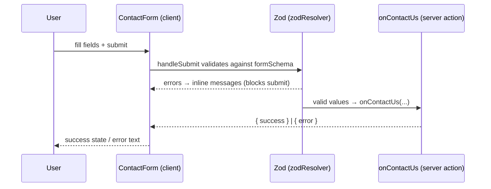

Spyro builds forms two ways depending on complexity:

1. **React Hook Form + Zod** for rich client forms (contact, affiliate signup) - controlled inputs,
   inline field errors, submit-state UI.
2. **Native `<form action>` + `useActionState`** for the many in-app mutation forms (add workspace,
   run keyword research, connect an integration) - minimal client code, validation done in the
   server action.

Both validate with **Zod** and submit through **server actions**. This page focuses on pattern (1)
with a complete real example; pattern (2) is covered in
[State management](/frontend/state-management#server-actions).

## The stack

| Concern | Library |
| --- | --- |
| Schema + validation | `zod` (v4) |
| Form state + RHF resolver | `react-hook-form` (v7) + `@hookform/resolvers/zod` |
| Submission | server action in `lib/actions/*` |
| Feedback | `sonner` toasts / local status state |

## A complete example: the contact form

`components/contact/contact-form.tsx` is the canonical React Hook Form + Zod form. It is a client
component that submits to the `onContactUs` server action. The pieces, all verbatim from source.

**1. The Zod schema** (`contact-form.tsx:31`) - the single source of truth for both validation and
the inferred TypeScript type:

```tsx
const formSchema = z.object({
  name: z.string().min(2, { message: "Name must be at least 2 characters." }),
  email: z.string().email({ message: "Please enter a valid email address." }),
  category: z.string().min(1, { message: "Please select a category." }),
  message: z
    .string()
    .min(10, { message: "Message must be at least 10 characters." }),
  plan: z.string().optional(), // Hidden field for tracking user plan
});

type FormValues = z.infer<typeof formSchema>;
```

**2. `useForm` with the Zod resolver** (`contact-form.tsx:47`) - `zodResolver` plugs the schema into
React Hook Form, so field errors come straight from the schema messages:

```tsx
const {
  register,
  handleSubmit,
  control,
  formState: { errors },
} = useForm<FormValues>({
  resolver: zodResolver(formSchema),
  defaultValues: {
    name: "",
    email: "",
    category: "",
    message: "",
    plan: "Anonymous",
  },
});
```

**3. The submit handler** (`contact-form.tsx:63`) - `handleSubmit` only calls `onSubmit` once the
schema passes; `onSubmit` calls the server action and maps the result to a local status:

```tsx
async function onSubmit(values: FormValues) {
  setStatus("loading");
  setErrorText("");
  try {
    const res = await onContactUs(
      values.name,
      values.email,
      values.category,
      values.message,
      values.plan || "Anonymous",
    );
    if (res.success) {
      setStatus("success");
    } else {
      setStatus("error");
      setErrorText("Something went wrong. Please try again later.");
    }
  } catch {
    setStatus("error");
    setErrorText("Failed to send message. Please try again.");
  }
}
```

The JSX wires `onSubmit` via `<form onSubmit={handleSubmit(onSubmit)} noValidate>`
(`contact-form.tsx:138`), binds text inputs by spreading `{...register("name")}` onto the `<Input>`,
and imports `Controller` to drive the custom `<Select>` (a Base UI component that isn't a native
input). Field errors render from `formState.errors` (e.g. `errors.name?.message`).



## Pattern 2: native form + server action

In-app mutations skip React Hook Form. The form posts `FormData` straight to a server action bound
through `useActionState`, and the action does the Zod validation server-side. For example
`addWorkspace` (`lib/actions/workspaces.ts:39`) parses the domain with a Zod `domainSchema` and
returns `{ ok, message }`; the client surfaces that as a toast. This keeps client bundles tiny and
guarantees validation runs on the server regardless of the client. See the
`GenericSearchForm` wiring in [State management](/frontend/state-management#wiring-an-action-to-the-ui).

## Other forms in the codebase

| Form | File | Validation |
| --- | --- | --- |
| Contact / support | `components/contact/contact-form.tsx` | RHF + Zod |
| Affiliate signup | `components/marketing/affiliate/affiliate-form.tsx` | RHF + Zod (includes a honeypot `hp` field + a terms `refine`) |
| Keyword research | `components/app/keyword-research-form.tsx` | `useActionState` + server action |
| Add site / workspace | `components/app/add-site-form.tsx` → `addWorkspace` | Zod in the action |
| Auth (signup/login/reset) | `components/app/auth-form.tsx`, `reset-form.tsx` | `useActionState` → `lib/actions/auth.ts` |
| Waitlist | → `lib/actions/waitlist.ts` | Zod in the action |

## Error handling

- **Field-level errors** come from the Zod schema messages, surfaced through `formState.errors` (RHF
  pattern) or returned in the action's `message` (native pattern).
- **Submission errors** are caught and shown as a local status (`contact-form.tsx`) or a Sonner
  toast (`generic-search-form.tsx`).
- **Server actions never throw to the client for expected failures** - they return
  `{ ok: false, message }`. They *do* throw for true authorization violations (e.g. `addWorkspace`
  throws `"Not permitted."` for a member role), which bubble to the route `error.tsx` boundary.
- **Spam protection** appears on public forms: the affiliate form uses a honeypot field, and a
  `turnstile.tsx` component exists for Cloudflare Turnstile challenges.

<Warning>
Client-side Zod validation is a UX convenience, not a security boundary. Every server action
re-validates with Zod and re-checks authorization before touching the database - see
[Security](/backend/security).
</Warning>

## Related

<CardGroup cols={2}>
  <Card title="State management" href="/frontend/state-management">Server actions, `useActionState`, and `revalidatePath`.</Card>
  <Card title="Components" href="/frontend/components">The input primitives (`Input`, `Select`, `Textarea`, `Label`).</Card>
  <Card title="APIs" href="/backend/apis">The route handlers some forms post to.</Card>
  <Card title="Authentication" href="/backend/authentication">The auth forms' server side.</Card>
</CardGroup>
