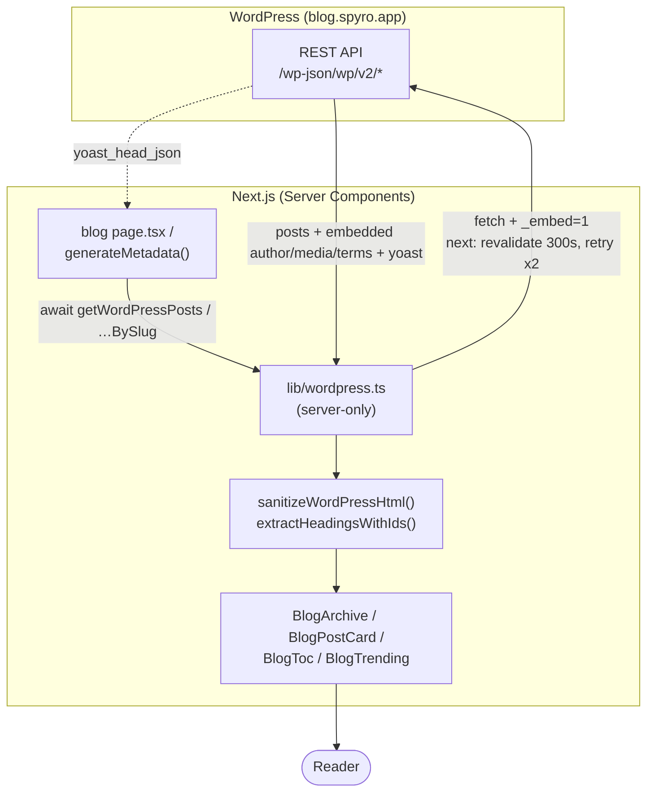

The public, unauthenticated half of Spyro lives in the `(home)` and `(marketing)` route groups. It
is SEO-first, runs the same shared `MarketingShell` chrome, and includes a **headless WordPress
blog** and a **free-tools** hub. This page documents its structure and, in detail, the WordPress
data flow.

## Structure

Both `app/(home)/layout.tsx` and `app/(marketing)/layout.tsx` are one-liners that render
`<MarketingShell>` (header, footer, theme transitions) around their pages.

```
app/(home)/page.tsx              "/"        landing page (AlyticsHomepage)
app/(marketing)/
  about/page.tsx                 /about
  pricing/page.tsx               /pricing
  contact/page.tsx               /contact   (RHF + Zod form → onContactUs)
  affiliates/page.tsx            /affiliates (+ live earnings calculator)
  privacy/page.tsx               /privacy
  terms/page.tsx                 /terms
  blog/…                         /blog       headless WordPress (see below)
  free-tools/…                   /free-tools 5 public tools (see below)
```

The landing page (`AlyticsHomepage`) is composed from `alytics-*` section components - hero,
features, pricing, testimonials, FAQ, footer - assembled in `components/marketing/`. It also injects
page-specific JSON-LD. Marketing pages are public and cacheable, in contrast to the `force-dynamic`
authenticated app (see [Overview](/frontend/overview)).

## The headless WordPress blog

Spyro's blog content is authored in **WordPress** and consumed through its **REST API** - the
Next.js app is a headless front end. All blog access goes through `lib/wordpress.ts`, which is
marked `import "server-only"` so it can never be bundled into a client component.

### Blog routes

Every archive scope has a base route and a `/page/[page]` pagination route. Posts are paginated 9 at
a time (`BLOG_POSTS_PER_PAGE = 9`).

| Route (folder) | URL | Purpose |
| --- | --- | --- |
| `blog/page.tsx` | `/blog` | main archive (page 1) |
| `blog/page/[page]/page.tsx` | `/blog/page/2` | archive pagination |
| `blog/[slug]/page.tsx` | `/blog/<slug>` | single post |
| `blog/category/[slug]/page.tsx` | `/blog/category/<slug>` | category archive |
| `blog/category/[slug]/page/[page]/page.tsx` | `/blog/category/<slug>/page/2` | category pagination |
| `blog/tag/[slug]/page.tsx` | `/blog/tag/<slug>` | tag archive |
| `blog/tag/[slug]/page/[page]/page.tsx` | `/blog/tag/<slug>/page/2` | tag pagination |

The canonical URL helpers in `lib/wordpress.ts` (`getCategoryArchiveUrl`, `getTagArchiveUrl`,
`getArchiveCanonicalUrl`) generate these paths, and the main archive page **redirects legacy
`?category=`/`?tag=` query params** to the dedicated routes for clean, indexable URLs.
`blog/loading.tsx`, `blog/error.tsx`, and `blog/[slug]/not-found.tsx` cover the streaming, error and
404 states.

### The data flow



Step by step:

1. **Fetch.** A Server Component (e.g. `blog/[slug]/page.tsx`) calls a `lib/wordpress.ts` function -
   `getWordPressPostBySlug(slug)`, `getWordPressPosts(query)`, `getWordPressCategoryBySlug`, etc.
   Internally `fetchWordPress` hits `/wp-json/wp/v2/<resource>` with `_embed=1` (so author, featured
   media and terms come back in one request), caches the response for 300s
   (`next: { revalidate: 300 }`), times out at 10s, and retries twice with backoff on 5xx/429.
2. **Sanitize + enrich.** Post HTML is run through `sanitizeWordPressHtml` (a Cheerio allowlist that
   strips scripts/`on*` handlers, forces `rel="noopener"` + `target="_blank"` on external links,
   lazy-loads images, and only permits YouTube/Vimeo iframes). `extractHeadingsWithIds` adds slugged
   `id`s to `h2`/`h3` and returns a table-of-contents list for `BlogToc`.
3. **SEO.** `generateMetadata` maps the post's `yoast_head_json` (title, description, canonical, OG,
   Twitter) into Next metadata; a `BlogPosting` JSON-LD schema is also emitted. See
   [Routing](/frontend/routing#metadata-and-generatemetadata).
4. **Render.** Typed helpers (`getPostTitle`, `getPostExcerpt`, `getPostAuthor`,
   `getPostFeaturedImage`, `getPostCategories`, `getReadingTime`, `formatPostDate`) feed the
   `components/marketing/blog/*` UI - archive grid, post cards, author block, related/adjacent posts,
   trending sidebar, and a newsletter card.

<Note>
WordPress has no view counter, so the "trending" sidebar (`getTrendingWordPressPosts`) treats
**sticky/pinned** posts as the curated selection and falls back to recent posts not already on the
page. Author avatars have a layered fallback: a real blog-hosted avatar → a manual slug override →
Gravatar with `d=404` → a branded initials avatar (`getAuthorAvatarUrl`).
</Note>

The blog base URL is configurable via `WORDPRESS_BASE_URL` (default `https://blog.spyro.app`), and
that hostname is also added to the `next/image` `remotePatterns` so featured images optimize. The
blog data feeds the dynamic sitemap too - `getAllWordPressPostRefs` and `getWordPressTermRefs` page
through every published slug and non-empty term for `app/sitemap.ts`.

### Caching

The whole blog is cached at the fetch layer for 5 minutes and surfaces new content automatically -
no redeploy. The details (the `next: { revalidate }` window and the matching `sitemap.ts`
`revalidate`) are in [Performance](/frontend/performance#caching-and-revalidation).

## Free-tools landing

`/free-tools` (`app/(marketing)/free-tools/page.tsx`) is the public hub for Spyro's five no-signup
tools, rendered by `FreeToolsHub` with its own `FAQPage`/tool JSON-LD. Each tool is its own route
under `free-tools/<tool>/` with a colocated `_components/` folder for its interactive client UI:

| Tool | Route |
| --- | --- |
| SEO and GEO Audit | `/free-tools/seo-geo-audit` |
| AI Visibility & Citation Readiness Checker | `/free-tools/ai-visibility-checker` |
| AI Crawler & robots.txt Checker | `/free-tools/ai-crawler-robots-checker` |
| Schema Markup Validator | `/free-tools/schema-markup-validator` |
| Meta & Snippet Preview | `/free-tools/meta-snippet-preview` |

These tools are the public, unauthenticated face of the same engines that power the paid app, and
each posts to a dedicated API route (`/api/free-audit`, `/api/ai-visibility`, `/api/schema-validator`,
…) plus a PDF export route. The tool UIs use `framer-motion` for progress/report animations and an
email-capture step. Their server implementation - scoring, isolation, rate-limiting and PDF
generation - is documented in [Free tools](/backend/free-tools).

## Related

<CardGroup cols={2}>
  <Card title="Free tools (backend)" href="/backend/free-tools">The 5 tools' server logic and API routes.</Card>
  <Card title="Performance" href="/frontend/performance">Blog ISR caching and `next/image`.</Card>
  <Card title="Routing" href="/frontend/routing">Blog metadata, loading and not-found conventions.</Card>
  <Card title="Components" href="/frontend/components">The `marketing/` and `blog/` component families.</Card>
  <Card title="Integrations" href="/backend/integrations">The WordPress integration on the publish side.</Card>
</CardGroup>
