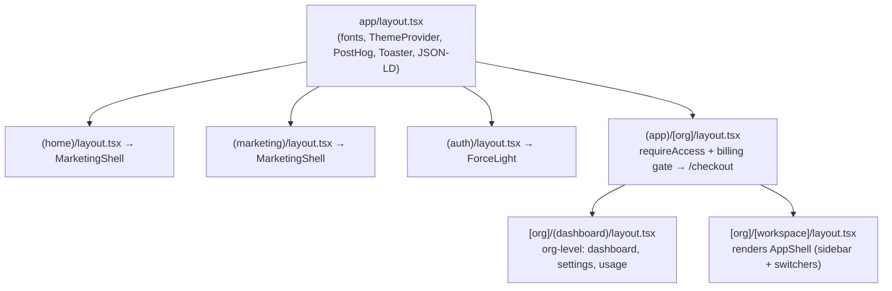

Spyro's frontend is a single **Next.js 16 App Router** application (`next@16.2.6`, `react@19.2.4`).
One codebase serves three very different surfaces - a public marketing site, an authenticated
multi-tenant SEO/GEO product, and a superadmin panel - separated cleanly with **route groups**.

This page is the map. It explains the rendering model, how server and client components are split,
what each route group is for, and how the layout hierarchy nests. The deeper mechanics live in the
sibling pages linked at the bottom.

## The App Router model

Spyro uses the App Router exclusively (`app/`, not `pages/`). The defining traits you will see
everywhere in the code:

- **Server Components by default.** A file is a React Server Component (RSC) unless it starts with
  the `"use client"` directive. Pages and layouts fetch data directly with `await` and never ship
  that code to the browser.
- **Client islands where interactivity is needed.** Roughly **210 files** carry `"use client"` -
  forms, charts, the chat agent, the editor, dropdowns. **Most** `components/ui/` primitives are
  client components (15 of the 22 `.tsx` files declare `"use client"`); purely presentational
  wrappers like `button.tsx` and `hugeicons.tsx` stay Server Components. Data-fetching pages and
  layouts are server too.
- **`params` and `searchParams` are Promises.** Under Next 16 you `await` them. Every dynamic page
  in the repo does this, e.g. `app/(app)/[org]/[workspace]/layout.tsx`:

```tsx
export default async function WorkspaceLayout({
  children,
  params,
}: {
  children: React.ReactNode;
  params: Promise<{ org: string; workspace: string }>;
}) {
  const { org: orgSlug, workspace: wsSlug } = await params;
  // ...
}
```

<Note>
The root document is configured in `app/layout.tsx`. It loads the `Inter` (`--font-sans`) and
`Lato` (`--font-heading`) Google fonts, injects a `beforeInteractive` no-flash theme script, mounts
the global `<ThemeProvider>`, `<PostHogIdentify>` and Sonner `<Toaster>`, and renders site-wide
JSON-LD (`Organization` + `WebSite`). It is a **Server Component** - only the providers it renders
are client components.

`<PostHogIdentify>` (`components/app/posthog-identify.tsx`) is the analytics provider - a client
component that calls `posthog.identify()` with the Supabase user on sign-in and `posthog.reset()` on
sign-out. PostHog traffic is reverse-proxied through the app's own origin: `next.config.ts` rewrites
`/ingest/:path*` to PostHog's hosts (`us.i.posthog.com` and `us-assets.i.posthog.com`), so analytics
requests aren't blocked by ad blockers and stay first-party.
</Note>

## Server vs client components

The split is deliberate and consistent:

| Concern | Where it runs | Examples |
| --- | --- | --- |
| Layouts, data pages, metadata | Server (RSC) | `app/layout.tsx`, every `layout.tsx`, blog/dashboard pages |
| Auth/billing gating | Server | `[org]/layout.tsx` calls `requireAccess()` then redirects |
| Design-system primitives | Mostly client | `components/ui/*` (15 of 22 declare `"use client"`) |
| Feature UI (chat, editor, calendar, charts) | Client | `components/app/agent`, `writer`, `calendar` |
| Theme, analytics identity | Client providers | `theme-provider.tsx`, `posthog-identify.tsx` |

The pattern throughout is **server shell, client island**: a server component fetches data and
passes only serializable props into a client component that owns the interactivity. A clear example
is the calendar, where `components/app/calendar/calendar-board.tsx` notes in its own comment that a
Server Component cannot pass a render-prop child to a Client Component, so the composition is
delegated across the `"use client"` boundary.

## Route groups

Route groups - folders wrapped in parentheses like `(marketing)` - let Spyro apply **different
layouts and chrome to different sections without affecting the URL**. The `(marketing)` segment is
not part of any path; it only scopes the layout.

```
app/
  (home)/         → the root marketing landing page  "/"
  (marketing)/    → public pages: about, pricing, blog, free-tools, contact, legal
  (auth)/         → login, signup, reset, verify (light-only chrome)
  (app)/          → the authenticated product (org + workspace shell)
  superadmin/     → internal admin panel (not a group; own subdomain rewrite)
  api/            → route handlers (see /backend/apis)
```

<CardGroup cols={2}>
  <Card title="(home)" icon="house">
    Holds only the root path `/`. Renders the marketing landing (`AlyticsHomepage`) inside
    `MarketingShell`. It also forwards a stray OAuth `?code=` that lands on the site root to
    `/auth/callback` so the session still gets exchanged.
  </Card>
  <Card title="(marketing)" icon="globe">
    The public site - `/about`, `/pricing`, `/blog`, `/free-tools`, `/contact`, `/privacy`,
    `/terms`, `/affiliates`. Also wraps everything in `MarketingShell`. The blog is a headless
    WordPress front end (see [Marketing site](/frontend/marketing-site)).
  </Card>
  <Card title="(auth)" icon="key">
    `/login`, `/signup`, `/reset`, `/verify`. The group layout is a pass-through that renders
    `<ForceLight>` - auth pages are light-only; dark mode is reserved for the dashboard.
  </Card>
  <Card title="(app)" icon="grid-2">
    The authenticated product. Has **no group-level layout** - gating and chrome live in the
    nested `[org]` and `[org]/[workspace]` layouts. This is the multi-tenant shell.
  </Card>
</CardGroup>

## The `(app)` authed shell vs the `(marketing)` public site

These two halves of the app are intentionally different.

The **`(marketing)` / `(home)`** side is public, SEO-first, and statically friendly. Both group
layouts are one line - they render `MarketingShell` (header, footer, theme transitions) around the
page. Content like the blog is fetched from WordPress and cached.

The **`(app)`** side is private and gated at the layout level. There is no `app/(app)/layout.tsx`;
instead the gating happens as you descend into the dynamic tenant segments:



The first layout in the `(app)` tree is `app/(app)/[org]/layout.tsx`. It is `force-dynamic`, calls
`requireAccess(org)`, and **hard-gates on billing** - an org without active billing (and without a
superadmin impersonation marker) is redirected to `/checkout`. One level deeper,
`app/(app)/[org]/[workspace]/layout.tsx` resolves the workspace and renders `AppShell` (the sidebar,
org/workspace switchers, user menu and trial banner). The org also has a parallel
`(dashboard)` group for org-scoped pages (dashboard, settings, usage) that sit beside the
per-workspace feature routes.

<Tip>
Route-level protection is enforced in two places working together: the edge `proxy.ts` middleware
(redirects unauthenticated users to `/login?next=…`) and the server layouts
(`requireAccess` / billing gate). See [Middleware](/backend/middleware) and
[Authentication](/backend/authentication) for the server side.
</Tip>

## Related

<CardGroup cols={2}>
  <Card title="Routing" href="/frontend/routing">Route groups, the `[org]/[workspace]` scheme, loading/error/metadata conventions.</Card>
  <Card title="Components" href="/frontend/components">The component catalogue by area (ui, app, marketing).</Card>
  <Card title="UI system" href="/frontend/ui-system">Tailwind v4, Base UI primitives, theme tokens, icons.</Card>
  <Card title="State management" href="/frontend/state-management">Server actions, context, hooks, URL state.</Card>
  <Card title="Performance" href="/frontend/performance">RSC streaming, `next/image`, caching and revalidation.</Card>
  <Card title="Architecture" href="/getting-started/architecture">The cross-cutting system diagrams.</Card>
</CardGroup>
