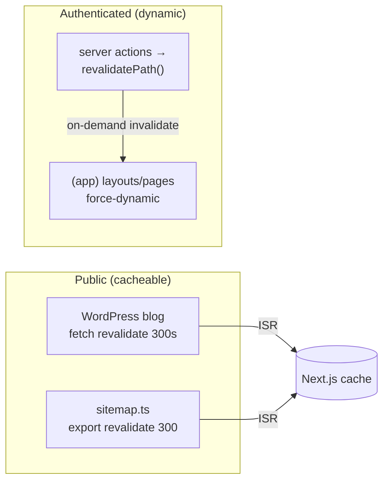

Spyro's performance strategy is built on the App Router defaults - ship as little JavaScript as
possible, stream the rest, and cache aggressively where data tolerates it. This page documents the
concrete mechanisms in the codebase.

## RSC and streaming

Because Server Components are the default, most of the UI never reaches the browser as JavaScript -
layouts, data pages, and the blog render on the server and stream HTML. Interactivity is opted into
per island with `"use client"` (~210 files), keeping the client bundle scoped to what actually needs
it.

Streaming is made visible with **`loading.tsx`** Suspense fallbacks. While a server segment fetches,
the App Router shows the sibling `loading.tsx` instantly. The blog renders skeleton cards:

```tsx
// app/(marketing)/blog/loading.tsx (excerpt)
<div className="mt-9 grid auto-rows-fr grid-cols-1 gap-6 sm:grid-cols-2 lg:grid-cols-3">
  {Array.from({ length: 9 }).map((_, index) => (
    <div key={index} className="rounded-[18px] border border-black/[0.06] bg-white p-7">
      <div className="h-6 w-24 animate-pulse rounded-full bg-black/[0.08]" />
      {/* …pulse placeholders… */}
    </div>
  ))}
</div>
```

There are loading skeletons for both the blog archive and individual posts
(`app/(marketing)/blog/[slug]/loading.tsx`), so a click feels instant even though WordPress is being
fetched behind the Suspense boundary.

## `next/image`

Images go through `next/image`, configured in `next.config.ts`:

```ts
images: {
  formats: ["image/avif", "image/webp"],
  qualities: [75, 85],
  remotePatterns: [
    { protocol: "https", hostname: "framerusercontent.com" },
    { protocol: "https", hostname: "images.unsplash.com" },
    { protocol: "https", hostname: wordpressImageHost },   // derived from WORDPRESS_BASE_URL
    { protocol: "https", hostname: "blog.spyro.app" },
    { protocol: "https", hostname: "secure.gravatar.com" },
    { protocol: "https", hostname: "*.gravatar.com" },
  ],
},
```

Key points:

- **AVIF + WebP** are served when the browser supports them, with JPEG/PNG fallback.
- **`remotePatterns`** allowlists the only external image hosts - the headless WordPress blog
  (`blog.spyro.app`, also derived dynamically from `WORDPRESS_BASE_URL`), Gravatar avatars, Unsplash,
  and Framer assets. An image from any other host will be rejected by the optimizer.
- The marketing site and blog (`blog-image.tsx`, author avatars) use `next/image`; `next/image` is
  imported in ~15 files. The default Open Graph image is a static `/public` PNG (not AVIF) so social
  scrapers render it reliably and it bypasses the auth proxy.

<Note>
`sharp` powers image optimization and is pinned and force-traced in `next.config.ts`
(`serverExternalPackages` + `outputFileTracingIncludes`) so its native `libvips` binaries ship into
every serverless function on Vercel. This is a deploy concern - see [Vercel](/deployment/vercel).
</Note>

## Code splitting

Code splitting is **automatic** at the `"use client"` boundary - each client island becomes its own
chunk loaded only on routes that use it, and route segments are split by the App Router. There is
**no manual `next/dynamic`** usage anywhere in `app/` or `components/` (0 imports). Heavy client
dependencies (TipTap editor, Recharts, framer-motion, the AI SDK chat runtime) are confined to the
specific feature components that import them, so they never load on the marketing pages.

## Metadata and SEO

SEO is handled entirely through the Metadata API (see [Routing](/frontend/routing#metadata-and-generatemetadata)):

- Site-wide defaults in `app/layout.tsx` - title template `"%s · Spyro"`, `metadataBase`, favicons,
  manifest, default OG/Twitter image, and global `Organization` + `WebSite` JSON-LD.
- Per-page static `metadata` or dynamic `generateMetadata` (blog posts map Yoast SEO fields,
  including canonical URLs and article OG tags).
- A dynamic **`app/sitemap.ts`** and `robots.txt`. The sitemap pulls blog slugs and term archives
  from WordPress and is itself revalidated (below).

## Caching and revalidation

Spyro mixes time-based ISR for public, slowly-changing data with on-demand revalidation for
mutations. It does **not** use `unstable_cache` or the experimental `"use cache"` directive.

### Time-based ISR (fetch cache + segment revalidate)

The headless WordPress data is cached at the `fetch` layer for 5 minutes
(`WORDPRESS_REVALIDATE_SECONDS = 300`). Every blog request reuses the cached response until it goes
stale (`lib/wordpress.ts:131`):

```ts
response = await fetch(url, {
  next: { revalidate: WORDPRESS_REVALIDATE_SECONDS }, // 300s
  signal: AbortSignal.timeout(WORDPRESS_FETCH_TIMEOUT_MS),
});
```

The sitemap matches that window with a **segment-level** revalidate (`app/sitemap.ts:14`):

```ts
export const revalidate = 300;
```

So newly published posts and term archives surface within ~5 minutes without a redeploy.

### On-demand revalidation (mutations)

In-app data is mutated through server actions that call **`revalidatePath`** to re-render the
affected server segments immediately. For example, after `addWorkspace` the whole org layout subtree
is invalidated (`lib/actions/workspaces.ts:51`):

```ts
revalidatePath(`/${orgSlug}`, "layout");
```

`revalidatePath` is used across ~20 actions, scoped either to a specific path or to a `"layout"` for
cascading invalidation. Client components pair this with `router.refresh()` for instant feedback.

### Per-request dynamic

Authenticated tenant routes opt out of caching entirely with `export const dynamic = "force-dynamic"`
(every `(app)` layout and many dashboard pages), because their output depends on the signed-in user's
session and membership and must never be cached or shared.



## Other tuning details

- **Fonts** are loaded with `next/font/google` (`Inter`, `Lato`) using `display: "swap"` and exposed
  as CSS variables - self-hosted, no layout shift, no external font request.
- **No-flash theme** - a `beforeInteractive` inline script in `app/layout.tsx` applies the stored
  theme before first paint, avoiding a flash of the wrong color scheme.
- **Resilient blog fetch** - `fetchWordPress` retries up to twice with backoff and a 10s timeout, so
  a slow WordPress response degrades gracefully rather than hanging the request.

## Related

<CardGroup cols={2}>
  <Card title="Routing" href="/frontend/routing">`loading`/`error` conventions and metadata.</Card>
  <Card title="State management" href="/frontend/state-management">`revalidatePath` and RSC data fetching.</Card>
  <Card title="Marketing site" href="/frontend/marketing-site">The WordPress blog data flow that ISR caches.</Card>
  <Card title="Vercel deploy" href="/deployment/vercel">`sharp`/file tracing and image optimization at deploy time.</Card>
</CardGroup>
