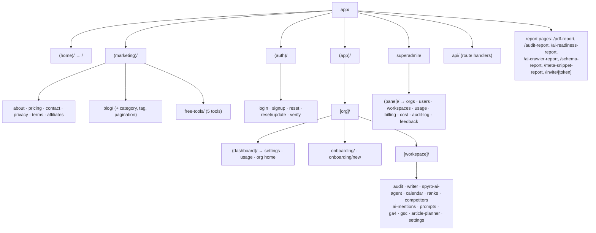

Spyro's URLs are organized with **route groups** and **dynamic segments**. This page enumerates the
real folder structure under `app/`, explains the multi-tenant `[org]/[workspace]` scheme, and
documents the file conventions (`layout`, `loading`, `error`, `not-found`, `generateMetadata`) that
the App Router relies on. Every path below is a real folder in the repository.

## The route-group tree



## Route groups in detail

A folder wrapped in parentheses (`(marketing)`) groups routes under a shared layout **without
adding a URL segment**. Spyro uses five top-level groupings.

<AccordionGroup>
  <Accordion title="(home) — the landing page" icon="house">
    `app/(home)/page.tsx` is the root path `/`. It renders the marketing landing component and
    forwards a stray OAuth `?code=` query to `/auth/callback`. `app/(home)/layout.tsx` wraps it in
    `MarketingShell`.
  </Accordion>
  <Accordion title="(marketing) — public site + blog + free tools" icon="globe">
    Public pages, each its own folder with a `page.tsx`:
    `about/`, `pricing/`, `contact/`, `privacy/`, `terms/`, `affiliates/`, `blog/`, `free-tools/`.
    The layout (`app/(marketing)/layout.tsx`) renders `MarketingShell`. Free tools live under
    `free-tools/<tool>/` with colocated `_components/` folders (the `_` prefix keeps them out of
    routing). See [Marketing site](/frontend/marketing-site) and [Free tools](/backend/free-tools).
  </Accordion>
  <Accordion title="(auth) — authentication flows" icon="key">
    `login/`, `signup/`, `reset/`, `reset/update/`, `verify/`. The group layout
    (`app/(auth)/layout.tsx`) is a pass-through that forces light mode via `<ForceLight>`; each page
    owns its own chrome (login/verify use a centered `AuthShell`, signup is a full-bleed split).
  </Accordion>
  <Accordion title="(app) — the authenticated product" icon="grid-2">
    The multi-tenant shell. Contains the dynamic `[org]/[workspace]` segments plus a handful of
    non-tenant routes: `checkout/`, `dashboard/`, `onboarding/`, `no-workspace/`, and an
    `error.tsx`. There is **no** `(app)/layout.tsx` — gating happens in the nested layouts below.
  </Accordion>
  <Accordion title="superadmin — internal panel" icon="shield">
    Not a route group; a real `/superadmin` segment with its own `(panel)` group. Reached in
    production at the `superadmin.<domain>` subdomain via a rewrite in `proxy.ts`, and gated by an IP
    allowlist + a dedicated admin session. See [Middleware](/backend/middleware).
  </Accordion>
</AccordionGroup>

## The multi-tenant `[org]/[workspace]` URL scheme

Spyro is multi-tenant: a user belongs to one or more **organizations**, and each org owns one or
more **workspaces** (a workspace ≈ a tracked website). This is encoded directly in the URL with two
nested dynamic segments:

```
/{org}                         → org home (dashboard group)
/{org}/settings                → org settings
/{org}/usage                   → org usage
/{org}/onboarding              → org onboarding
/{org}/{workspace}             → workspace dashboard
/{org}/{workspace}/audit       → site audit
/{org}/{workspace}/writer      → AI article writer
/{org}/{workspace}/spyro-ai-agent
/{org}/{workspace}/calendar    → content calendar
/{org}/{workspace}/ranks · /competitors · /ai-mentions · /prompts · /ga4 · /gsc · /settings
```

The matching folders are:

- `app/(app)/[org]/layout.tsx` — the **org boundary**. `force-dynamic`; runs `requireAccess(org)`
  and the billing gate (redirect to `/checkout` when the org has no active billing and is not being
  impersonated). It also renders the impersonation banner when a superadmin marker cookie is present.
- `app/(app)/[org]/(dashboard)/` — an **org-scoped layout group** (`settings/`, `usage/`, and the
  org home `page.tsx`). The `(dashboard)` group keeps these org-level pages on a different layout
  from the workspace pages while sharing the `/{org}` URL prefix.
- `app/(app)/[org]/[workspace]/layout.tsx` — the **workspace boundary**. `force-dynamic`; resolves
  the workspace with `requireWorkspace`, loads the user's orgs and visible workspaces in parallel,
  computes a plan label, and renders `AppShell` (sidebar + switchers + trial banner) around the
  feature pages.

<Note>
Both tenant layouts export `export const dynamic = "force-dynamic"` because they depend on the
signed-in user's session and org/workspace membership, which cannot be statically pre-rendered.
Authorization is membership-driven — see [Authorization](/backend/authorization).
</Note>

## Layouts

Layouts wrap their segment's pages and persist across navigation. Spyro's hierarchy:

| Layout file | Renders | Notes |
| --- | --- | --- |
| `app/layout.tsx` | `<html>`, fonts, providers, Toaster, JSON-LD | Root; Server Component |
| `app/(home)/layout.tsx` | `MarketingShell` | one-liner |
| `app/(marketing)/layout.tsx` | `MarketingShell` | one-liner |
| `app/(auth)/layout.tsx` | `<ForceLight>` + children | light-only |
| `app/(app)/[org]/layout.tsx` | impersonation banner + children | billing gate |
| `app/(app)/[org]/(dashboard)/layout.tsx` | org settings/usage chrome | org-scoped |
| `app/(app)/[org]/[workspace]/layout.tsx` | `AppShell` | workspace chrome |
| `app/superadmin/(panel)/layout.tsx` | admin nav + session gate | IP-allowlisted |

## `loading`, `error`, and `not-found` conventions

The App Router renders these special files automatically. Spyro uses them where they pay off:

- **`loading.tsx`** — a Suspense fallback shown while a server segment streams.
  `app/(marketing)/blog/loading.tsx` and `app/(marketing)/blog/[slug]/loading.tsx` render skeleton
  cards (`animate-pulse`) so the blog feels instant while WordPress is fetched.
- **`error.tsx`** — a client error boundary. `app/(app)/error.tsx` is a `"use client"` boundary that
  logs the error, special-cases a `SPYRO_NOT_CONFIGURED` message into an `<EnvSetupNotice>`, and
  otherwise shows a retry button calling the `reset()` prop. `app/(marketing)/blog/error.tsx` does
  the same for the blog.
- **`not-found.tsx`** — rendered when `notFound()` is called. `app/(marketing)/blog/[slug]/not-found.tsx`
  handles unknown post slugs; the blog post page calls `notFound()` when WordPress returns no post.

```tsx
// app/(app)/error.tsx — client error boundary
export default function DashboardError({ error, reset }: { error: Error & { digest?: string }; reset: () => void }) {
  useEffect(() => { console.error(error); }, [error]);
  if (error.message?.includes("SPYRO_NOT_CONFIGURED")) return <EnvSetupNotice />;
  // ...retry / go-home UI
}
```

## Metadata and `generateMetadata`

Spyro drives SEO entirely through the App Router metadata API — there are no hand-written `<head>`
tags (the root layout comment explicitly notes a raw `<head>` would conflict with the metadata
system).

- **Static `metadata`** for fixed pages. `app/(marketing)/free-tools/page.tsx` and
  `app/(home)/page.tsx` export a `metadata` object (title, description, canonical, Open Graph,
  Twitter card).
- **`generateMetadata()`** for dynamic pages. The blog archive and blog post pages build metadata at
  request time. The post page resolves the slug, fetches the WordPress post, and maps its Yoast SEO
  fields into Next metadata:

```tsx
// app/(marketing)/blog/[slug]/page.tsx
export async function generateMetadata({ params }: { params: BlogPostParams }): Promise<Metadata> {
  const { slug } = await params;
  const post = await getWordPressPostBySlug(slug);
  if (!post) return { title: "Post not found" };
  const title = post.yoast_head_json?.title || getPostTitle(post);
  const canonical = new URL(getPostCanonicalUrl(post.slug), env.APP_URL).toString();
  return { title, description, alternates: { canonical }, openGraph: { /* … */ }, twitter: { /* … */ } };
}
```

The root layout sets the site-wide defaults — a `title.template` of `"%s · Spyro"`, the
`metadataBase`, favicons, manifest, and a default Open Graph image — which every page inherits and
can override.

<Warning>
There are **no** `generateStaticParams` exports in `app/` — blog slugs and tenant segments are not
pre-rendered at build time. Dynamic blog pages rely on fetch-level ISR (the WordPress fetch is
cached for 300s); tenant pages are `force-dynamic`. See [Performance](/frontend/performance).
</Warning>

## Related

<CardGroup cols={2}>
  <Card title="Overview" href="/frontend/overview">The rendering model and route-group purpose.</Card>
  <Card title="Marketing site" href="/frontend/marketing-site">Blog category/tag/pagination routes in depth.</Card>
  <Card title="Middleware" href="/backend/middleware">`proxy.ts` route protection and the superadmin rewrite.</Card>
  <Card title="Authentication" href="/backend/authentication">How `requireAccess` gates the tenant layouts.</Card>
</CardGroup>
