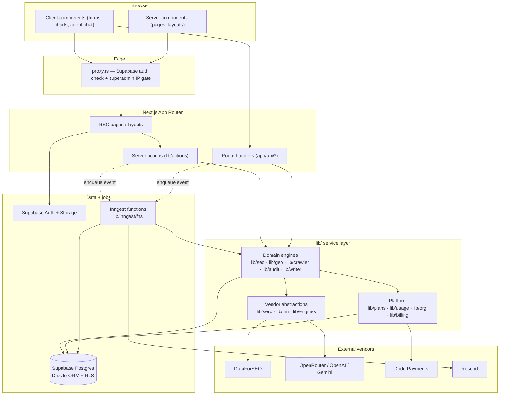
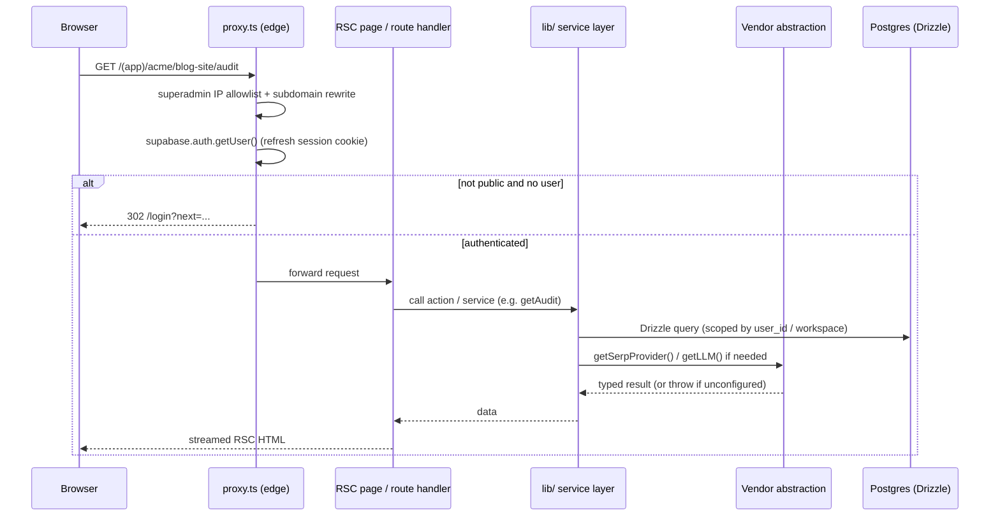
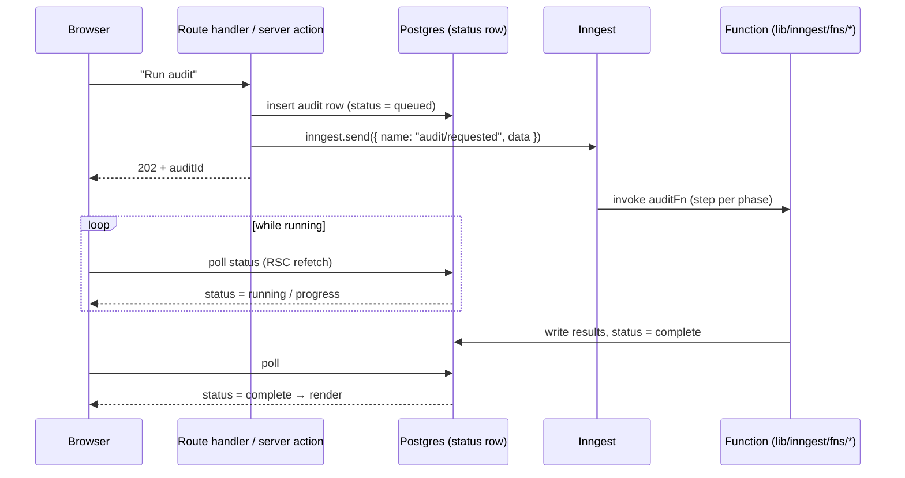
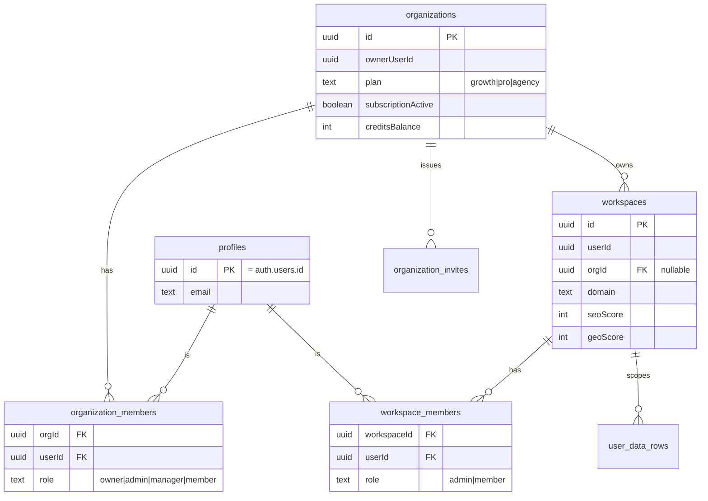

Spyro is one Next.js application, but it is layered deliberately. This page is the map: the overall system, the request lifecycle, how background work runs, and the multi-tenancy model. Each subsystem then has its own page under [Backend](/backend/overview).

## The layers

From top to bottom:

1. **Frontend (App Router, RSC)** — pages and layouts are React Server Components by default. Client components (`"use client"`) are used only where interactivity is required. The UI mutates data through **server actions** and reads through RSC or **route handlers**.
2. **Server actions + route handlers** — `lib/actions/*` are the typed mutation entry points called from forms and buttons; `app/api/*` route handlers serve webhooks, OAuth callbacks, streaming endpoints, the public API, and PDF/report generation.
3. **`lib/` service layer** — all business logic. It wraps every external vendor behind an interface (`lib/serp`, `lib/llm`, `lib/engines`) so feature code is vendor-agnostic, and holds the domain engines (`lib/seo`, `lib/geo`, `lib/crawler`, `lib/audit`, `lib/writer`, `lib/billing`, …).
4. **Data — Drizzle + Supabase Postgres + RLS** — the server connection uses Drizzle over `postgres-js` and connects as the service role (`lib/db/index.ts`). Postgres RLS (`drizzle/rls.sql`) scopes user-session access by `user_id = auth.uid()`.
5. **Background jobs — Inngest** — anything slow runs as an Inngest function (`lib/inngest/fns/*`). Request handlers enqueue an event and return immediately.

### Overall system architecture



## The abstraction-layer philosophy

The rule is simple: **feature code never imports a vendor SDK**. It calls a factory that returns an interface. This keeps providers swappable and keeps "is this configured?" logic in one place.

There are three distinct abstraction families, and they solve different problems:

| Abstraction | Entry point | What it wraps | Missing-key behavior |
| --- | --- | --- | --- |
| SERP / keyword data | `getSerpProvider()` (`lib/serp/index.ts:20`) | DataForSEO (the only impl) | **Throws** — no mock, so failures are visible |
| Internal LLM | `getLLM()` (`lib/llm/index.ts:19`) | OpenRouter → OpenAI → Gemini, in that order | **Throws** when none configured |
| Citation-target engines | `getEngine()` / `allEngineImpls()` (`lib/engines/index.ts`) | The AIs Spyro *queries* (ChatGPT, Claude, Perplexity, Gemini, Google AI Overview) | Engine omitted when its key is absent |

<Note>
  `lib/llm` and `lib/engines` are easy to confuse. **`lib/llm` is the AI Spyro *uses*** to write and reason. **`lib/engines` are the AIs Spyro *queries*** to check whether a customer's site gets cited. The citation engines (except `ai_overview`, which rides on the SERP layer) all route through a single `OPENROUTER_API_KEY` via OpenRouter's OpenAI-compatible endpoint (`lib/engines/index.ts`).
</Note>

The LLM provider chain, verbatim from `lib/llm/index.ts:19`:

```ts
export function getLLM(): LLMProvider {
  if (_provider) return _provider;
  if (env.OPENROUTER_API_KEY) {
    _provider = createOpenRouterProvider(env.OPENROUTER_API_KEY);
  } else if (env.OPENAI_API_KEY) {
    _provider = createOpenAIProvider(env.OPENAI_API_KEY);
  } else if (env.GOOGLE_GENAI_API_KEY) {
    _provider = createGeminiProvider(env.GOOGLE_GENAI_API_KEY);
  } else {
    throw new Error("[llm] No LLM provider configured. ...");
  }
  return _provider;
}
```

<Warning>
  The README describes Gemini as "the only LLM provider." That is stale. The code's primary provider is **OpenRouter** (one key routes Kimi, Claude, GPT, and Gemini models); Gemini is only the third fallback. Trust `lib/llm/index.ts`.
</Warning>

## Request lifecycle

Every non-static request passes through `proxy.ts` first — Spyro's edge middleware. (In Next.js 16 the middleware file is named `proxy.ts`, not `middleware.ts`.) It does three jobs: gate the superadmin panel by IP, rewrite the `superadmin.<domain>` subdomain onto the internal `/superadmin/*` segment, and refresh the Supabase session, redirecting unauthenticated users away from private paths.



Two source facts anchor this flow:

- The public-path list and the redirect logic live in `proxy.ts` (`isPublic`, `PUBLIC_PREFIXES`, lines 5–25 and 100–112).
- The superadmin IP gate returns a bare **404** for off-allowlist IPs so the panel's existence is never revealed (`proxy.ts:65`).

See [Middleware](/backend/middleware) for the full breakdown and [Authentication](/backend/authentication) / [Authorization](/backend/authorization) for the session and role model.

## Background jobs

Long work — site crawls, scheduled rank / citation / AI-overview checks, blog generation, and the weekly digest — never runs inside a request handler. Instead the handler **enqueues an Inngest event** and returns; the UI then **polls a status row** in Postgres for progress. The Inngest client is created once (`lib/inngest/client.ts`, app id `"spyro"`) and every function is registered at the serve endpoint `app/api/inngest/route.ts`.



Each Inngest function splits its work into one `step.run` per phase so no single Vercel invocation exceeds the `maxDuration = 300` ceiling set in `app/api/inngest/route.ts`. For dev convenience, on-demand actions fall back to a **capped inline run** when Inngest is unreachable. Weekly jobs are fanned out per workspace on the workspace's own local Monday by hourly dispatchers (`lib/inngest/fns/dispatcher.ts`), so an Agency org's sites don't all run at the same UTC hour. Full catalogue in [Background jobs](/backend/background-jobs).

## Multi-tenancy

Spyro's tenancy is a three-level hierarchy, verified from `lib/db/schema.ts`:

- **`profiles`** — identity only. `id` equals `auth.users.id`; created by the signup trigger in `drizzle/rls.sql` (`lib/db/schema.ts:64`).
- **`organizations`** — the tenancy and billing root. Holds `ownerUserId`, the `plan` (`growth` / `pro` / `agency`), Dodo billing ids, trial state, and credit balance. Billing moved here from `profiles` in migration `0006` / `0007` (`lib/db/schema.ts:73`).
- **`workspaces`** — exactly one website each (1:1). Carries `userId` and a nullable `orgId`, plus the site's SEO/GEO scores, brand/tone profiles, and onboarding state. Plan caps the count: Growth/Pro = 1, Agency = many (`lib/db/schema.ts:159`).

Membership and roles are separate join tables: `organization_members` (roles `owner` / `admin` / `manager` / `member`) and `workspace_members` (roles `admin` / `member`), each with a unique `(scope, user)` index (`lib/db/schema.ts:101` and `:117`). Invites are tokenized in `organization_invites`.



Two enforcement layers protect tenant data:

1. **`user_id` on every data row** — every user-owned table carries `user_id` (and usually a workspace id), so queries scope by owner.
2. **Postgres RLS** — `drizzle/rls.sql` enables `user_id = auth.uid()` policies as defence-in-depth for any access made with the **user's own Supabase session**. The server-side Drizzle connection runs as the **service role and bypasses RLS** (`lib/db/index.ts`), which is why it must only be imported from server code and jobs.

The URL mirrors the hierarchy: authenticated pages live under `app/(app)/[org]/[workspace]/…`, so the org and workspace are resolved from the path. See [Authorization](/backend/authorization) and [Database](/backend/database).

## Related

- [Backend overview](/backend/overview) · [Services](/backend/services)
- [Database](/backend/database) · [Middleware](/backend/middleware) · [Background jobs](/backend/background-jobs)
- [Authentication](/backend/authentication) · [Authorization](/backend/authorization)
- [Frontend overview](/frontend/overview) · [Environment](/getting-started/environment)
