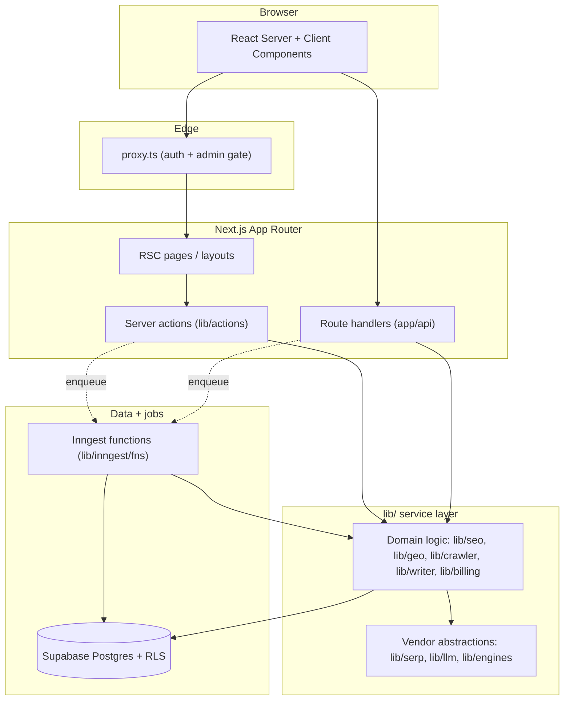

Spyro is a SEO and AI-visibility (GEO/AEO) SaaS. It helps site owners **rank on Google and get cited by AI assistants** (ChatGPT, Gemini, Claude, Perplexity, and Google's AI Overviews). This documentation describes the application as it actually exists in source — it is reverse-engineered from the codebase, not from marketing copy.

<Info>
  This page is written for engineers working *on* Spyro. If you are looking for the product story, start with the running app. If you want to build or extend a feature, start here and follow the links into the subsystem docs.
</Info>

## What Spyro does

Spyro runs a set of analysis and content engines against a customer's website:

- **Keyword research and SERP analysis** — real search volume, difficulty, intent, and live SERP features via DataForSEO.
- **Website audit** — crawls a site, scores SEO and GEO readiness, checks Core Web Vitals and AI-bot access, and suggests fixes.
- **AI-visibility tracking** — queries the "citation-target" AIs (ChatGPT, Gemini, Claude, Perplexity, Google AI Overviews) with buyer prompts and records, as a *frequency*, whether the customer's brand is mentioned.
- **Content engine** — blog ideation, topic clusters, an AI article writer, featured-image generation, and publishing to WordPress / Notion.
- **Rank tracking and digests** — scheduled rank, citation, and AI-overview checks plus a weekly email digest.
- **Free public tools** — five no-login marketing tools (AI visibility checker, SEO/GEO audit, schema validator, robots checker, meta-snippet preview).

The data model is **multi-tenant**: every customer is an **organization** that owns one or more **workspaces**, and each workspace is exactly one website. See [Architecture](/getting-started/architecture) for the full tenancy model.

## Tech stack

Everything below is taken from `package.json`, the config files, and the `lib/` source.

| Layer | Choice | Source |
| --- | --- | --- |
| Framework | Next.js 16.2.6 (App Router, React Server Components) | `package.json:74` |
| UI runtime | React 19.2.4 | `package.json:80` |
| Language | TypeScript 5, `strict` mode | `tsconfig.json:7` |
| Styling | Tailwind CSS v4 (via `@tailwindcss/postcss`) + shadcn / Base UI | `postcss.config.mjs`, `package.json` |
| Database | Supabase Postgres, accessed through Drizzle ORM | `lib/db/index.ts`, `drizzle.config.ts` |
| Auth | Supabase Auth (`@supabase/ssr`) | `proxy.ts`, `lib/supabase` |
| Background jobs | Inngest (functions + cron) | `lib/inngest/client.ts` |
| SERP / keyword data | DataForSEO (behind an abstraction) | `lib/serp/index.ts` |
| LLMs | OpenRouter (primary) → OpenAI → Gemini (behind an abstraction) | `lib/llm/index.ts` |
| Billing | Dodo Payments (Merchant of Record) | `lib/dodo`, `app/api/webhooks/dodo` |
| Email | Resend | `lib/email` |
| Analytics | PostHog | `next.config.ts` |
| Package manager | pnpm (`pnpm-lock.yaml`, `.npmrc` `node-linker=hoisted`) | `.npmrc` |
| Runtime | Node `>=22.17.0` | `package.json:5` |

<Note>
  **README drift.** The in-repo `README.md` is partly stale. It describes billing as **Polar** and LLMs as **Gemini-only**, but the code uses **Dodo Payments** (`app/api/webhooks/dodo`, migration `drizzle/0022_dodo_payments.sql`) and an **OpenRouter-first** LLM stack (`lib/llm/index.ts`). When a doc and the code disagree, this documentation follows the code.
</Note>

## High-level architecture

Spyro is a single Next.js application organized in clear layers. Requests flow from React Server Components and route handlers, into a `lib/` service layer that wraps every external vendor behind an interface, down to Drizzle/Postgres. Anything slow runs as an Inngest background job rather than in the request path.

Three ideas define the codebase:

1. **Vendor abstraction.** Feature code never imports a vendor SDK. It calls `getSerpProvider()`, `getLLM()`, or an engine from `lib/engines`. Each returns an interface, so swapping or adding a provider is a config change, not a rewrite (`lib/serp/index.ts`, `lib/llm/index.ts`, `lib/engines/index.ts`).
2. **Long work is a background job.** Crawls, citation checks, rank checks, and article generation run as Inngest functions; request handlers enqueue an event and return, and the UI polls a status row (`lib/inngest/client.ts`).
3. **Degrade, don't crash — selectively.** Many integrations fall back to a mock when their key is absent so you can click through the product. The two core providers (DataForSEO and the LLM layer) are the exception: they throw real errors instead of masking missing data. See [Environment](/getting-started/environment).

## Where to go next

<CardGroup cols={2}>
  <Card title="Installation" icon="rocket" href="/getting-started/installation">
    Clone, install with pnpm, set up the database, and run the dev servers.
  </Card>
  <Card title="Project structure" icon="folder-tree" href="/getting-started/project-structure">
    A folder-by-folder tour of `app/`, `lib/`, `components/`, and `drizzle/`.
  </Card>
  <Card title="Architecture" icon="diagram-project" href="/getting-started/architecture">
    The layered design, request lifecycle, background jobs, and multi-tenancy.
  </Card>
  <Card title="Environment" icon="key" href="/getting-started/environment">
    How configuration works and which keys turn on which features.
  </Card>
</CardGroup>

## Related

- [Backend overview](/backend/overview) and the [service map](/backend/services)
- [Database schema and RLS](/backend/database)
- [Background jobs](/backend/background-jobs)
- [Deployment on Vercel](/deployment/vercel)
