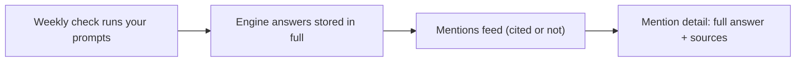

The **Mentions** tab is the *read side* of [AI visibility](/product/ai-visibility):
a live feed of every answer the AI engines gave to your [tracked prompts](/product/prompts),
whether or not they mentioned you. You reach it at `/{org}/{workspace}/ai-mentions`.

Where the [Overview](/product/ai-visibility) tab tells you *how often* you're cited
and the [Prompts](/product/prompts) tab manages *what's asked*, this tab shows you
the *actual words* - exactly how each engine described you, in context.

<Note>
The feed shows **every** response in the window - cited or not - so you can see
each prompt's full result even when the engines didn't mention you. Rows where
your site was cited are badged **Mentioned**.
</Note>

## What's in the feed

Each row is one AI engine answer from the last **30 days** (newest first), and
carries:

| Field | What it means |
| --- | --- |
| **Engine** | Which model answered - ChatGPT, Gemini, Perplexity or Claude. |
| **Date** | When the check ran. |
| **Prompt** | The buyer question that triggered the answer. |
| **Mention status** | A green **Mentioned** badge when the answer cited you; otherwise **Not mentioned**. |
| **Sentiment** | How you were portrayed - positive, neutral or negative - on answers that cited you. |
| **Snippet** | The relevant excerpt of the answer, with your brand highlighted. |

<Note>
**Sentiment is only classified on answers that cited you.** A response that didn't
mention your site has no sentiment, and recently cited answers may still show as
not-yet-classified until the labeling runs.
</Note>

## The summary strip

Above the feed, a summary covers the same 30-day window:

- **Responses · 30d** - the total number of AI answers in the window.
- **Mentioned you** - how many cited you, with an icon per engine that mentioned
  you and a count of distinct engines.
- **Sentiment** - the positive / neutral / negative split across cited answers, or
  **Not yet classified** when none have been labeled.

## How to use it

<Steps>
  <Step title="Scan for mentions">
    Look for the green **Mentioned** badges to see which answers actually cited
    you - and on which engines and prompts.
  </Step>
  <Step title="Read the snippet in context">
    The highlighted snippet shows the exact sentence where you appeared, so you
    can judge *how* you were framed, not just whether you were named.
  </Step>
  <Step title="Watch the negatives">
    Filter your attention to negative sentiment - those are answers steering buyers
    away from you, and the highest-leverage thing to fix.
  </Step>
  <Step title="Open the full answer">
    Click any row to read the complete response and its source links.
  </Step>
</Steps>

<Tip>
The feed is the best place to understand *why* your [Overview](/product/ai-visibility)
share of voice moved. A drop usually traces back to specific answers here - a rival
the engine started recommending, or a question where it stopped naming you.
</Tip>

## The mention detail page

Opening a row (at `/{org}/{workspace}/ai-mentions/{id}`) shows the full picture of
a single answer:

- A **headline** stating whether the engine mentioned you, with the date and a
  **Mentioned / Not mentioned** label.
- The **prompt** that triggered it.
- The **full engine response**, rendered in full - not just the snippet.
- **Source links** - the URLs the engine cited in that answer, when it provided
  any.

## Related

<CardGroup cols={2}>
  <Card title="Overview" icon="chart-pie" href="/product/ai-visibility">Your AI share of voice and the competitor ranking.</Card>
  <Card title="Prompts" icon="list-check" href="/product/prompts">Manage the buyer questions Spyro runs against each engine every week.</Card>
  <Card title="GEO engine (dev)" icon="robot" href="/backend/geo-engine">How answers are captured and sentiment is classified.</Card>
  <Card title="AI internals (dev)" icon="code" href="/backend/ai">The model layer behind the engine responses.</Card>
</CardGroup>
