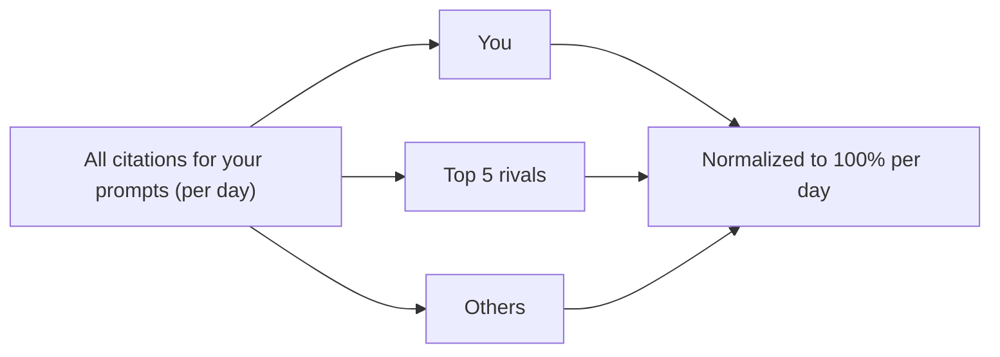

**AI visibility** is Spyro's GEO tracker: it asks the AI engines real buyer
questions every week and measures whether they recommend *you*. The feature has
three tabs — **Overview** (this page) is your share of voice, [**Prompts**](/product/prompts)
is the buyer questions Spyro runs, and [**Mentions**](/product/ai-mentions) is
the live feed of every answer. This page covers the **Overview** tab, which you
reach at `/{org}/{workspace}/competitors`.

<Note>
Because LLMs are non-deterministic, Spyro never reports a citation as a yes/no.
Every result is a **frequency** — "cited in N of M runs" — and the percentages on
this page are averages of those frequencies across engines, prompts and time.
</Note>

## What this tab shows

The Overview tab answers one question: *across the AI engines, how often do you
get recommended versus your competitors?* It has three parts, top to bottom.

<Steps>
  <Step title="Per-engine visibility cards">
    One card per engine you track — **Google AI Overviews**, **Gemini**,
    **ChatGPT**, **Perplexity** and **Claude**. Each shows your average citation
    frequency over the last 7 days, how many times that engine mentioned you, the
    week-over-week trend, and a sentiment breakdown when answers have been
    classified.
  </Step>
  <Step title="Share-of-voice chart">
    A daily stacked chart of you plus your top rivals, normalized so every day
    totals 100%. This is your **share of voice** — your slice of all the AI
    citations across your tracked prompts.
  </Step>
  <Step title="Competitor ranking table">
    Every brand the engines cited for your prompts, ranked by average citation
    frequency — with a synthetic **You** row dropped in so you can see exactly
    where you sit.
  </Step>
</Steps>

The header strip summarizes the window: `N prompts · M engines · last 7 days`.

<Note>
If you haven't added prompts yet, or the weekly check hasn't run, this tab shows
**No AI visibility data yet**. Add prompts on the [Prompts](/product/prompts) tab —
the first check runs instantly when you add one, and recurring checks run every
Monday.
</Note>

## Per-engine visibility cards

Each card is one engine. Read it as "on this engine, here's how visible you are
right now."

| Field | What it means |
| --- | --- |
| **Visibility** | Your average citation frequency on this engine over the last 7 days, shown as a percentage. |
| **Mentions** | How many answers from this engine cited you in the window. |
| **Trend** | The change versus the previous 7-day window. A real arrow only appears once there's a prior week to compare. |
| **Sentiment** | How the engine portrayed you in answers that cited you — positive, neutral or negative. Shows nothing until at least one cited answer is classified. |

<Tip>
Sentiment is only judged on answers that actually cited you — a "neutral" count
of zero doesn't mean the engine dislikes you, it means it hasn't mentioned you
yet (or the classification hasn't run).
</Tip>

## Share of voice

**Share of voice** is your portion of all the AI citations happening for your
tracked prompts. Spyro takes you and your **top 5 rivals** for each day, weights
each by how many runs it appeared in, and normalizes the day to 100%. Everything
outside the top 5 is grouped into **Others**.

How to read it:

- **A rising "You" band** means you're winning a bigger slice of AI answers —
  even if the absolute number of prompts didn't change.
- **A flat band while a rival's grows** means you're losing ground in relative
  terms; that's your cue to look at which prompts they win on.
- Share of voice is *relative*. It can fall even when your own visibility holds
  steady, simply because a competitor surged.

<Note>
Days without enough citations are marked low-confidence and left out of the
chart. If there isn't enough data yet, you'll see **Not enough data for the
share-of-voice chart yet — checks resume every Monday** in place of the chart.
</Note>

## Competitor ranking

The table ranks every brand the engines cited for your prompts, with a **You** row
injected and the whole list sorted by average citation frequency. The highest
average is `#1`.

| Column | What it means |
| --- | --- |
| **Rank** | Position by average citation frequency, highest first. |
| **Brand** | The competitor domain, or your site on the highlighted **You** row. |
| **Prompts where cited** | How many of your tracked prompts cited this brand, as `N / M`. The **You** row shows `—` here. |
| **Avg frequency** | Average citation frequency across every (prompt × engine) check in the last 7 days. |
| **7-day trend** | Change versus the previous 7-day window. |

The **You** row is shaded and carries a **You** badge so you can spot your own
ranking at a glance. Averages are taken across `(prompt × engine)` checks in the
last 7 days; share of voice is normalized to 100% per day across you plus your
top 5 rivals.

<Tip>
To find *where* a rival is beating you, note the prompts they're cited on here,
then open the [Prompts](/product/prompts) tab to see which specific buyer
questions they win — and the [Mentions](/product/ai-mentions) feed to read the
exact answers.
</Tip>

## Related

<CardGroup cols={2}>
  <Card title="Prompts" icon="list-check" href="/product/prompts">Manage the buyer questions Spyro runs against each engine every week.</Card>
  <Card title="Mentions" icon="radio" href="/product/ai-mentions">The live feed of every AI answer and whether it cited you.</Card>
  <Card title="GEO engine (dev)" icon="robot" href="/backend/geo-engine">How citation checks and share of voice are computed.</Card>
  <Card title="AI internals (dev)" icon="code" href="/backend/ai">The model layer behind prompts, sentiment and scoring.</Card>
</CardGroup>
