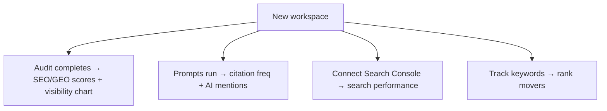

The dashboard is the home screen for a workspace, at `/{org}/{workspace}`. It
answers one question - *what's happening with this site?* - across SEO, AI
visibility, and content health. Most panels also link straight into the tool
behind them.

The header greets you with the workspace **domain** and two quick actions:
**Run audit** and **Manage** (workspace settings).

## While setup is still running

If you just finished [onboarding](/product/onboarding), the crawl and first
audit run in the background. Until they're done you'll see, above the cards:

- A **setup status banner** tracking the index, SEO, GEO, SERP and intelligence
  jobs as they complete.
- A **content-plan progress** indicator for your first auto-generated plan.
- Once insights land, **setup diagnostics** - short notes explaining anything
  that came back thin (for example, a missing sitemap), with links to fix it.

These disappear automatically once the workspace is ready.

## The KPI band

Four cards summarize the workspace. Each shows a dash (`-`) until the data that
feeds it exists, and the score cards show a small **trend** chip comparing the
two most recent audits.

| Card | What it shows | Source |
| --- | --- | --- |
| **SEO health** | Your latest SEO score, out of 100 | Most recent audit |
| **GEO readiness** | Your latest GEO (AI-readiness) score, out of 100 | Most recent audit |
| **AI citation freq** | Average % of tracked prompts that cite you, with the **count of prompts tracked** | Recent citation checks |
| **Domain Rating** | Your domain authority | Latest intelligence snapshot |

<Tip>
The trend chip on **SEO health** and **GEO readiness** only appears once you
have at least two audits to compare - run a second [audit](/product/audit) to
see movement.
</Tip>

## Visibility and AI citations

The hero row pairs two panels:

- **Visibility report** - a chart of your SEO and GEO scores over your recent
  audit history, so you can see the trajectory rather than a single number.
- **AI engine citations** - a horizontal bar per engine (ChatGPT, Gemini,
  Perplexity, Claude) showing how often each one cites your site, with the
  overall **average** called out. If you haven't tracked any prompts yet, this
  shows a **No citation data** empty state.

## Search performance and rank movers

This row appears only once there's data for it - Search Console history or
tracked-keyword movement.

<AccordionGroup>
  <Accordion title="Search performance" icon="chart-line">
    Google **clicks** and **impressions** for the last 28 days, each with a
    percentage delta versus the prior 28 days, plus a sparkline. Links through to
    [Search Console](/product/search-console). Before you connect Search Console,
    a **No Search Console data** state invites you to link it.
  </Accordion>
  <Accordion title="Rank movers" icon="arrow-up-arrow-down">
    The keywords with the biggest position changes since the last check -
    improvements in green, drops in red, each showing the current position and
    where it moved from. Links to the [rank tracker](/product/rank-tracker).
    Empty until you track keywords.
  </Accordion>
</AccordionGroup>

## Recent AI mentions

When AI engines cite your site in an answer, the latest few show up here as
cards - each with the **engine**, the **date**, a **sentiment** tag
(positive / neutral / negative) where available, and a snippet of the answer.
Each card opens the full mention, and **See all** jumps to the
[mentions feed](/product/ai-mentions). This section is hidden entirely until
there's at least one mention; the empty state explains that answers from
ChatGPT, Gemini, Perplexity or Claude will appear here.

## First-run state

On a brand-new workspace, the structure is the same but most panels show their
empty states: the KPI cards read `-`, the citation and mention panels prompt you
to track prompts, and the performance row stays hidden until Search Console or
rank data exists. As audits complete, prompts run, and Search Console connects,
each panel fills in on its own.

## Related

<CardGroup cols={2}>
  <Card title="Product overview" icon="grid-2" href="/product/overview">Orgs, workspaces, and the full feature map.</Card>
  <Card title="Onboarding" icon="rocket" href="/product/onboarding">How you get to this screen.</Card>
  <Card title="Site audit" icon="shield-check" href="/product/audit">What powers the SEO and GEO scores.</Card>
  <Card title="AI mentions" icon="quote-left" href="/product/ai-mentions">The full feed behind recent mentions.</Card>
</CardGroup>
