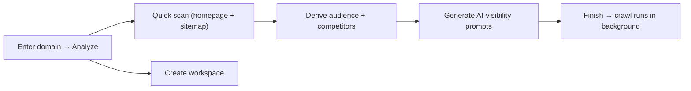

This page walks you through your very first session: creating an account,
verifying your email, adding a website, and the short setup wizard that turns
that website into a fully configured **workspace**. By the end you land on your
dashboard with a crawl already running in the background.

<Note>
A **workspace** is one tracked website, and it lives inside an **organization**
(your billing root). Onboarding creates your first workspace. For how that's
structured, see [Product overview](/product/overview).
</Note>

## Create your account

You can reach signup from the marketing site or directly at `/signup`.

<Steps>
  <Step title="Open the sign-up page">
    Go to **Create your account**. Spyro starts you on a **3-day free trial**.
    If you're already signed in, Spyro skips this and sends you straight into
    the app.
  </Step>
  <Step title="Enter your details">
    Fill in **Full name**, **Email**, **Password** and **Confirm password**.
    Passwords must be at least 8 characters, and the two fields have to match -
    the **Create account** button stays disabled until they do. A show/hide
    toggle (the eye icon) lets you check what you typed.

    Prefer single sign-on? Use **Continue with Google** instead - it skips the
    password and email-verification steps entirely.
  </Step>
  <Step title="Confirm your email with the 8-digit code">
    After you submit, Spyro emails an **8-digit verification code** and takes you
    to the **Confirm your email** screen. Enter the code - it submits
    automatically once all eight digits are in, so there's no extra click. If it
    doesn't arrive, use **Resend code**.

    <Tip>
    The address you're confirming is read from a secure pending-signup session,
    not the URL, so the verify page only works while a sign-up is actually in
    progress. If you land there without one, Spyro returns you to `/signup`.
    </Tip>
  </Step>
</Steps>

<Note>
Already have an account? Use [`/login`](/product/onboarding) instead - same
split-screen screen, with **Email** + **Password** (and a **Forgot password?**
link) or **Continue with Google**.
</Note>

After verification, Spyro provisions your profile and personal organization and
sends you to onboarding. If your trial or plan needs a payment method first,
you'll pass through a short checkout step before the wizard appears.

## Add your first website

Onboarding opens on a single question: **What's your website?** Enter a domain
or full URL (for example `example.com`) and choose **Analyze**.

The moment you submit, two things happen in parallel:

- Spyro creates the workspace for this domain.
- Spyro runs a fast **quick scan** - a single homepage fetch plus a cheap
  sitemap probe - to pre-fill the first setup steps in a few seconds at no API
  cost.

<Warning>
Spyro reads only your **public** pages, and it never fails closed: if the
homepage can't be fetched, the wizard still opens with a domain-derived
skeleton you can fill in by hand.
</Warning>

## What Spyro derives for you

While you're still on the first step, Spyro works ahead so the wizard arrives
pre-filled. Steps that were populated by the scan show an **Auto-detected from
your website** chip.

| What Spyro computes | How | Where it lands |
| --- | --- | --- |
| **Brand name, brand color, logo, language** | Deterministic parse of your homepage (and linked CSS when colors are JS-rendered) | Business profile step |
| **Sitemap URL** | `robots.txt` + common sitemap paths | Business profile + Blog setup |
| **Audience tags + business description** | AI reads your homepage text | Audience step |
| **Competitors** | Auto-discovered from shared-keyword data, locale-aware | Competitors step |
| **AI-visibility prompts** | Generated from your niche + competitors | AI prompts step |

<Tip>
Everything Spyro derives is a **draft you can edit**. If you change something -
your audience tags, the competitor list - Spyro won't silently overwrite your
edits when it refreshes a suggestion.
</Tip>

## The setup wizard

The wizard is an 8-step flow with a step rail on the left. You can move with
**Continue** / **Back**, or jump straight to any step in the rail. A couple of
steps validate before they let you advance.

<AccordionGroup>
  <Accordion title="1 · Business profile" icon="building">
    Confirm the basics Spyro pulled from your homepage: **brand name**
    (required), **primary color**, **logo**, **language**, **country** and
    **sitemap URL**. Your country matters - it's the locale Spyro uses to
    re-check competitors on step 3.
  </Accordion>
  <Accordion title="2 · Your audience" icon="users">
    Review the **audience segments** (tags) and **business description** Spyro
    derived. You need at least one audience segment to continue. These feed
    later prompt and content generation.
  </Accordion>
  <Accordion title="3 · Competitors" icon="crosshairs">
    A list of **auto-discovered rivals** with their shared-keyword counts (up to
    10). Add or remove any. If discovery came back empty or errored, a **Retry**
    re-runs it with your confirmed country. Editing the list locks it so Spyro
    won't overwrite your changes.
  </Accordion>
  <Accordion title="4 · Blog setup" icon="newspaper">
    Tell Spyro what existing content to learn from: your **sitemap URL**, a
    **blog path**, and up to three of your **best article URLs**. You can also
    **Connect Google Search Console** here to bring in real query and page data.
  </Accordion>
  <Accordion title="5 · Article style" icon="pen-nib">
    Defaults for every article Spyro writes: **style** (informational /
    commercial / mixed), **content focus** (awareness / balanced / conversion),
    **internal-link count**, **publishing pace**, **GEO mode**, a **featured
    image** size and preset (with a **custom style** option that takes a prompt
    and up to four example images), and any **global instructions**.
  </Accordion>
  <Accordion title="6 · AI visibility prompts" icon="robot">
    The buyer questions Spyro will ask AI engines (ChatGPT, Gemini, Perplexity,
    Claude) each week to see whether they cite you. Drafts are generated the
    first time you reach this step - edit them so they match how customers
    actually search for you.
  </Accordion>
  <Accordion title="7 · Need a hand setting up?" icon="life-ring">
    Optional **Done-For-You** setup. Say yes and Spyro's team reaches out to
    configure the workspace with you.
  </Accordion>
  <Accordion title="8 · How did you find us?" icon="comment">
    A quick acquisition-source question (Google, ChatGPT, LinkedIn, a friend,
    and so on). Choosing **Finish setup** here completes onboarding.
  </Accordion>
</AccordionGroup>

<Note>
The same wizard powers **adding another site** on Agency plans, at
`/{org}/onboarding/new`. It's scoped to that organization and checks your
workspace limit before it opens.
</Note>

## Finishing and landing in your workspace

When you choose **Finish setup**, Spyro launches the full site index and routes
you to your workspace home at `/{org}/{workspace}`. The heavy work - crawling,
the SEO + GEO audit, competitor intelligence, and your first auto-generated
content plan - runs in the **background**.

On the dashboard you'll see a **setup status banner** and a **content-plan
progress** indicator while those jobs run, then the KPI cards and panels fill in
as data arrives. See the [Dashboard](/product/dashboard) for what each card
means.

<Tip>
If you close the tab mid-setup, just reopen the app. Spyro resumes onboarding
for any workspace still in the crawl phase, and finished workspaces drop you
straight on the dashboard.
</Tip>

## Related

<CardGroup cols={2}>
  <Card title="Product overview" icon="grid-2" href="/product/overview">Orgs, workspaces, and the full feature map.</Card>
  <Card title="Dashboard" icon="gauge" href="/product/dashboard">Where onboarding lands you.</Card>
  <Card title="Crawler (dev)" icon="spider" href="/backend/crawler">How Spyro reads your site.</Card>
  <Card title="Background jobs (dev)" icon="gears" href="/backend/background-jobs">How the post-finish crawl and audit run.</Card>
</CardGroup>
