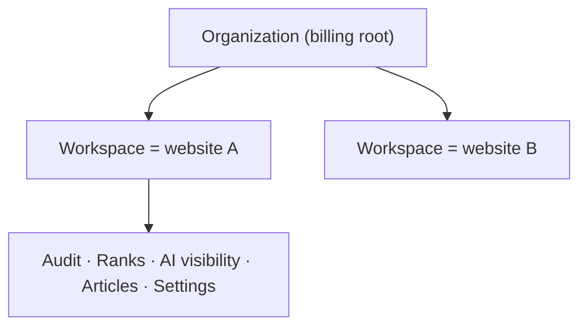

Spyro is an **SEO + AI-visibility (GEO/AEO) platform**: it audits your site, tracks
your Google rankings, measures whether AI engines (ChatGPT, Gemini, Perplexity,
Claude, Google AI Overviews) cite your brand, and plans and writes the content
that closes the gaps. This guide walks through the product feature by feature,
mirroring the app's left-hand navigation.

<Note>
This is the **product guide** — how to *use* each screen. For how each feature is
*built*, see the [Developer Docs](/introduction). Most pages cross-link to their
engineering counterpart under `/backend/*`.
</Note>

## Organizations and workspaces

Everything you do lives inside a **workspace**, and every workspace is exactly one
website.

- An **organization** is your billing root. It owns one or more workspaces and a
  team of members.
- A **workspace** is one tracked site — its audits, keywords, prompts, articles,
  integrations and settings all hang off it.

This is encoded directly in the URL as two segments — `/{org}/{workspace}/…`. For
example, the audit for the `spyro-app` workspace in the `support-3` org is at
`/support-3/spyro-app/audit`. You switch orgs and workspaces from the switchers at
the top of the sidebar.

<Tip>
Your **plan** decides how many workspaces you get and which features are unlocked.
**Pro** covers 1–2 sites; **Agency** covers 3–20 with volume discounts. See
[Plans, billing & usage](/product/billing-and-usage).
</Tip>

## The navigation

The sidebar groups features the same way this guide does:

<AccordionGroup>
  <Accordion title="Overview" icon="grid-2">
    - [**Dashboard**](/product/dashboard) — your workspace at a glance: scores,
      recent activity, and quick links into every tool.
  </Accordion>
  <Accordion title="SEO" icon="magnifying-glass">
    - [**Spyro AI research**](/product/spyro-ai-agent) — a chat agent that does
      keyword research, finds content gaps, and recommends topics using your live
      site and SERP data.
    - [**Site audit**](/product/audit) — crawl your site for SEO + GEO issues, get
      a scored report, AI fix suggestions, and a downloadable PDF.
    - [**Search Console**](/product/search-console) — connect Google Search
      Console to see real query/page performance and AI-surface traffic.
    - [**Rank tracker**](/product/rank-tracker) — track keyword positions over time;
      articles you publish are auto-tracked.
  </Accordion>
  <Accordion title="AI visibility" icon="robot">
    The three tabs of Spyro's GEO tracker:
    - [**Overview**](/product/ai-visibility) — your share of voice across AI engines
      versus competitors.
    - [**Prompts**](/product/prompts) — the buyer questions Spyro runs against the
      AI engines each week.
    - [**Mentions**](/product/ai-mentions) — the live feed of every AI answer and
      whether it cited you.
  </Accordion>
  <Accordion title="Create" icon="pen-nib">
    - [**Calendar & Article Planner**](/product/calendar) — a content plan and an
      editorial calendar of blog ideas.
    - [**Writer**](/product/writer) — the article workspace where drafts are
      generated, edited, scored, and published.
    - [**Article settings**](/product/article-settings) — defaults for tone, style,
      images, and publishing integrations.
  </Accordion>
  <Accordion title="Account" icon="gear">
    - [**Settings**](/product/settings) — account, workspace, audience, competitors,
      crawled pages, and API keys.
    - [**Team members**](/product/team-members) — invite teammates and assign roles.
    - [**Plans, billing & usage**](/product/billing-and-usage) — your subscription,
      seats, and monthly usage.
  </Accordion>
</AccordionGroup>

## Free tools (no account needed)

Spyro also publishes five [**free public tools**](/product/free-tools) — an SEO &
GEO audit, AI-visibility checker, AI-crawler & robots checker, schema-markup
validator, and meta-snippet preview — that anyone can run without signing in.

## A typical first session

<Steps>
  <Step title="Sign up and onboard">
    Create an account and add your first website. Spyro crawls it to learn your
    brand, audience and competitors. See [Onboarding](/product/onboarding).
  </Step>
  <Step title="Audit the site">
    Run a [site audit](/product/audit) to see SEO + GEO issues and scores.
  </Step>
  <Step title="Check your AI visibility">
    Review the [prompts](/product/prompts) Spyro tracks and watch the
    [mentions feed](/product/ai-mentions) to see where AI engines cite you.
  </Step>
  <Step title="Plan and publish content">
    Use the [Article Planner](/product/calendar) to build a content plan, then the
    [Writer](/product/writer) to draft, score and publish — and watch new keywords
    appear in the [rank tracker](/product/rank-tracker).
  </Step>
</Steps>

## Related

<CardGroup cols={2}>
  <Card title="Onboarding" icon="rocket" href="/product/onboarding">Get your first workspace set up.</Card>
  <Card title="Dashboard" icon="grid-2" href="/product/dashboard">The workspace home screen.</Card>
  <Card title="Developer docs" icon="code" href="/introduction">How Spyro is built.</Card>
  <Card title="Plans & billing" icon="credit-card" href="/product/billing-and-usage">Pricing, seats, and limits.</Card>
</CardGroup>
