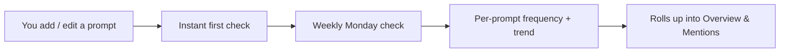

The **Prompts** tab is the *input side* of [AI visibility](/product/ai-visibility):
it's where you manage the buyer questions Spyro runs against the AI engines every
week. You reach it at `/{org}/{workspace}/prompts`.

A **tracked prompt** is a natural buyer question - the kind a potential customer
would actually type into ChatGPT or Perplexity - not an SEO keyword and never your
own brand name. Spyro runs each one against your chosen engines on a weekly
schedule and records how often the answers cite you.

<Note>
Results are always a **frequency**, "cited in N of M runs", never a yes/no -
because the same question can be answered differently each time an LLM runs it.
Your plan runs each prompt once per engine per weekly check; the percentages you
see are these frequencies averaged across engines and weeks.
</Note>

## Seed prompts from onboarding

You don't start from a blank page. During [onboarding](/product/onboarding),
Spyro generates a starter set of **five buyer questions** from your site's niche
and competitors and lets you review or edit them before they go live. They cover a
mix of intents - recommendation ("best X for Y"), discovery, comparison and
how-to - and they deliberately never mention your own brand, because the whole
point is to measure whether AI recommends you *unprompted*.

## Adding and managing prompts

<Steps>
  <Step title="Write the buyer question">
    Use the **Add prompt** box at the top of the tab - for example,
    `best budget standing desk for a home office`. Phrase it the way a real
    customer would ask, and don't name your own brand.
  </Step>
  <Step title="Choose engines">
    Tick the engines to run this prompt against. All available engines are
    selected by default - **Google AI Overviews**, **Gemini**, **ChatGPT**,
    **Claude** and **Perplexity**. (An engine only appears if its API access is
    configured for your workspace.)
  </Step>
  <Step title="Track it">
    Click **Track prompt**. It runs immediately for a first result, then joins the
    weekly Monday schedule. Each prompt can be **paused** or **deleted** from its
    detail page.
  </Step>
</Steps>

<Warning>
You can track up to **10 prompts** per workspace. The header shows your usage as
`N / 10 prompts`. Deleting a prompt frees a slot - but it also removes that
prompt's entire citation history across all engines, and that can't be undone.
Pause a prompt instead if you only want to stop running it.
</Warning>

## Reading a prompt card

Each prompt in the list is a card summarizing its current week. Paused prompts
sink to the bottom of the list.

| Field | What it means |
| --- | --- |
| **This week frequency** | Your average citation frequency for this prompt across its engines this week. |
| **Trend** | The change versus last week. Needs two weeks of data before it means anything. |
| **Per-engine row** | This week's frequency on each selected engine, with a tile per engine. |
| **Sources** | The competitor (and your own) source domains the engines cited for this prompt this week. |
| **Weeks of data** | How many distinct weeks this prompt has been checked. |
| **Next run** | When the next weekly check is scheduled, in your workspace's timezone. |

The **summary bar** above the list rolls these up across all your prompts: how many
are tracked, how many were mentioned this week (`n / m`), the average frequency,
the average trend, and the engines you track.

<Tip>
The **Sources** list is a fast way to see who you're competing against on a given
question - these are the domains the engines pulled into their answers. Rivals
that show up here are the ones to study on the [Overview](/product/ai-visibility)
ranking.
</Tip>

## The weekly schedule

Citation checks run **weekly, every Monday**, in your workspace's timezone. The
tab and each prompt card show the next scheduled run as a friendly label (for
example, `Mon, 9:00 AM PST`).

You can also force a check from the detail page with **Run now**, subject to a
**24-hour cooldown** - if a prompt already ran in the last day, Run now is
disabled and tells you when it's next allowed.

## The prompt detail page

Opening a prompt (at `/{org}/{workspace}/prompts/{id}`) shows its full history:

- A **headline strip** - this week's average citation rate and trend, total runs
  and engines this week, and your **top competitor** for this prompt with their
  frequency.
- The **next scheduled run** and how many days away it is.
- A **per-engine history** of every check (up to the last 30), grouped by engine,
  so you can see how each engine's frequency moved over time.
- **Recent mentions for this prompt** - the most recent answers that cited you,
  each linking through to the full response on the [Mentions](/product/ai-mentions)
  tab.
- **Run now**, **Active/Paused** toggle and **Delete** controls.

## Related

<CardGroup cols={2}>
  <Card title="Overview" icon="chart-pie" href="/product/ai-visibility">Your AI share of voice and the competitor ranking.</Card>
  <Card title="Mentions" icon="radio" href="/product/ai-mentions">The live feed of every AI answer and whether it cited you.</Card>
  <Card title="GEO engine (dev)" icon="robot" href="/backend/geo-engine">How prompts are scheduled and checked against each engine.</Card>
  <Card title="AI internals (dev)" icon="code" href="/backend/ai">The model layer behind seed prompts and citation checks.</Card>
</CardGroup>
