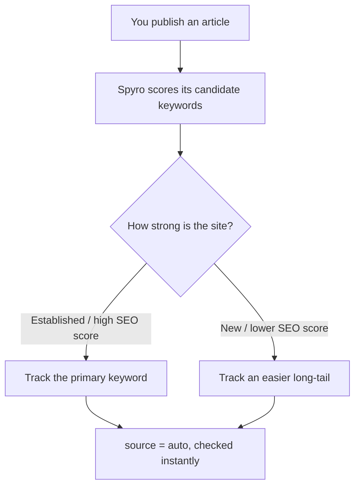

The **Rank tracker** follows where your pages sit in Google for the keywords you
care about, and charts how those positions move week to week. You add keywords by
hand, and Spyro adds one automatically every time you publish an article — picking
the single keyword that page is most likely to actually rank for. You'll find it
under **SEO → Rank tracker** at `/{org}/{workspace}/ranks`.

<Note>
This is the **product guide** — how to use the screen. For how ranking checks and
keyword selection are built, see [SEO Engine](/backend/seo-engine) in the
developer docs.
</Note>

## Add a keyword

Type a keyword (2–120 characters) into the **Track keyword** box and submit. Spyro
checks for duplicates, then runs an **immediate live check** so the position
appears within seconds — you'll see *"Tracking '…' — checking its rank now."* These
manual additions are stored with a source of `manual`.

<Tip>
A counter at the top of the page shows how many of your **500** keyword slots are
in use (for example `120/500`, "380 keywords left"). It turns amber as you approach
the limit.
</Tip>

## Read the position table

Each tracked keyword is a row in a sortable, filterable table:

| Column | What it shows |
| --- | --- |
| **Keyword** | The keyword, an **Auto** badge if Spyro added it, and the ranking URL. |
| **Current** | The latest position (`#1`, `#2`, …) or "not in top 100". |
| **Best** | The best position ever recorded. |
| **Change** | The move since the previous check — green up, red down. |
| **Added** | When the keyword started being tracked. |
| **History** | A mini bar chart of the last 12 checks (taller bar = better rank). |
| **Actions** | Delete to stop tracking and free a slot. |

You can sort by keyword, current position, change or date, search by text, and
filter by source — **All**, **Auto-tracked** or **Manual**.

## How often positions are checked

- **New keywords are checked immediately.** Adding a keyword (by hand or via
  auto-tracking) fires an instant live SERP check, so you don't wait for the weekly
  run.
- **Existing keywords are re-checked weekly** — a batched recurring check every
  Monday. The page shows the exact next run time in your workspace's timezone.

## Smart auto-tracking

This is the part you don't have to do anything for. **When you publish an article,
Spyro automatically adds one keyword to the tracker for it** — and crucially, it
adds the *single most-achievable* keyword, not just the obvious one.

For each new article, Spyro weighs the **primary keyword** against the article's
**long-tail** alternatives, scoring each for *rankability* — a blend of the
keyword's difficulty, your site's authority (SEO score) and your Search Console
signal. The most-achievable candidate wins:

- On a **strong, established site**, the **primary keyword** usually wins — you can
  realistically rank for it.
- On a **newer or weaker site**, an **easier long-tail** wins instead. As your SEO
  score climbs, that same article's primary keyword becomes worth tracking later.
- Ties default to the **primary keyword**, keeping your focus on the page's main
  target.

The chosen keyword is stored with source `auto`, linked back to the article (the
**Auto** badge links to it in the Writer), and checked instantly so you see its
starting position right away.

<Note>
Auto-tracking is skipped if the keyword is already tracked, or if the workspace is
at its keyword cap — it never breaks the publishing flow.
</Note>

## The 500-keyword cap

Each workspace can track up to **500 active keywords** (`trackedKeywordsMax`),
counting both manual and auto keywords. "Active" means *currently tracked* — only
keywords you haven't deleted count. When you're at the cap:

- A **manual add** is refused with *"You're already tracking the maximum of 500
  keywords for this workspace. Remove one to add another."*
- **Auto-tracking** quietly skips that article.

**Deleting a keyword immediately frees a slot**, with no cooldown — so prune
keywords you no longer need to make room for new ones.

## Related

<CardGroup cols={2}>
  <Card title="Site audit" icon="magnifying-glass" href="/product/audit">Find the SEO + GEO issues holding your rankings back.</Card>
  <Card title="Google Search Console" icon="magnifying-glass" href="/product/search-console">See real impressions, clicks and position.</Card>
  <Card title="SEO Engine (dev docs)" icon="code" href="/backend/seo-engine">How ranking checks and keyword selection work.</Card>
  <Card title="Product overview" icon="grid-2" href="/product/overview">The full feature map.</Card>
</CardGroup>
